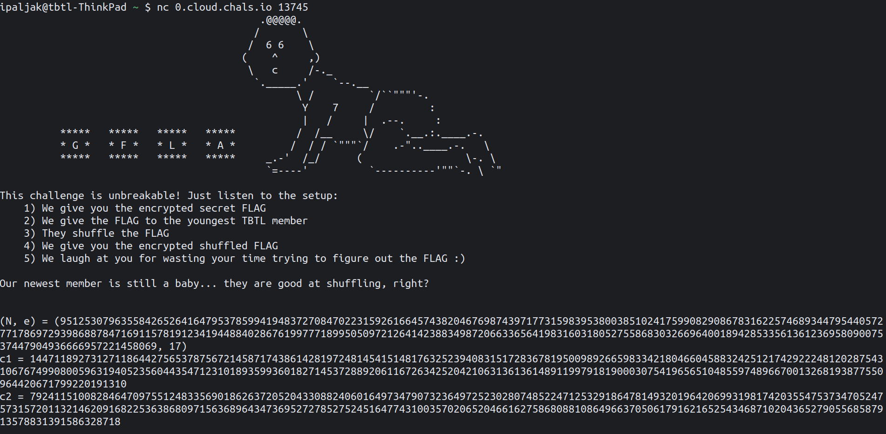

# Baby Shuffle &mdash; Solution

We are given a file called `server.py` along with a connection string to the
remote server. When we connect to the server, we receive the following data:



The setup of the challenge is basically laid out in front of us. More precisely,
we have the following information:
  * The public [RSA](https://en.wikipedia.org/wiki/RSA_(cryptosystem)) key, i.e.
    the modulus $N$ and the public exponent $e$.
  * The ciphertext produced by encrypting the flag using the above public key.
  * The ciphertext produced by encrypting the permuted flag using the above
    public key.
  * The challenge strongly hints that the "flag shuffling" was not done
    partciularly well.

Let's check out the relevant parts of the implementation in `server.py`.

```python
class RSA:
    BITS = 512

    def __init__(self):
        self.p = getPrime(self.BITS)
        self.q = getPrime(self.BITS)
        self.n = self.p * self.q
        self.e = 17

    def pubkey(self):
        return (self.n, self.e)

    def encrypt(self, m):
        return pow(m, self.e, self.n)
```

So far, so good... The `RSA` class seems to be reasonably implemented in the
context of a CTF. Let's see how is it used.

```python
flag = open("flag.txt", "r").read().strip()
shuffled_flag = flag[-1] + flag[:-1]

assert(len(flag) == 61)

myprint(f"(N, e) = ({cipher.n}, {cipher.e})")

m1 = bytes_to_long(flag.encode("utf-8"))
m2 = bytes_to_long(shuffled_flag.encode("utf-8"))

c1 = cipher.encrypt(m1)
c2 = cipher.encrypt(m2)

myprint(f"c1 = {c1}")
myprint(f"c2 = {c2}")
```

Ok, looks like the flag is not shuffled at all. Instead, it has been
[circularly shifted](https://en.wikipedia.org/wiki/Circular_shift) to the right
by one character.

If this doesn't immediately give out the attack to you, it is a good idea to
research some well-known attacks against the RSA cryptosystem. A great resource
for that purpose is [this
paper](https://crypto.stanford.edu/~dabo/pubs/papers/RSA-survey.pdf) by Dan
Boneh.

Just by looking at the attack names, the "Franklin-Reiter Related Message
Attack" immediately stands out because the two encrypted messages in our case
are definitely strongly related. Let's see what is this attack all about and
what conditions need to be satisfied in order to mount it.

The necessary conditions are:
  * We need to know the public key with which two messages were encrypted
  * The public exponent $e$ needs to be "small"
  * Messages $M_1$ and $M_2$ need to satisfy $M_1 = f(M_2) \mod N$, for some
    known linear polynomial $f(x) = ax + b \in \mathbb{Z}_N[x]$, where $b \ne 0$.

Given these conditions are met, an attacker should be able to deduce $M_1$ and
$M_2$, which is exactly what we want.

The first two conditions obviously hold, what about the third one? Can we find
the linear polynomial $f(x)$ such that $f(M_1) = M_2$?

Of course we can!

To make our lives easier, we will transform $M_2$ (the *shuffled* flag) into
$M_1$ using a linear polynomial. Let's see, we need to:
  * Add the character `}` as the last element.
  * Remove the character `}` from the first element.

To add a character, we need to *make some room for it*. In other words, we will
need to shift $M_2$ to the left by 8 bits in order to append a new character.
This is the same as multiplying $M_2$ by $2^8$. Adding the character now boils
down to incrementing $M_2$ with the ascii value of `}`, which is $125$.

Now to remove the first character, we will simply decrease the value of $M_2$
by the shifted ascii value of `}` by the length of the flag. This equals to
$2^{61 \cdot 8} \cdot 125$.

In total, we've multiplied $M_2$ by $2^8$, therefore $a = 2^8$. We've also
added to it $125$, and subtracted $2^{61 \cdot 8} \cdot 125$, making $b = 125 - 2^{61 \cdot 8} \cdot 125$

Now, all that is left to do is to implement the attack by following the
description in the paper.

Putting it all together in a solve script:

```sage
from Crypto.Util.number import *

(N, e) = (112153052251909364783308270590397746531609910104166334595923202016390447976677079867403232057727250231696335160570132850610262158172833494281653230380660063956295425794739260806712635773413785147778859690744295256452049506808129359916021415700901260208117922700040853622956983687979711198405721229154361646579, 17)
c1 = 78864742082332223108178230358000266004470931720079683255285292238641115808760648155039121450606113339286686223280031100480222153671600244333633846762469936846532257315775568469791246301540478826458197579990381744555892521144223274010450757999785181053774832962110745144727049687042555070865449787051501053959
c2 = 6585395060343147891100039023563439293501539588909846320283080181220377506011006401305950317373682510271235776656043396895585148284029657373536876376820285984022186488664177497404180038601761647270471329724434774733979814363977868741805880498722071147845627397600301632678051748619345144811128191656190996124
L = 61 * 8

a = 2^8
b = -2^L * ord('}') + ord('}')

def compositeModulusGCD(a, b):
  if b == 0:
    return a.monic()
  return compositeModulusGCD(b, a % b)

P.<x> = PolynomialRing(Zmod(N))
f = (a*x + b)^e - c1
g = (x)^e - c2
m = Integer(N - (compositeModulusGCD(f,g)).coefficients()[0])

shuffled = long_to_bytes(m).decode("utf-8")
flag = shuffled[1:] + shuffled[0]
print(flag)
```

This finally yields the flag: `TBTL{1_5i7_4nd_wa7ch_7h3_ch1ldr3n_pl4y_w17h_r3l4t3d_m3554g35}`.
