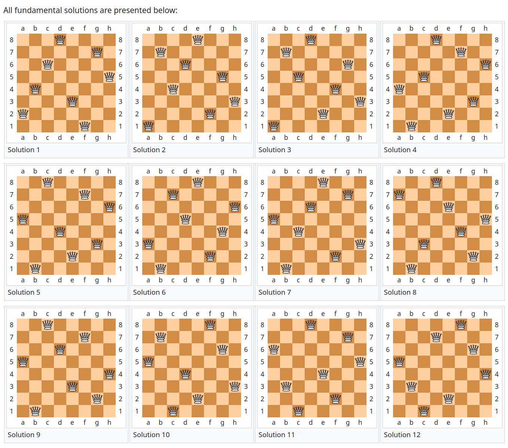

# Classical Conundrum &mdash; Solution

In this challenge, we are given the following encrypted message:

```
Dppjwi#,0:o=>oC n> a1,\,u;?k: u9;t AjLQvZm) Ffqe hq tgh] /n<4k AvLMo;q

: r N 2 | # 2 t
b G a W [ 3 d b
C < t M 6 l ~ D
Y Q $ V + + X 0
7 , 6 z B I . A
o - b u M % x Y
? p ! / ^ { @ W
= : X E 5 3 : @

2jI t8@t<3 A<X #1; b^u9\ bGyc Kgp dle 9sg cpfWLK.sB4k Dp>Hw?H{ TL w77 <5xY \7( s]ji esef vr m{!3R CDs =hDCi1 c+r6 t;9m6 zBI MF~as)1,

OCD QJ ;}!r8~&

toF;xIBnYgB/ 73b<5qB j7 L enpuhpn uq kq{y
"iHAj32s5 c8*Z/9 >f74f? jA f B~Zqodj frhmb
Bg\YE y6EnG8i 6r:>9 UR@h 4x 2xC3 =,P( ll
Gppjoi yw ,2Ej7: C6bB4q?S *| Ek8 f=Ef ?sHU*

Okc pudrr dk ZLS B;d 4i3?o;GtK B? CAt88
~Cd,/ #`nkmhog bpg xr)7>q9Ab>4d 8p 7b0 .DlH7i
'o79wLRvaldqe dabg idfXu *s2 dH6sK fEFzGa=
H09dC<x A`*6Nuasd. xiui h{m!0 D`MBuB@j5 ^@ [{{-

v>u2@h?9i G% i fmnoldw j\rX M/ B8b:?p>BjO
RTWE1vB>x Cd0@^1-Yt$ cqq tibv tvr 1RnH4sI
M?C 32i%{0 rCZ E:fLYqE +e# htfqy spf^c TL y68 4@p=
V;<$X\G3 C:d 6k05' -^ Yqi hu upqn

T)):o 7b3<dBB ?.X' =>b DiC;m? t? +[m ksos
Q`afi_ LE*n<Fs Ei7 fBHpQ} @k4K 35`A o1) ojzkv

Io uhfzp} Ha 5m18rZ q4.l ",7k 5w6Dz @nGC
?m\ygof mn pogaP >sBHq@6e\ w>>( TB9 CA D8h=3

nZ|cnki gos rdy|r)2L' 0o4 `>0iEC\*t 9l75
tHfEM ;W+X `{_nhndc* ig X?=y3E F9f ?r7=
```

The challenge description states that there is no advanced math involved, and
that it has a *good old days* type of vibe. These types of challenges are
usually all about ~~reading the author's mind~~ the times when cryptography was
more of a creative/artistic endeavor, rather than a hard science. The secret
sauce is usually in the *clever* way the ciphertext was crafted (e.g.
[cryptex](https://en.wikipedia.org/wiki/Cryptex), [book
cipher](https://en.wikipedia.org/wiki/Book_cipher)).

In that light, let's try to analyze the secret message.

At the first glance, it looks like some kind of substitution cipher. We can see
the outline of the message, and looks like a single character of the plaintext
was somehow replaced by some ciphertext character. 

The usual suspects may be quickly exhausted by using a tool such as [cyber
chef](https://gchq.github.io/CyberChef/). Most likely, there is some custom
flavour added into the mix.

There are multiple ways to approach this. For example, we could assume that the
majority of the text is written in the English language, as we can clearly see
the whitespace, and the lengths of the tokens could potentially match something
you'd expect from an English text. 

Also, we can observe that the ciphertext alphabet consists of ASCII printable
characters.  The first idea that comes to mind when we're dealing with an
alphabet of ASCII printable characters is something similar to
[rot47](https://dencode.com/en/cipher/rot47), but it doesn't work out of the box.

Let's try to abuse the specifics of English texts. There are a couple of valid
approaches (e.g. assume trigrams correspond to English word `the`), but in this
case it just so happens that it may be easiest to focus on the first word
&mdash; `Dppjwi#,0:o=>oC`. It has $15$ letters, let's try to find most common
$15$-letter English words by inspecting some datasets such as [this
one](https://www.kaggle.com/datasets/rtatman/english-word-frequency).

A couple of most common $15$-letter words are:

```text
recommendations
characteristics
representatives
pharmaceuticals
congratulations
representations
troubleshooting
internationally
confidentiality
instrumentation
notwithstanding
vulnerabilities
```

Out of those, `congratulations` immediately stands out because it looks like a
good sentence-opening word, and it also makes sense in the context of the
challenge.

Let's see:
  * `D` is one letter away from `C`,
  * `p` is one letter away from `o`,
  * `p` is two letters away from `n`, 
  * `j` is three letters away from `g`, 
  * `w` is five letters away from `r`,
  * `i` is eight letters away from `a`,
  * ...

And the pattern emerges, the distances are Fibonacci numbers. Assuming
everything was computed modulo the number of printable characters, we quickly
decrypt the message and get:

```
Congratulations on deciphring this message. Here is your final puzzle:

G H ! 3 N T 7 R
U B _ V Z 1 _ U
! A G } 7 ? T Q
L { Q U Y X S R
D 1 8 { C K 3 N
3 ( 1 E L R D L
L F R 0 0 N E 5
0 5 V D 4 1 5 3

You should use the 10th, 1st, 6th and 9th fundamental solution as the key, and feel free to enjoy our little poem while you think...

ODE TO H4CK3RS

Enthusiastic hackers on a mission to find
Intricate flags, hidden in a digital grind
Going through code, byte by byte they go
Hoping to unlock secrets, no one else knows

The quest is on, the challenge is tough
Quick thinking and perseverance is not enough
Understanding each line, and every command
Eagerly searching, with every keystroke at hand

Entangled in a complex maze of technology
Endlessly searching, for that one mystery
Not giving up, they'll try every trick in the book
Securing the flag, is all it took

Great hackers seek the thrill of the hunt
Racing against the clock, they bear the brunt

In search of flags, they scan every line
Leaving no stone unturned, they aim to shine

Looking for patterns, and analyzing code
Every byte examined, no matter the load
```

Ok, we have some grid of characters, mentions of *fundamental solutions* and a
nice-little poem. 

Poems have historically been used to hide some sort of information. Maybe the
most famous type of such poem is an
[acrostic](https://en.wikipedia.org/wiki/Acrostic). As you can see, the poem
from the challenge is an example of an acrostic, and first letter of each line
spells out `EIGHTQUEENSGRILLE`.

What is a grille?

[Grille](https://en.wikipedia.org/wiki/Grille_(cryptography)) is a cipher based
on a grid of characters, such as the one we have. The only thing left to do is to
figure out the secret key to the grille cipher.

```
You should use the 10th, 1st, 6th and 9th fundamental solution as the key...
```

Now, the only unused hints are *8 queens* and some sort of *fundamental
solutions*. You guessed it, this is referring to the famous [8 queens
puzzle](https://en.wikipedia.org/wiki/Eight_queens_puzzle). It has $12$ fundamental
solutions.



Taking only the letters corresponding to queens in 10th, 1st, 6th, and 9th
solution spells out the flag: `TBTL{L0V3_GR1LL1N_QU33N5!1}`
