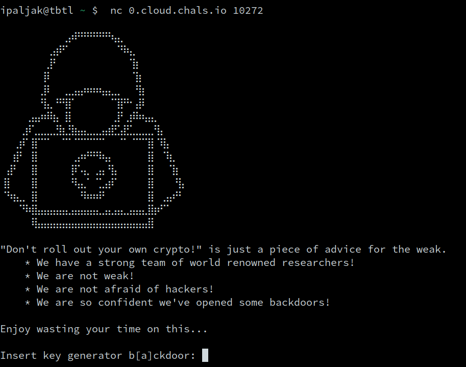
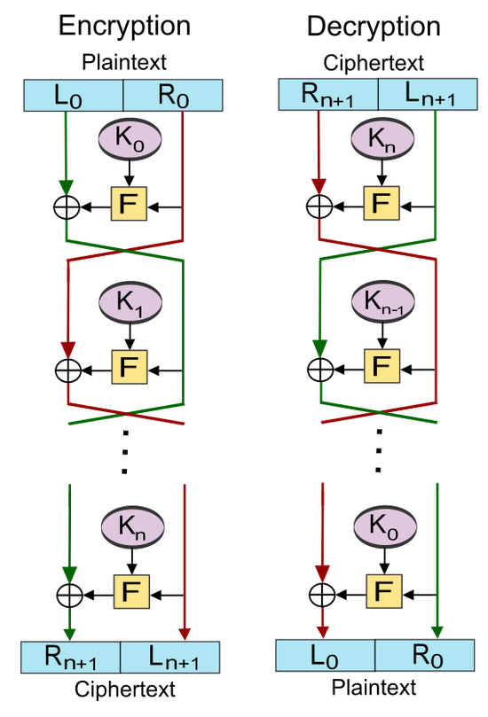

# Custom Cipher &mdash; Solution

We are given a file called `server.py` along with a connection string to the
remote server. When we connect to the server, we receive the following data:



It's not exactly clear what is expected of us just from the prompt, let's
further inspect the `server.py` source.

```python
def bxor(a, b):
    return bytes([_a ^ _b for _a, _b in zip(a, b)])


def hash(num):
    return hashlib.sha256(long_to_bytes(num)).digest()


class LCG:
    def __init__(self, a, b, m):
        self.a = a
        self.b = b
        self.m = m
        self.state = bytes_to_long(os.urandom(32))

    def next(self):
        self.state = (self.a * self.state + self.b) % self.m
        return self.state


class CustomCipher:
    N_KEYS = 16

    def __init__(self, keygen):
        self.keygen = keygen
        self.keys = [hash(keygen.next()) for _ in range(self.N_KEYS)]

        if len(set(self.keys)) < self.N_KEYS // 2:
            hack_detected()

    def encrypt(self, pt):
        L = [pt[:32]]
        R = [pt[32:]]

        for (i, ki) in enumerate(self.keys):
            iv = bxor(self.keys[i][16:], self.keys[(
                i + self.N_KEYS // 2) % self.N_KEYS][:16])
            F = AES.new(ki, AES.MODE_CBC, iv=iv)
            l, r = R[-1], bxor(L[-1], F.encrypt(R[-1]))
            if i + 1 == self.N_KEYS // 2:
                l, r = r, l
            L.append(l)
            R.append(r)

        return L[-1] + R[-1]

    def tamper(self, a, b, c):
        for idx in [a, b, c]:
            if not 1 <= idx <= self.N_KEYS:
                hack_detected()

        self.keys[a - 1] = bxor(self.keys[b - 1], self.keys[c - 1])
```

The `LCG` and `CustomCipher` classes implement the main cryptographic
primitives used in the challenge. This time, `LCG` seems to be reasonably
implemented, assuming that it is constructed with proper parameters $a$, $b$,
and $m$.

On the other hand, `CustomCipher` immediately looks like the most important
part of the challenge, hence the name. When constructed, an instance of
`CustomCipher` will generate `N_KEYS = 16` *keys*. These keys correspond to the
`SHA256` hash of integers computed by the given random number generator,
presumably an instance of `LCG`.

These keys are being used during encryption, but let's treat that function as
a black box for now and see what happens in `main()`.

```python
    m = 2 ** 256
    a = int(input("Insert key generator b[a]ckdoor: ")) % m
    b = int(input("Insert key generator [b]ackdoor: ")) % m

    cipher = CustomCipher(LCG(a, b, m))

    for i in range(1, 13):
        myprint(
            f"[{i}/12] Wanna tamper with the keys [(a, b, c) --> ka = kb ^ kc])?")

        s = input("> ")

        if s == "no":
            continue

        a, b, c = map(int, s.split())
        cipher.tamper(a, b, c)

    flag = open("flag.txt", "rb").read()
    assert(len(flag) == 64)

    flag_ct = cipher.encrypt(flag).hex()

    myprint(f"Here is your encrypted flag: {flag_ct}")
```

Looks like the modulus of the `LCG` is fixed to $2^{256}$, and other parameters
are chosen by the user.

The user then has the chance to *tamper* with the keys generated by the
`CustomCipher` instance. More precisely, they have the chance to set
$k_a = k_b \oplus k_c$ at most $12$ times.

After the user has used both backdoors, i.e. controlled the parameters of `LCG`
and tampered with the keys, the server proceeds to call the `cipher.encrypt()`
function on the flag and returns the ciphertext.

We obviously need to influence the `CustomCipher` in such a way that we can
somehow leak the flag from its ciphertext. Ideally, we would make the
`encrypt()` function a no-op, i.e. `cipher.encrypt(flag) == flag` would hold.

Let's now focus on the internals of `encrypt()`.

On a high level of abstraction, the following happens:
  * Plaintext is being split into two parts, left and right &mdash; $L$ and
    $R$.
  * For each generated key, some sort of computation is made over $L$ and $R$,
    and the result of that operation is also split into two parts.
  * The computation depends on the current key, a bit of randomness, and the
    left and right part obtained from the previous computation.
  * The result of the `encrypt()` function are the concatenated left and right
    parts after the last computation.

This immediately reminds us of a [Feistel
Network](https://en.wikipedia.org/wiki/Feistel_cipher).



Let's see if what we have is the correct implementation the Feistel network.
It's not hard to see that it's very close, but there is a subtle difference.
More precisely, the left and right parts are swapped after half of the key
rounds have been completed.

Notice that in the decryption network, the left and right parts of the
ciphertext are supposed to be swapped before being fed to the decryptor. In
other words, the implementation in `CustomCipher` seems to have concatenated
the Feistel networks for encryption and decryption.

This further strengthens our hypotheses that we can make the `encrypt()` a
no-op. The only thing we need to do is somehow make $k_1 = k_{16}$,
$k_2 = k_{15}$, and so on. In other words, if we succeed in making the `keys` list
palindromic, the server should simply print out the flag.

We can influence the contents of `keys` by abusing our backdoors. One approach
is the following:
  * Set $a = 1$ and $b = 2^{125}$. This will make the period of the seed equal
    to $8$ for every seed. In other words, now we have $k_1 = k_9$, $k_2 = k_{10}$,
    and so on.
  * Swap $k_1$ with $k_8$, $k_2$ with $k_7$, $k_3$ with $k_6$, and $k_4$ with $k_5$
    using the *key tampering* backdoor. In other words, we will
    [use three xor operations](https://betterexplained.com/articles/swap-two-variables-using-xor/)
    to swap a pair of keys. Since we need to swap four key pairs, the allowed $12$
    operations will do the trick.

Assembling everything in a solve script:

```python
from Crypto.Util.number import *
from pwn import *

m = 2 ** 256

r = process("./server.py")

l = log.progress("Injecting keygen backdoors")

r.recvuntil("Insert key generator b[a]ckdoor: ")
r.sendline(b"1")

r.recvuntil("Insert key generator [b]ackdoor: ")
r.sendline(str(m // 8).encode("utf-8"))

l.success("Done")

l = log.progress("Constructing palindromic Feistel network")

nkeys = 16
ids = [(i + 1, nkeys // 2 - i) for i in range(nkeys // 2)][:4]

for (x, y) in ids:
    r.recvuntil("\n> ")
    r.sendline((str(x) + " " + str(x) + " " + str(y)).encode("utf-8"))

    r.recvuntil("\n> ")
    r.sendline((str(y) + " " + str(y) + " " + str(x)).encode("utf-8"))

    r.recvuntil("\n> ")
    r.sendline((str(x) + " " + str(x) + " " + str(y)).encode("utf-8"))

l.success("Done")

flag_ct = r.recvline().decode("utf-8").strip().split(" ")[-1]
log.info("Encrypted flag: " + flag_ct)

l = log.progress("Decrypting flag")

flag_pt = flag_ct[64:] + flag_ct[:64]

l.success("Done")

log.info("Decrypted flag: " + bytes.fromhex(flag_pt).decode("utf-8"))
```

reveals the flag: `TBTL{Wh3n_y0u_r0ll_y0ur_0wn_Cryp7o_1_R0l1_my_ey35}`
