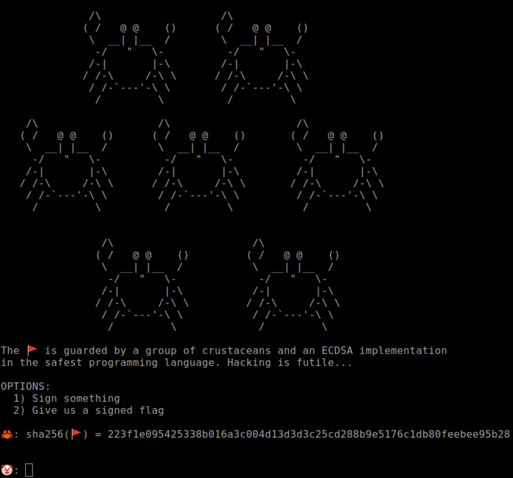

# Memory Safe ECDSA &mdash; Solution

We are given a `.zip` archive containing the implementation of the server along
with a connection string. When we connect to the server, we receive the
following data:



The setup seems straightforward:
  * We have the hash of the flag.
  * We can obtain
    [ECDSA](https://en.wikipedia.org/wiki/Elliptic_Curve_Digital_Signature_Algorithm)
    signatures of arbitrary messages
  * We must produce a valid digital signature for the flag.

If the server is correctly implemented, this should be impossible. Let's check out the
implementation.

```rust
const BASE_POINT_ORDER_BYTE_SIZE: usize = <NistP224 as Curve>::FieldBytesSize::USIZE;
```

The curve being used is [secp224r1](https://neuromancer.sk/std/nist/P-224),
there doesn't seem to be anything fishy about the curve choice.

Moving on to the piece of code that produces and verifies digital signatures.

```rust
fn sign(private_key: &[u8], m_bytes: &[u8]) -> (Vec<u8>, Vec<u8>) {
    let d = bytes_into_scalar(private_key);

    let k_bytes = random_byte_array::<BASE_POINT_ORDER_BYTE_SIZE>();
    let k = bytes_into_scalar(&k_bytes);

    let e = hex::decode(sha256::digest(m_bytes)).expect("Error");
    let z = GenericArray::clone_from_slice(&e[..BASE_POINT_ORDER_BYTE_SIZE]);

    let sig = d.try_sign_prehashed(k, &z).expect("Error");
    (sig.0.r().to_bytes().to_vec(), sig.0.s().to_bytes().to_vec())
}

fn verify(q: &AffinePoint, m_bytes: &[u8], sig: (&[u8], &[u8])) -> bool {
    let e = hex::decode(sha256::digest(m_bytes)).expect("Error");
    let z = GenericArray::clone_from_slice(&e[..BASE_POINT_ORDER_BYTE_SIZE]);

    let sig = Signature::from_scalars(
        GenericArray::clone_from_slice(sig.0),
        GenericArray::clone_from_slice(sig.1),
    )
    .expect("Error");

    q.verify_prehashed(&z, &sig).is_ok()
}
```

Again, the implementation looks reasonable.

We also know that the source of randomness is extremely important when
producing ECDSA signatures, both for generating the private key and the nonce
value $k$ when signing each message.

```rust
fn random_byte_array<const SIZE: usize>() -> [u8; SIZE] {
    let mut rng = RdRand::new().expect("Error");
    let mut ret = [0u8; SIZE];
    rng.try_fill_bytes(&mut ret).expect("Error");
    ret
}
```

The server uses Intel's [read random](https://en.wikipedia.org/wiki/RDRAND)
instruction, this should be a cryptographically secure source of randomness.

What about the interaction with the user?

```rust
    let mut scanner = Scanner::default();

    for _ in 0..MAX_QUERIES {
        output("\n");
        output("🤡: ");

        let option = scanner.next::<usize>();

        match option {
            1 => {
                output("\n");
                output("🦀: What do you want to sign?\n");
                output("\n");
                output("🤡: ");

                let message = scanner.next::<String>();
                let (r, s) = sign(&private_key, message.as_bytes());

                output("\n");
                output(format!("🦀: signature = {} {}\n", hex::encode(r), hex::encode(s)).as_str());
            }
            2 => {
                output("\n");
                output("🦀: So... you have a signed flag?\n");
                output("\n");
                output("🤡: ");

                let r = scanner.next::<String>();
                let s = scanner.next::<String>();

                let r_bytes = hex::decode(r).expect("Error");
                let s_bytes = hex::decode(s).expect("Error");

                match verify(q, flag.as_bytes(), (&r_bytes, &s_bytes)) {
                    false => {
                        output("\n");
                        output("🦀: hahaha... you clown... your efforts are futile!!\n");
                        std::process::exit(0x0);
                    }
                    true => {
                        output("\n");
                        output("🦀: Wow... looks like you're not a clown after all!\n");
                        output("\n");
                        output(format!("🦀: 🚩 = {}\n", flag).as_str());
                        std::process::exit(0x0);
                    }
                };
            }
            _ => done(),
        }
    }
```

Everything looks good here as well...

All in all, the implementation looks fine. If that's the case, what could
possibly allow us to obtain a correct flag signature?

Well, the code we see here is just the tip of the iceberg. Let's check its
dependencies to see if they somehow violate the security of the application.
Let's see what we have in `Cargo.toml`.

```toml
[package]
name = "memory_safe_ecdsa"
version = "0.1.0"
edition = "2021"

[dependencies]
ecdsa = { version = "=0.16", features = ["arithmetic", "hazmat"] }
hex = { version = "=0.4.3" }
p224 = { version = "=0.13", features = ["ecdsa"] }
rdrand = { version = "=0.8.0" }
sha256 = { version = "=1.1.2" }
```

All of these dependencies make sense in the context of an ECDSA challenge.
Still, depending on `rdrand` looks almost too secure. This should [scratch that
part of your mind](https://www.youtube.com/watch?v=QqknSms8VVI).

Let's dig a bit deeper around the
[rust_rdrand](https://github.com/nagisa/rust_rdrand) crate.  You'll quickly
find [this issue](https://github.com/nagisa/rust_rdrand/issues/18) claiming
that `rdrand::RdRand::try_fill_bytes` only partially fills the destination
vector in certain situations. Also, look at the username of the person
submitting the issue &mdash; they are from TBTL, this must be it!

Of course, the version of the dependency is the one containing that
vulnerability. Let's convince ourselves that it's actually relevant to the
challenge. For starters, the bug only manifests itself if the destination
vector has a size that is not a multiple of `WORD_SIZE` on that particular
machine. 

```rust
const BASE_POINT_ORDER_BYTE_SIZE: usize = <NistP224 as Curve>::FieldBytesSize::USIZE;

// lots of lines omitted

let k_bytes = random_byte_array::<BASE_POINT_ORDER_BYTE_SIZE>();

// lots of lines omitted

let private_key = random_byte_array::<BASE_POINT_ORDER_BYTE_SIZE>();
```

The order of our group has $224$ bits, this is $28$ bytes. There is a high
probability that the server has word size of $8$, and $28$ is not a multiple of
$8$. Therefore, there is a good chance that both private key and every nonce is
biased, i.e. has a suffix of zeros.

This leads us directly to a [very well-known lattice-based attack on
ECDSA](https://eprint.iacr.org/2019/023.pdf). The attack is very-well
documented in the paper, but you can also find [numerous writeups with
implementations](https://jsur.in/posts/2020-09-20-downunderctf-2020-writeups#impeccable)
of this attack from former CTFs. 

Putting it all together in a (relatively ugly) solve script:

```python
from Crypto.Util.number import *
from pwn import *

import ecdsa
import hashlib

MAX_QUERIES = 10

r = process("./target/release/memory_safe_ecdsa")


def get_flag_hash():
    l = log.progress("Getting flag hash")

    for _ in range(36):
        r.recvline()

    flag_hash = r.recvline().decode("utf-8").split()[-1].strip()

    l.success(f"Done -- {flag_hash}")

    return flag_hash


def collect_signatures():
    l = log.progress("Collecting signatures")

    sigs = {}

    for i in range(MAX_QUERIES - 1):
        r.recvuntil(b"\xf0\x9f\xa4\xa1: ")
        r.sendline('1'.encode("utf-8"))

        r.recvuntil(b"\xf0\x9f\xa4\xa1: ")
        r.sendline(str(i).encode("utf-8"))

        r.recvline()

        sig_tokens = r.recvline().decode("utf-8").strip().split()
        sig = (sig_tokens[-2], sig_tokens[-1])
        sigs[str(i)] = sig

    l.success("Done")

    return sigs


def leak_private_key():
    l = log.progress("Leaking private key")

    f = open("leak.in", "w")
    f.write(f"{n}\n")


    for (mi, (ri_hex, si_hex)) in sigs.items():
        hi = bytes_to_long(hashlib.sha256(mi.encode("utf-8")).digest()[:28])
        ri = bytes_to_long(bytes.fromhex(ri_hex))
        si = bytes_to_long(bytes.fromhex(si_hex))
        f.write(f"{hi} {ri} {si}\n")

    f.close()

    r1 = process("./leak.sage")
    key_leak = int(r1.recvline().decode("utf-8"))
    r1.close()

    l.success("Done " + str(key_leak))

    return key_leak


def sign_flag():
    l = log.progress("Signing flag")

    h = bytes_to_long(bytes.fromhex(flag_hash)[:28])
    k = 1337

    sig_r = (k * G).x()
    sig_s = inverse(k, n) * (h + sig_r * private_key) % n

    r_hex = hex(sig_r)[2:]
    s_hex = hex(sig_s)[2:]

    r.recvuntil(b"\xf0\x9f\xa4\xa1: ")
    r.sendline('2'.encode("utf-8"))

    r.recvuntil(b"\xf0\x9f\xa4\xa1: ")
    r.sendline((r_hex + " " + s_hex).encode("utf-8"))

    r.recvuntil(b"\xf0\x9f\x9a\xa9 = ")
    flag = r.recvline().decode("utf-8")
    r.close()

    l.success("Done " + flag)


Curve = ecdsa.NIST224p
G = Curve.generator
n = Curve.order

flag_hash = get_flag_hash()
sigs = collect_signatures()
private_key = leak_private_key()
sign_flag()
```

The script internally calls `leak.sage` to do the heavy lifting:

```sage
#!/usr/bin/sage

f_lines = open("leak.in", "r").readlines()

n = int(f_lines[0])
hashes, sigs = [], []

for line in f_lines[1:]:
  hi, ri, si = map(int, line.split())
  hashes.append(hi)
  sigs.append((ri, si))

Zn = Zmod(n)
N = len(sigs)
lo = 32
B = 2^(224 - 32)

M = [[0] * i + [n] + [0] * (N - i + 1) for i in range(N)]

Ts = [int(Zn(ri / (Zn(si)))) for (ri, si) in sigs]
M.append(Ts + [B/n, 0])

As = [int(Zn(-hi / (Zn(si * 2^lo)))) + B for (hi, (ri, si)) in zip(hashes, sigs)]
M.append(As + [0, B])

M = Matrix(M)

M = M.LLL()

for (i, row) in enumerate(M):
  if row[-1] == B:
    priv_key = -int(row[-2] * n / B) * 2^lo
    print(priv_key)
```

This finally reveals the flag: `TBTL{S4f3_l4n6u4g35_d0n7_pr3ven7_d3vel0p3r5_fr0m_wr1tin6_bug6y_c0d3}`
