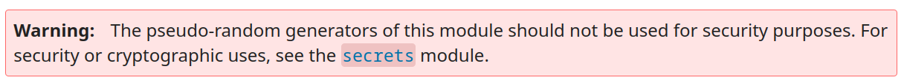

# Perfect Secrecy &mdash; Solution

We are given a file `challenge.py` along with its output in `output.txt`. Let's
inspect source code.

```python
#!/usr/bin/python3

import random


def encrypt(m_bytes):
    l = len(m_bytes)
    pad = random.getrandbits(l * 8).to_bytes(l, 'big')
    return bytes([a ^ b for (a, b) in zip(m_bytes, pad)]).hex()


def main():
    flag = open("flag.txt", "rb").read()
    assert(flag.startswith(b"Blockhouse{") and flag.endswith(b"}"))
    [print(encrypt(flag)) for _ in range(300)]


if __name__ == '__main__':
    main()
```

The code is short and sweet. Basically, we know the following:
  * Flag has the format `Blockhouse{...}`.
  * We have $300$ ciphertexts obtained by encrypting the flag using the
    [One-time Pad](https://en.wikipedia.org/wiki/One-time_pad).
  * Each ciphertext was obtained using a different, freshly generated key.

On the surface, this challenge is indeed unbreakable, as one-time pad really does
offer
[perfect secrecy](https://en.wikipedia.org/wiki/One-time_pad#Perfect_secrecy), and we
shouldn't be able to recover the flag if the implementation is correct.

For this property to hold, it is pivotal that:
  * The secret key has the same length as the plaintext.
  * The secret key must never be reused.
  * The secret key must be uniformly distributed in the set of all possible
    keys and independent of the plaintext.

The first two points obviously hold, what about the third one?

Let's investigate our source of randomness, i.e.
[random](https://docs.python.org/3/library/random.html) from Python's standard
library.

As soon as you open the documentation, you should notice the following big, red box:



This looks like our ticket to success. If we crack the random number generator,
it is game over. Let's take a look under the hood:

```text
Python uses the Mersenne Twister as the core generator. It produces 53-bit precision floats and has a period of 2**19937-1. The underlying implementation in C is both fast and threadsafe. The Mersenne Twister is one of the most extensively tested random number generators in existence. However, being completely deterministic, it is not suitable for all purposes, and is completely unsuitable for cryptographic purposes.
```

Ah, the core generator in Python's standard library is the [Mersenne
Twister](https://en.wikipedia.org/wiki/Mersenne_Twister). This is a well-known
pseudorandom number generator, and there are a bunch of resources online on
[how to crack
it](https://jazzy.id.au/2010/09/22/cracking_random_number_generators_part_3.html).
It is also easy to find [python-specific
implementations](https://github.com/tna0y/Python-random-module-cracker).

That's it, we just need $624$ consecutive $32$-bit integers from the generator.
Wait, what? Where are we supposed to get that?

Let's see what we can obtain...

We know the flag format, therefore, we know all of the randomly generated bits
that correspond to bits in the plaintext with characters `Blockhouse{}`. This
means we only know some partial output from the generator, such as:

```text
1111110001000001100000110111101000110110100111010100001010000011110001011010001111101001????????????????????????????????????????????????????????????????????????????????????????????????????????????????????????????????????????????????????????????????01101110
0001100011000011010110000000001001000101000001101000110010001011101011011011110110010111????????????????????????????????????????????????????????????????????????????????????????????????????????????????????????????????????????????????????????????????00101010
0110101100100001101101101010101111101010001010110011000110010100110011100111000010011110????????????????????????????????????????????????????????????????????????????????????????????????????????????????????????????????????????????????????????????????10001111
1000000000110100010000010110111010111111001000001011100111000011011111001110101100110101????????????????????????????????????????????????????????????????????????????????????????????????????????????????????????????????????????????????????????????????11100111
0111001011000101101010111010100000010001110000100011111011011000001010110110010000100000????????????????????????????????????????????????????????????????????????????????????????????????????????????????????????????????????????????????????????????????11100010
```

Luckily, given enough partial data, it is still possible to symbolically
determine the internal state of the generator. There are also correct,
python-specific implementations [available online](https://github.com/icemonster/symbolic_mersenne_cracker/tree/main).

Feeding our partial output into the symbolic cracker gives us the flag:
`Blockhouse{Cr4ck_m3_4_6en3r470r}`
