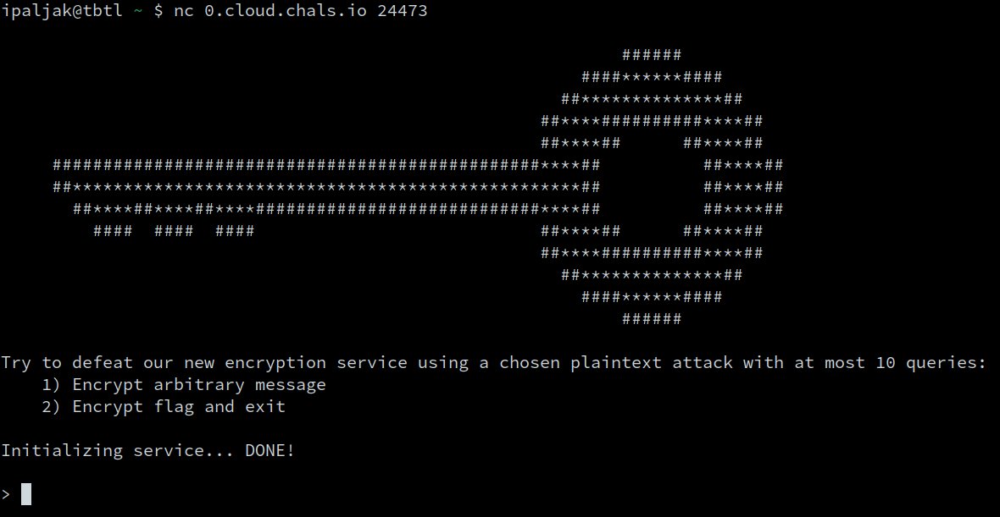
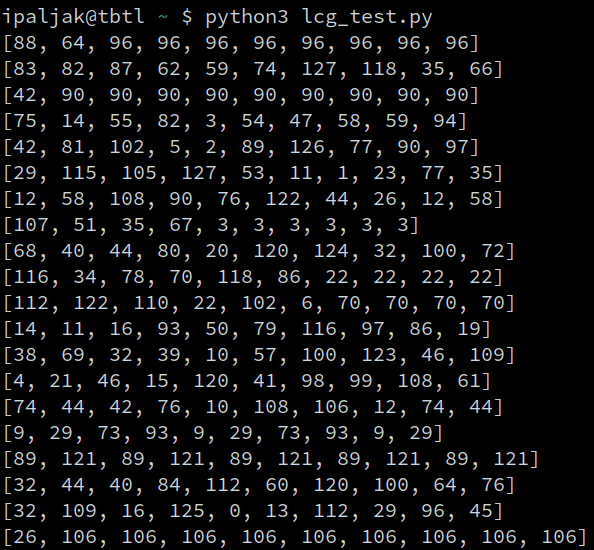

# Random Keys &mdash; Solution

We are given a file called `server.py` along with a connection string to the
remote server. When we connect to the server, we receive the following data:



Looks like we need to mount a [chosen plaintext
attack](https://en.wikipedia.org/wiki/Chosen-plaintext_attack) against the
encryption scheme from the challenge. Let's inspect `server.py` to find out
more about the encryption being used.

```python
class LCG:
    def __init__(self):
        self.m = 128
        self.state = bytes_to_long(os.urandom(1))
        self.a = bytes_to_long(os.urandom(1))
        self.b = bytes_to_long(os.urandom(1))

    def next(self):
        self.state = (self.a * self.state + self.b) % self.m
        return self.state


class RSA:
    BITS = 512

    def __init__(self):
        self.primes = [getPrime(self.BITS) for _ in range(128)]
        self.gen = LCG()

    def encrypt(self, msg):
        p = self.primes[self.gen.next()]
        q = self.primes[self.gen.next()]
        N = p * q
        e = 0x10001
        return (N, e, hex(pow(msg, e, N)))
```

The `LCG` class obviously implements a [Linear Congruential
Generator](https://en.wikipedia.org/wiki/Linear_congruential_generator) with
non-standard parameters. More precisely, the modulus is fixed $m = 128$, while
the *multiplier* $a$ and *increment* $b$ are randomly generated by invoking
`os.urandom(1)`, which basically returns a random byte.

The `RSA` class also implements the
[RSA](https://en.wikipedia.org/wiki/RSA_(cryptosystem)) in a non-standard way.
In its constructor, it generates a list of $128$ large prime numbers and
instantiates a random number generator based on previously-mentioned `LCG`
implementation.

Inspecting the `encrypt` function reveals that a *new* public key is generated
on the spot. More precisely, its modulus is the product of two primes chosen by
the `LCG`-based random generator. The remainder of the function performs
standard RSA encryption.

Let's inspect what happens in the main function of `server.py`.

```python
def main():
    signal.signal(signal.SIGALRM, handler)
    signal.alarm(300)

    myprint(BANNER)

    myprint("Try to defeat our new encryption service using a chosen plaintext attack with at most 10 queries:")
    myprint("    1) Encrypt arbitrary message")
    myprint("    2) Encrypt flag and exit")
    myprint("")

    print("Initializing service... ", end="", flush=True)
    cipher = RSA()
    myprint("DONE!")
    myprint("")

    for _ in range(10):
        action = input("> ")
        if action == '1':
            message = bytes_to_long(bytes.fromhex(input("Message (hex): ")))
            result = cipher.encrypt(message)
            myprint(f"Result (N, e, ct): {result}")
        elif action == '2':
            flag = bytes_to_long(open("flag.txt", "rb").read())
            result = cipher.encrypt(flag)
            myprint(f"Result (N, e, ct): {result}")
            exit(0)

```

The user basically has $10$ attempts to either:
  * obtain a ciphertext for a chosen plaintext
  * obtain the encrypted flag

Since the mere existence of the `LCG` implementation is suspicious, let's
analyze it further. It is very easy to see that any LCG, regardless of how we
choose its parameters, will eventually end up in a cycle for any given seed
value. In general, we want the length of that cycle, also known as the seed
period, to be as large as possible. It should also be obvious that not all
choices of parameters will ensure that property.

At this point, you may bring out your trusty pen and paper and calculate the
[expected](https://en.wikipedia.org/wiki/Expected_value) seed period given the
value $m$, and the fact that all parameters (including the seed) are generated
uniformly at random. An easier approach is to simply test this LCG
implementation and see what happens.

```python
#!/usr/bin/python3

from Crypto.Util.number import *

import os

class LCG:
    def __init__(self):
        self.m = 128
        self.state = bytes_to_long(os.urandom(1))
        self.a = bytes_to_long(os.urandom(1))
        self.b = bytes_to_long(os.urandom(1))

    def next(self):
        self.state = (self.a * self.state + self.b) % self.m
        return self.state


def main():
    for _ in range(20):
        gen = LCG()
        nums = []
        for _ in range(10):
            nums.append(gen.next())
        print(nums)


if __name__ == '__main__':
    main()
```

Running this code gives us



We can see that in $6$ out of $20$ experiments, the our generator ends up in a
cycle of length $1$. This is a serious flaw in the context of the challenge,
because it means that the last few encryptions will be done with an RSA modulus
$N = p^2$, which is obviously trivial to factorize. This completely breaks the
security of the encryption scheme.

More precisely, we can solve the challenge by:
  * Spamming the encryption oracle $9$ times hoping that the generator ends up
    in a cycle of length $1$.
  * Obtaining the encrypted flag in the $10$-th query.
  * Attempting to factorize $N$ by taking the square root. If it turns out that
    $N \ne p^2$, we simply try again.
  * Decrypt the flag by calculating the private key $d$ as the multiplicative inverse
    of $e$ modulo $\varphi$, where $\varphi = p(p - 1)$.

Putting it all together in the solve script

```python
from Crypto.Util.number import *
from gmpy2 import isqrt
from pwn import *

r = remote("0.cloud.chals.io", 24473)
print(r.recvuntil("Initializing service...").decode("utf-8"))

l = log.progress('Waiting for prompt')
r.recvuntil(b"> ")
l.success('Done')

l = log.progress('Spamming encryption oracle')
for i in range(9):
    r.sendline(b"1")
    r.recvuntil(b"Message (hex): ")
    r.sendline(b"ab")
    r.recvuntil(b"> ").decode("utf-8")
l.success('Done')

l = log.progress('Getting encrypted flag')
r.sendline(b"2")
(N, e, ct) = eval(r.recvline().decode("utf-8").split(":")[-1])
ct = int(ct, 16)
l.success('Done')

l = log.progress('Decrypting flag')

p = int(isqrt(N))
if p * p != N:
    l.failure('N is not a perfect square, try again!')
    exit(0)
phi = p * (p - 1)
d = inverse(e, phi)
flag = long_to_bytes(pow(ct, d, N)).decode("utf-8")
l.success(flag)
```

After a few attempts, this reveals the flag: `TBTL{L1n3ar_C0ngru3n71al_Gen3r4t0r5_W17h_R4nd0m_P4ram3t3r5_5uck!}`.
