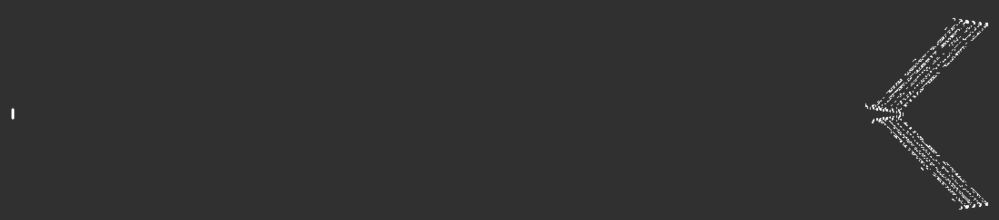
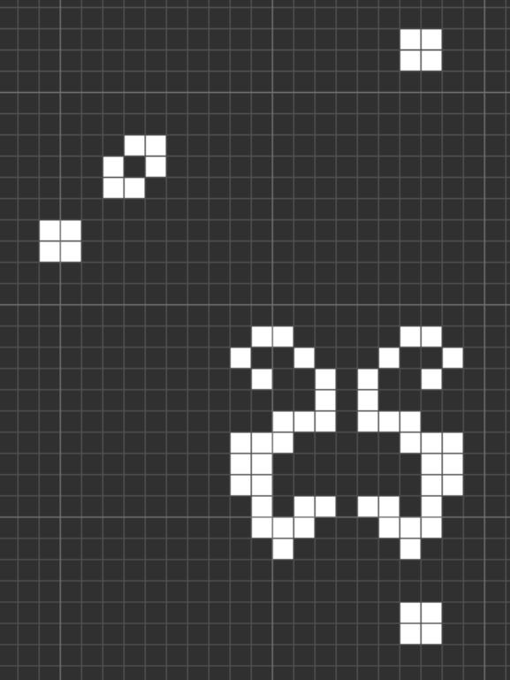

# A Matter of Life and Death &mdash; Solution

The challenge description mentions a cat, and you are given a very long list of
integer pairs called `alive`. Weird...

A reasonable approach would be to assume these integer pairs are coordinates.
Let's plot them and hope they simply spell out the flag.

The points definitely don't spell out the flag, but they don't look random
either. Let's enhance...

An experienced eye might recognize these shapes, but suppose we're not that
lucky.

Let's recap what we know so far:
  * When interpreted as points on a plane, the contents of `alive` file seem to
    produce some deliberatly made shapes in the plane.
  * The challenge description contains some weird sentence about the definition
    of a cat.
  * The title of the challenge, and the name of the file seem to revolve around
    life and death.

Let's google the sentence from the challenge description.

We quickly find [this video](https://www.youtube.com/watch?v=FdMzngWchDk) of
John Conway talking about his game of life. It should now be obvious that the
contents of `alive` represent the initial state of the world in the game of life.

Now we simply plug that into a simulator, and let the nature do its wonder:

**Easter Egg:** The flag contains a lyric from [this
song](https://www.youtube.com/watch?v=o7X3LYGV_N8), which in turn references
the [Monster group](https://en.wikipedia.org/wiki/Monster_group) &mdash; a
beautiful, very large, symmetrical thing that John Conway seemed to be
[somewhat interested in](https://www.youtube.com/watch?v=xOCe5HUObD4).
