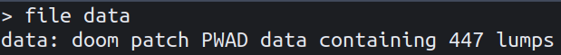

# All the Data &mdash; Solution

An unknown file called `data`, how original...

Let's go through the standard checklist to figure out what type of file we're
dealing with.

This looks useless, let's try invoking `strings data`. Bingo, we finally find
some useful information:

Looks like we are dealing with a [WAD file](https://doomwiki.org/wiki/WAD)
&mdash; a file format used by Doom engine based games for storing data. WAD
actually stands for "Where's All the Data?", which makes the challenge title
and description make more sense.

Wait a minute, how come `file data` didn't recognize the WAD format? Is it
corrupted? Let's try to inspect its bytes...

Of course, the first few bytes of the file header are wrong. Luckily, it's easy
to figure out they should spell out `PWAD`. After fixing the header in our
favourite hex editor, we get:

We may now be tempted to fire up DOOM and rip & tear through the game. While
being fun, it will be very hard, if not impossible to extract the flag this
way. Instead, let's open up the WAD file in a DOOM level editor, such as
[eureka](https://eureka-editor.sourceforge.net/).

Going through the good old [E1M1:
Hangar](https://doom.fandom.com/wiki/E1M1:_Hangar_(Doom)), we see the first
glimpse of the flag in the nukage pool outside.

Further inspecting the subsequent levels yields:

Putting it all together, we get the first flag: `TBTL{Wh47ch4_G07_1n_7h3r3?}`.

The second flag is hiding in [E1M8: Phobos
Anomaly](https://doom.fandom.com/wiki/E1M8:_Phobos_Anomaly_(Doom)), but it has a
twist:

We have the word `SCRAMBLE` and a bunch of numbers. Presumably, each number
corresponds to one character of the flag.

Crypto enthusiasts probably unscrambled the numbers without external help since
the cipher is not particularly strong. However, the intended way of approaching
this was to find the connection with DOOM, and that connection is [cheat code
encryption](http://justsolve.archiveteam.org/wiki/Doom_cheat_code_encryption).

Once we find that, it's trivial to uncover the second flag:
`TBTL{1n_h3r3?_D0oOo0M!}`.

**Easter Egg:** When combined, the two flags reference [this piece of
dialogue](https://www.youtube.com/watch?v=8K0oeM0wHeY) from [The Color of
Money](https://www.imdb.com/title/tt0090863/), which was the inspiration for
the name of the game that changed the world.
