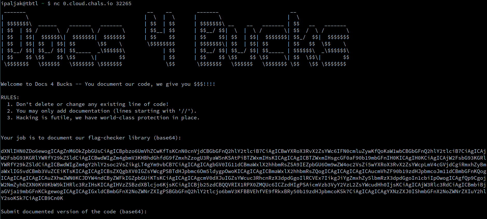
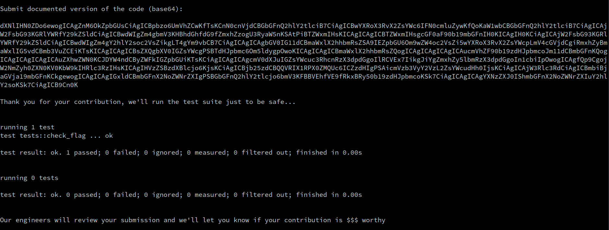
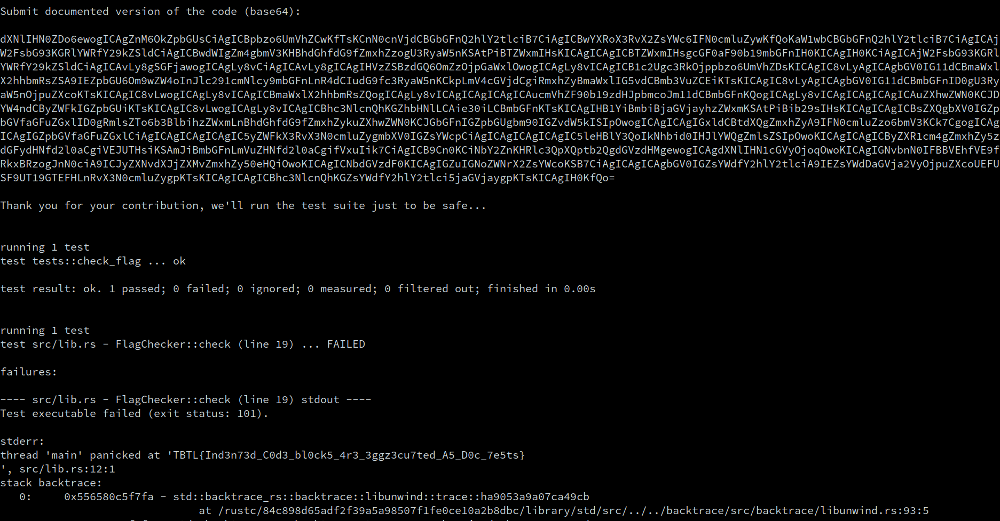

# Docs 4 Bucks &mdash; Solution

The challenge tells us to connect to `0.cloud.chals.io 32265`, let's see what
happens.



Ok, let's base64 decode the supposed `flag-checker` library:

```rust
use std::{
    fs::File,
    io::Read,
};

struct FlagChecker {
    path_to_flag: String,
}

impl FlagChecker {
    #[allow(dead_code)]
    pub fn new(path_to_flag: String) -> Self {
        Self { path_to_flag }
    }

    #[allow(dead_code)]
    pub fn check(self) -> bool {
        let mut file_handle = File::open(self.path_to_flag).expect("Flag file not found!");
        let mut flag = String::new();

        file_handle
            .read_to_string(&mut flag)
            .expect("Can't read file");

        return flag.starts_with("TBTL{") && flag.ends_with("}\n");
    }
}

#[cfg(test)]
mod tests {
    use super::*;

    const PATH_TO_FLAG: &str = "resources/flag.txt";

    #[test]
    fn check_flag() {
        let flag_checker = FlagChecker::new(PATH_TO_FLAG.to_string());
        assert!(flag_checker.check());
    }
}
```

Cool, looks like we got a simple piece of [Rust](https://www.rust-lang.org/)
code that should be able to read the flag and check that it's wrapped inside
`TBTL{}`.  The code reveals to us that the flag is stored at
`resources/flag.txt`.

The challenge tells us to document this code and send it back. Let's see what
happens when we send back exactly the same code we've received.



Ah, the test suite is going to be run and we will see its output. We probably
need to use this in order to get to the flag.

The challenge tells us the following rules:
  1. Don't delete or change any existing line of code!
  2. You may only add documentation (lines starting with '//').
  3. Hacking is futile, we have world-class protection in place.

Indeed, reasonable-yet-naive approaches will simply be met with:

```text
H4cking attempt detected...
No $$$ for you!!
```

These include things such as:
  * Changing the source code so that the flag is outputted on `stdout`
  * Changing the test so it dumps the flag on `stdout`
  * Adding a new test
  * etc.

Basically, it looks like we are only allowed to add comments. Could it be
possible that you can somehow execute commented code?

Absolutely! One of Rust's great features is that you are able to write
so-called [Documentation tests (or
doctests)](https://doc.rust-lang.org/rustdoc/write-documentation/documentation-tests.html).
Looks like we just need to add a bit of rustdoc containing a doctest that dumps
the flag, and we're good to go...

Let's "document" the public `check` function as:

```rust
    #[allow(dead_code)]
    /// Nothing to see here ;)
    ///
    /// ```
    /// use std::fs::File;
    /// use std::io::Read;
    /// let mut file_handle = File::open("resources/flag.txt".to_string()).expect("Flag file not found!");
    /// let mut flag = String::new();
    ///
    /// file_handle
    ///     .read_to_string(&mut flag)
    ///     .expect("Can't read file");
    ///
    /// assert!(false, "{}", flag);
    /// ```
    pub fn check(self) -> bool {
        let mut file_handle = File::open(self.path_to_flag).expect("Flag file not found!");
        let mut flag = String::new();

        file_handle
            .read_to_string(&mut flag)
            .expect("Can't read file");

        return flag.starts_with("TBTL{") && flag.ends_with("}\n");
    }
```

We submit the payload, and...

```text
H4cking attempt detected...
No $$$ for you!!
```

Darn it, looks like there are still some protections in place. After a few
trials you should easily be able to deduce that comments containing the
backtick characters are immediately discarded.

Digging a bit deeper through the Rust documentation, we realize that rustdoc is
actually valid markdown, and code blocks are by default executed as doctests.

How can you specify a code block in markdown? 

Again, digging through markdown documentation reveals [Indented Code
Blocks](https://spec.commonmark.org/0.30/#indented-code-blocks), and [Fenced
Code Blocks](https://spec.commonmark.org/0.30/#fenced-code-blocks). Backticks
are one way of constructing fenced code blocks, but you can construct them
using tildes (`~`) as well.

Let's construct a payload using indented code blocks:

```rust
use std::{
    fs::File,
    io::Read,
};

struct FlagChecker {
    path_to_flag: String,
}

impl FlagChecker {
    #[allow(dead_code)]
    pub fn new(path_to_flag: String) -> Self {
        Self { path_to_flag }
    }

    #[allow(dead_code)]
    /// Hack
    ///
    ///     use std::fs::File;
    ///     use std::io::Read;
    ///     let mut file_handle = File::open("resources/flag.txt".to_string()).expect("Flag file not found!");
    ///     let mut flag = String::new();
    ///
    ///     file_handle
    ///           .read_to_string(&mut flag)
    ///           .expect("Can't read file");
    ///
    ///     assert!(false, "{}", flag);
    pub fn check(self) -> bool {
        let mut file_handle = File::open(self.path_to_flag).expect("Flag file not found!");
        let mut flag = String::new();

        file_handle
            .read_to_string(&mut flag)
            .expect("Can't read file");

        return flag.starts_with("TBTL{") && flag.ends_with("}\n");
    }
}

#[cfg(test)]
mod tests {
    use super::*;

    const PATH_TO_FLAG: &str = "resources/flag.txt";

    #[test]
    fn check_flag() {
        let flag_checker = FlagChecker::new(PATH_TO_FLAG.to_string());
        assert!(flag_checker.check());
    }
}
```

Encoding this as base64 gets and sending to the server gets us:



There you go, the flag is
`TBTL{Ind3n73d_C0d3_bl0ck5_4r3_3ggz3cu7ted_A5_D0c_7e5ts}` (you could have
solved using tildes as well).

**Embarrassing moment:** The challenge author stumbled upon this fact by
accident, and [thought it was a bug in
Rust](https://github.com/rust-lang/rust/issues/107994).
