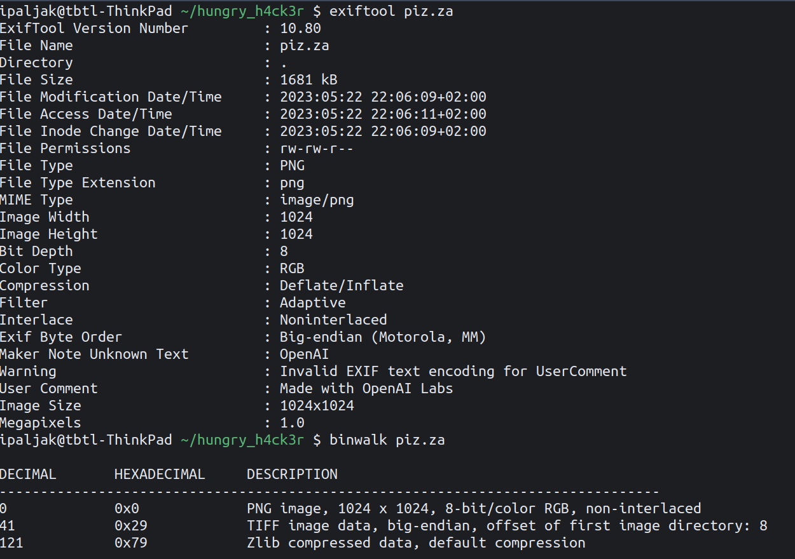
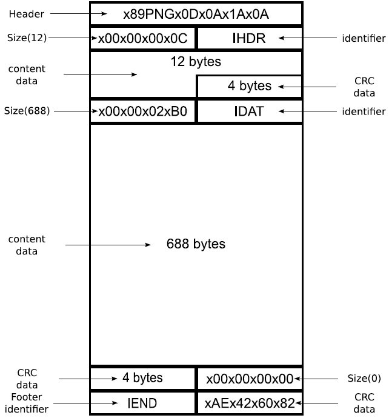
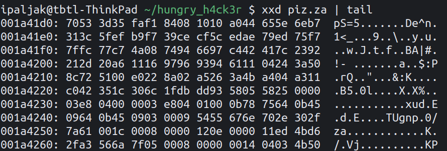

# Hungry Hacker &mdash; Solution

We are given a file called `piz.za`, let's figure out what it is.



Looks like we're dealing with a `.png` image, nothing suspicious thus far.
When opened, we see a [DALL-E](https://openai.com/product/dall-e-2) generated
image of a pizza slice.


At this point you may be tempted to run a bunch of steganography tools and
techniques, but they won't get you far.

Instead, let's dump the bytes of the file and see if something feels
suspicious.  Well, to know if something feels suspicious, we first need to know
what to expect. After some research, you should easily come across very detailed
descriptions of the `.png` file format.



It's easy to see that `piz.za` doesn't end with `IEND` followed by CRC data.



Since the image is displaying correctly, the file probably contains a valid PNG
footer, followed by some unknown bytes. Let's carve out the part of the file
following the PNG footer, and inspect it.

Note that these bytes end with `\0x04\0x03\0x4b\0x50`, or in ascii `♦♥KP`. When
reversed, the bytes spell out `PK♥♦`, which is one of the most famous file
headers, that of a `.zip` archive.

Indeed, reversing the suffix in question gets us a valid `.zip` archive.
Additionally, you may note that `piz.za` reversed spells out `az.zip`, which
may also point you in the right direction.

Extracting the contents of `az.zip` we get the following files:

```
0.png  2.png  4.png  6.png  8.png  A.png  C.png  E.png  G.png  I.png  K.png  M.png  O.png  {.png  P.png  R.png  T.png  V.png  X.png  Z.png
1.png  3.png  5.png  7.png  9.png  B.png  D.png  F.png  H.png  J.png  L.png  N.png  _.png  }.png  Q.png  S.png  U.png  W.png  Y.png
```

These images depict the characters from their corresponding titles. Inspecting
their metadata (e.g. using `exiftool`) reveals an interesting array of numbers.
For example, image `T.png` contains numbers `[1, 3, 6, 26, 30]` in its
metadata. We already know that the first and third letters of the flag must be
`T`, so its reasonable to assume that these numbers correspond to positions in
the flag where that specific character appears.

It's now just a matter of writing a simple script that uncovers the flag &mdash;
`TBTL{TH3R3_15_N0_PIZZ4_W1TH0UT_ZIP}`.
