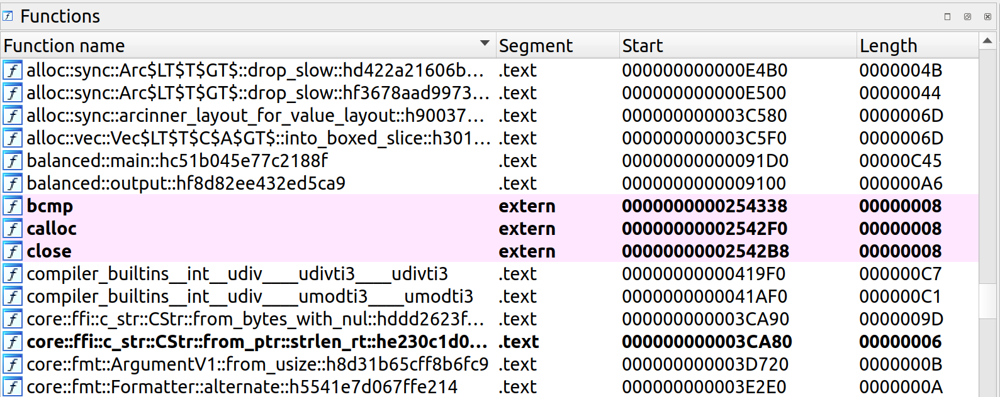

# Balanced -- Solution

We're given a 64-bit Linux command line executable, let's run it, give it some input and see what happens:

```c
$ ./balanced 

⠀⠀⠀⠀⠀⠀⠀⠀⠀⠀⠀⠀⣀⣀⣀⣀⣀⣀⠀⠀⠀⠀⠀⠀⠀⠀⠀⠀⠀⠀
⠀⠀⠀⠀⠀⠀⠀⢀⣠⠶⠞⢛⣿⣿⣿⣿⣿⣿⣿⣷⣶⣄⡀⠀⠀⠀⠀⠀⠀⠀
⠀⠀⠀⠀⠀⣠⡾⠋⠀⠀⣰⣿⣿⣿⣿⣿⣿⣿⣿⣿⣿⣿⣿⣷⣄⠀⠀⠀⠀⠀
⠀⠀⠀⢀⡾⠋⠀⠀⠀⢰⣿⣿⡿⠉⠀⠀⠉⢿⣿⣿⣿⣿⣿⣿⣿⣷⡀⠀⠀⠀
⠀⠀⢠⡞⠀⠀⠀⠀⠀⢸⣿⣿⣇⠀⠀⠀⠀⣸⣿⣿⣿⣿⣿⣿⣿⣿⣷⡄⠀⠀
⠀⠀⣾⠁⠀⠀⠀⠀⠀⠘⣿⣿⣿⣷⣤⣤⣾⣿⣿⣿⣿⣿⣿⣿⣿⣿⣿⣷⠀⠀
⠀⢸⡏⠀⠀⠀⠀⠀⠀⠀⠘⢿⣿⣿⣿⣿⣿⣿⣿⣿⣿⣿⣿⣿⣿⣿⣿⣿⡇⠀
⠀⢸⡇⠀⠀⠀⠀⠀⠀⠀⠀⠀⠉⠙⠛⠛⠻⠿⣿⣿⣿⣿⣿⣿⣿⣿⣿⣿⡇⠀
⠀⢸⣇⠀⠀⠀⠀⠀⠀⠀⠀⠀⠀⠀⠀⠀⠀⠀⠈⢻⣿⣿⣿⣿⣿⣿⣿⣿⡇⠀
⠀⠀⢿⡀⠀⠀⠀⠀⠀⠀⠀⠀⠀⢀⣤⣤⡀⠀⠀⠀⢻⣿⣿⣿⣿⣿⣿⡿⠀⠀
⠀⠀⠘⢧⠀⠀⠀⠀⠀⠀⠀⠀⢰⣿⣿⣿⣿⡆⠀⠀⢸⣿⣿⣿⣿⣿⡿⠃⠀⠀
⠀⠀⠀⠈⢷⣄⠀⠀⠀⠀⠀⠀⠈⠿⣿⣿⠿⠁⠀⠀⣸⣿⣿⣿⣿⡿⠁⠀⠀⠀
⠀⠀⠀⠀⠀⠙⢷⣄⠀⠀⠀⠀⠀⠀⠀⠀⠀⠀⠀⣰⣿⣿⣿⡿⠋⠀⠀⠀⠀⠀
⠀⠀⠀⠀⠀⠀⠀⠈⠙⠶⢦⣤⣄⣀⣀⣀⣠⣤⣾⡿⠿⠋⠁⠀⠀⠀⠀⠀⠀⠀
⠀⠀⠀⠀⠀⠀⠀⠀⠀⠀⠀⠀⠉⠉⠉⠉⠉⠉⠀⠀⠀⠀⠀⠀⠀⠀⠀⠀⠀⠀

🧘: Greetings dear traveller and welcome to my temple.

🧘: What do you seek?

🤖: hello

🧘: Sorry... we don't have that here. Bye!
```

Looks like the binary is expecting some magic string to proceed. Next step is to open the binary using a disassambler such as [IDA Free](https://hex-rays.com/ida-free/) and try to retrieve/examine the source code or the assembly. 

First thing to notice is that the function names indicate the binary is a compiled [Rust](https://www.rust-lang.org/) program. Also, by searching through the function names we obtain the most likely candidate for the main function -- `balanced::main`.



Decompiling the `balanced::main` function using the IDA's cloud decompiler feature gives us 400+ lines of barely readable C code. We proceed to analyze the code using IDA and the gdb debugger.

Next step is to look for the error message string `Sorry... we don't have that here. Bye!` in the compiled binary. After locating the string (along with the unicode prompt `🧘:`) at label `unk_422FF`, we track back the references and find the snippet of the `balanced::main` function that is most likely responsible for checking the magic string.

```c
  if ( v7 != 4 || *(_DWORD *)v80 != -1449484304 )
  {
    balanced::output::hf8d82ee432ed5ca9(&unk_422E0, 1LL);
    balanced::output::hf8d82ee432ed5ca9(&unk_422FF, 45LL);
    std::process::exit::h0304ff240336b59b();
  }
```

The number -1449484304 turns out to be the flag character 🚩 in unicode and the easy part is done.

```python
>>> import struct
>>> struct.pack("<i", -1449484304)
b'\xf0\x9f\x9a\xa9'
>>> b'\xf0\x9f\x9a\xa9'.decode('utf-8')
'🚩'
>>> 
```

When we give the 🚩 as input to the binary, it just crashes. Running with `RUST_BACKTRACE=1` indicates that it failed to open a file.

```
🤖: 🚩

🧘: To get your 🚩, you must look deep into your soul and find balance.
    Each time you find it, you get one step closer to your 🚩

thread 'main' panicked at 'Error: Os { code: 2, kind: NotFound, message: "No such file or directory" }', src/main.rs:93:62
stack backtrace:
   0: rust_begin_unwind
             at /rustc/d5a82bbd26e1ad8b7401f6a718a9c57c96905483/library/std/src/panicking.rs:575:5
   1: core::panicking::panic_fmt
             at /rustc/d5a82bbd26e1ad8b7401f6a718a9c57c96905483/library/core/src/panicking.rs:64:14
   2: core::result::unwrap_failed
             at /rustc/d5a82bbd26e1ad8b7401f6a718a9c57c96905483/library/core/src/result.rs:1791:5
   3: balanced::main
note: Some details are omitted, run with `RUST_BACKTRACE=full` for a verbose backtrace.
```

We use the `strace` tool to trace the system calls the binary is making, hoping to figure out what file is the tool trying to open.

```
$ echo 🚩 | strace ./balanced
... bunch of output ommited ...
openat(AT_FDCWD, "resources/flag.txt", O_RDONLY|O_CLOEXEC) = -1 ENOENT (No such file or directory)
... bunch of output ommited ...
```

Ok, the binary is trying to read the flag from `resources/flag.txt`, we create the file with the dummy flag and proceed. The binary expects another input, giving a string `hello` again leads to a crash.

```
🧘: What do you seek?

🤖: 🚩

🧘: To get your 🚩, you must look deep into your soul and find balance.
    Each time you find it, you get one step closer to your 🚩

🤖: hello
thread 'main' panicked at 'Error', src/main.rs:37:24
note: run with `RUST_BACKTRACE=1` environment variable to display a backtrace
```

Running with `RUST_BACKTRACE=1` gives us more details:
```
$ echo 🚩 hello | RUST_BACKTRACE=1 ./balanced 
... bunch of output ommited ...
stack backtrace:
   0: rust_begin_unwind
             at /rustc/d5a82bbd26e1ad8b7401f6a718a9c57c96905483/library/std/src/panicking.rs:575:5
   1: core::panicking::panic_fmt
             at /rustc/d5a82bbd26e1ad8b7401f6a718a9c57c96905483/library/core/src/panicking.rs:64:14
   2: core::panicking::panic_display
             at /rustc/d5a82bbd26e1ad8b7401f6a718a9c57c96905483/library/core/src/panicking.rs:135:5
   3: core::panicking::panic_str
             at /rustc/d5a82bbd26e1ad8b7401f6a718a9c57c96905483/library/core/src/panicking.rs:119:5
   4: core::option::expect_failed
             at /rustc/d5a82bbd26e1ad8b7401f6a718a9c57c96905483/library/core/src/option.rs:1879:5
   5: balanced::main
note: Some details are omitted, run with `RUST_BACKTRACE=full` for a verbose backtrace.
```

Function `expect_failed` is only called once from `balanced:main`. The name `FromStr$u20$for$u20$u128$GT$` indicates that the failure happens after attempting the convert a string to a 128-bit integer.
```
    core::num::_$LT$impl$u20$core..str..traits..FromStr$u20$for$u20$u128$GT$::from_str::h547f01180127bc9e();
    if ( (_BYTE)v63 )
      core::option::expect_failed::hc5e8507006410982();
```

Reasonable assumption is that we need to give an integer as input to the binary, let's try with 123456.

```
🧘: To get your 🚩, you must look deep into your soul and find balance.
    Each time you find it, you get one step closer to your 🚩

🤖: 123456

🧘: You can't find balance, there's nothing I can do for you...
```

As before, we look for the error message in the binary and, again, there is only one reference to the string. The code block immediatelly preceeding the error message looks like a good candidate for input checking logic.
```c
LABEL_76:
    v47 = *((_QWORD *)&v74 + 1);
    v46 = v74;
    v48 = 0;
    v49 = 100;
    do
    {
      v50 = v48 + ((v46 & 1) == 0 ? -1 : 1);
      if ( v50 < 0 )
        goto LABEL_100;
      v48 = ((v46 & 2) == 0 ? -1 : 1) + v50;
      if ( v48 < 0 )
        goto LABEL_100;
      *(_QWORD *)&v51 = v46;
      *((_QWORD *)&v51 + 1) = v47;
      v46 = v51 >> 2;
      v47 >>= 2;
      v49 -= 2;
    }
    while ( v49 );
    if ( v48 )
    {
LABEL_100:
      balanced::output::hf8d82ee432ed5ca9(&unk_422E0, 1LL);
      v56 = 66LL;
      v57 = &unk_42400;
LABEL_99:
      balanced::output::hf8d82ee432ed5ca9(v57, v56);
      std::process::exit::h0304ff240336b59b();
    }
```

The code seems to be examining the 100 bits of the integer received from the user and either incrementing or decrementing a counter. Stepping through the assembly in the debugger confirms the hypothesis. Furthermore, the error message is triggered as soon as the counter goes below zero or it is positive after the loop completes.

With the problem name as an additional hint, we conclude that the binary is checking if the binary representation of the integer corresponds to a well balanced parentheses expression assuming 0 is `"("` and 1 is `")"`. If we give it such integer as input, we get back one character of the flag.

```
$ python3 -c 'print(int("0"*50+"1"*50, 2))'
1125899906842623
$ echo 🚩 1125899906842623 | ./balanced 
... bunch of output ommited ...
🧘: To get your 🚩, you must look deep into your soul and find balance.
    Each time you find it, you get one step closer to your 🚩

🤖: 
🧘: d

🤖: 
```

Now, the solution is straightforward. The binary also stores the received values and will not give out flag characters for duplicates. However, it's not hard to generate different random integers satisfying the criteria above.

```python
from pwn import *
import random

def conn():
    context.update(arch='amd64', os='linux', terminal=['tmux', 'new-window'])
    if args.REMOTE:
        p = remote('0.cloud.chals.io', 13594)
    else:
        p = process('./balanced')
    return p

FLAG = '🚩'.encode('utf-8')

def genrandom():
    x = ['0011', '0101']
    a = ''
    for i in range(25):
        a += random.choice(x)    
    return a

p = conn()
flag = []
p.sendlineafter(b':', FLAG) 
for i in range(68):
    p.sendlineafter(b':', str(int(genrandom(), 2)).encode())
    ret = p.recvline() + p.recvline()
    flag.append(ret[-2])
print(bytes(flag))
p.interactive()
```

Running the solution above gives the flag.
```
$ python3 solve.py REMOTE
[+] Opening connection to 0.cloud.chals.io on port 13594: Done
b'\n.TBTL{Bal4nc3_15_n07_50m3th1n6_y0u_f1nd_1t5_s0m37h1ng_you_cre4t3} \n'
[*] Switching to interactive mode
[*] Got EOF while reading in interactive
$  
```
