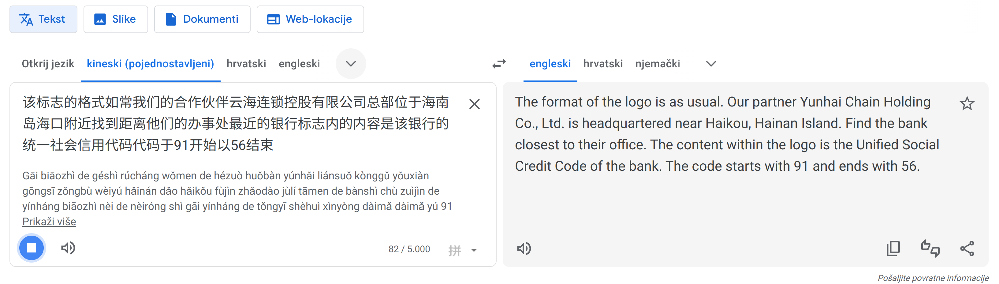
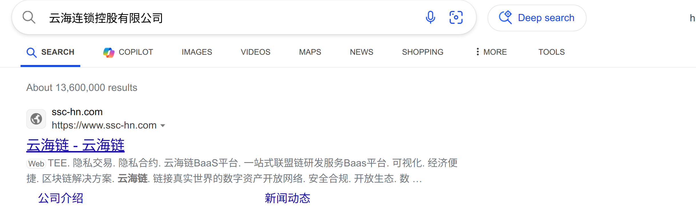
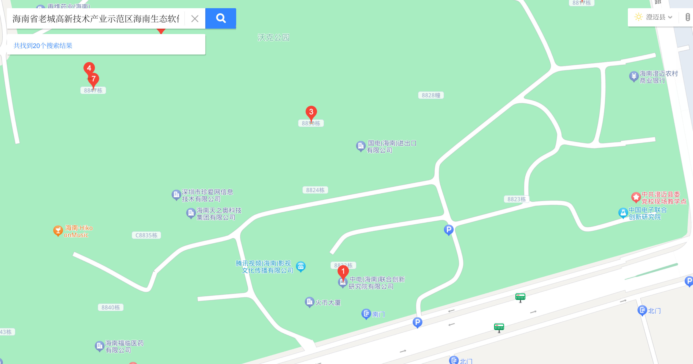
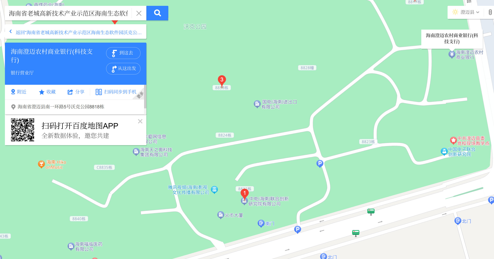
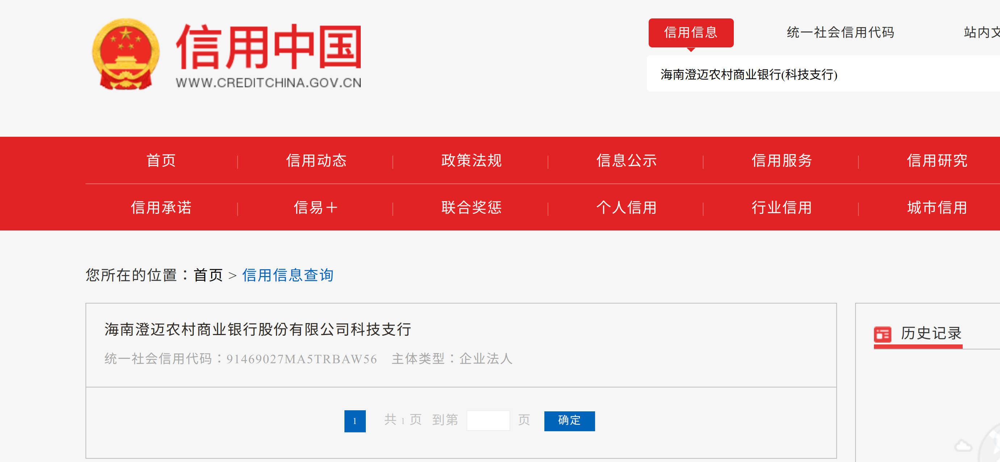

# Tower of Babel &mdash; Solution

*Disclaimer*: Author does not speak or understand Chinese, and the task was prepared using automated translation and text-to-speech tools --- it's quite possible that we messed something up, and we apologize in advance ¯\\\_(ツ)_/¯.

This OSINT task was inspired by authors' experience overcoming language barriers during a recent trip to [Hainan](https://en.wikipedia.org/wiki/Hainan), China. We are given a good luck message in Chinese, and an mp3 file with a short speech in, presumably, the same language. 

First step is to use an online translation and/or speech-to-text service to make sense of the message. Both Google and Bing do a decent job of translating speech, although some fidgeting is needed for good results --- audio needs to be slowed down a bit for Google translate, and broken into individual sentences for Bing translator that, annoyingly, stops translation after a very short break in the speech.

The game plan is to just follow the steps --- find the company, find their address, find nearest bank, figure out what the *[Unified Social Credit Code](https://en.wikipedia.org/wiki/Unified_Social_Credit_Identifier)* is and how to look it up. The twist is that commonly used tools in the Europe/US (where we believed most our players will be from) don't really work that well in China, and we will need to use local tools/services along with a translator service. Also, a mistake in one of the steps can lead us to a wild goose chase and waste a lot of time.

Looking up the company name in English does not get us far. However, if we manage to extract the right subsequence of Chinese characters and search for it using several different engines, we get a decent hit --- a company that is indeed on the Hainan island.

After going over their website with the translator, we locate the address and search for it (in Chinese) using [Baidu maps](map.baidu.com).

Exploring with Baidu map, we notice several banks nearby, the closest one seems to be a very short distance to the northeast from the office.

Finally, after a bit of searching around, we find that there are several services where one can look up company information in China. Many of them, however, block access from outside China. One that we can use is [Credit China](https://www.creditchina.gov.cn/).

Searching for the bank name (again using Chinese characters), gives us the content of our flag.

