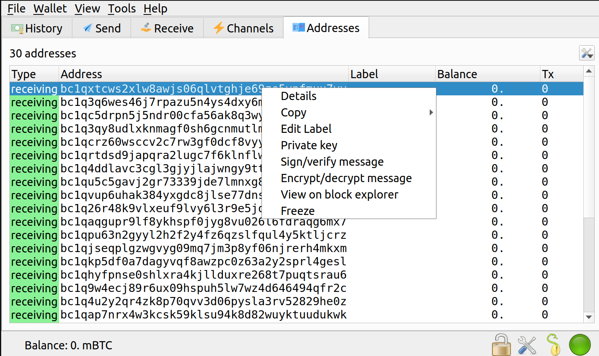

# Unfair Camera Wire &mdash; Solution

The challenge consist of an image `mnenomic.jpg` and an encrypted flag `flag.enc`. 
The image contains contains a sequence of 12 words, with two missing due to
water damage. 

If you ever used a self-custodial cryptocurrency wallet, you will probably notice
that this could be a [BIP 39 seed](https://github.com/bitcoin/bips/blob/master/bip-0039.mediawiki)
--- a wallet recovery phrase that can be used to generate wallet's 
cryptographic keys in a [deterministic fashion](https://github.com/bitcoin/bips/blob/master/bip-0032.mediawiki).

Analyzing the encrypted flag gives us further hints --- the base64 decoded 
binary starts with the magic bytes `BIE1`.

```bash
$ base64 -d < flag.enc
BIE1:�T�(2]�$P�:{�aj�79��y���}�aU}7,z���k�8;�j�5U����:�bU!���H�Eh�R��+E�
�)Z������V��0BIձ�r78Q��}L+d����5�$�Vm�oq5lc
```

Searching the web/github for the prefix `BIE1` gives the most likely 
candidate for the tool that encrypted the flag --- the popular Bitcoin wallet 
[Electrum](https://electrum.org/). 

After installing Electrum and playing with it, we discover that, indeed, by default
the wallet keys are generated deterministically from the 12 word recovery phrase
generated during setup. Furthermore, it supports the non-commonly-used feature of 
using Bitcoin public/private keys as encryption/decryption keys for arbitrary 
messages. We attempt to encrypt an message and discover that the ciphertext
has the same format as our encrypted flag.


We proceed with the assumptions that 1) `mnemonic.jpg` contains a phrase generated by 
an Electrum wallet during setup and 2) `flag.enc` is obtained by encrypting the 
flag with one of the default public keys generated by that Electrum wallet 
(and hence, can be decrypted with the corresponding private key).

Now, the game plan is straightforward --- we will brute force the two missing
words (from the BIP 39 word list), generate the Electrum keys from the phrase using 
the Electrum wallet, and attempt to decrypt the flag with the generated private keys.

The implementation is a bit more challenging (multiple keys can be derived from 
the  same seed phrase, and there are different types of seed phrases supported 
by Electrum), but the fact that the Python source code for Electrum is 
[freely available](https://github.com/spesmilo/electrum) greatly helps. 

Finally, in order to make the brute force search more efficient we use 
the fact that the first missing word seems to end with the letter `y`, and that 
the second missing word is short.  It turns out that we find the flag by
using the *default* settings --- the correct decryption key is the first wallet key
(at address index (0, 0)).

```python
#!/usr/bin/env python3

from electrum import mnemonic
from electrum import keystore
from electrum import util

PATTERN = 'west peanut {} cousin napkin unfair camera wire {} convince act oppose'

wordlist = mnemonic.Wordlist.from_file(mnemonic.filenames['en'])
ct = open('flag.enc', 'rt').read()

for a in wordlist:
    if a[-1] != 'y':
        continue
    for b in wordlist:
        if len(b) > 4:
            continue
        phrase = PATTERN.format(a, b)
        try:
            ks = keystore.from_seed(phrase, None, False)
            print(ks.decrypt_message((0, 0), ct, None))
        except (util.BitcoinException, util.InvalidPassword):
            pass
```

Running the script yields the flag after a few seconds.
```bash
$ python3 solve.py
b'TBTL{12_w0rd5_70_5h13ld_y0u_fr0m_7h3_c47457r0ph3}\n'
```
