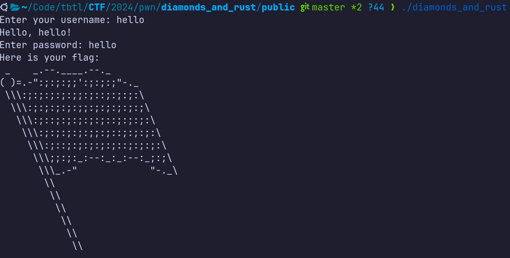
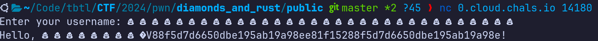
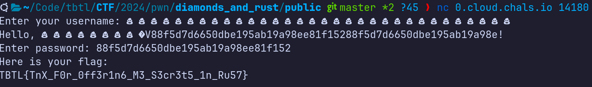

# Diamonds and Rust &mdash; Solution

We are given the source code, binary file, and a connection string to a remote
server running the code we are given. Let's run the binary, give it some input,
and see what happens.



Looks like the binary expects us to provide correct credentials. Let's inspect
the source code:

```rust
use std::{
    include_bytes,
    include_str,
    io::Write,
};

use secrecy::{
    ExposeSecret,
    Secret,
};

const MAX_USERNAME_LENGTH: usize = 32usize;
const MAX_PASSWORD_LENGTH: usize = 32usize;

#[repr(C)]
struct User {
    username_size: usize,
    password_size: usize,
    username: [u8; MAX_USERNAME_LENGTH],
    password: [u8; MAX_PASSWORD_LENGTH],
}

macro_rules! set_field {
    ($self:expr, $value:expr, $max_len:expr, $field_size:ident, $field:ident) => {
        $self.$field_size = $value.len();
        let value_chars = $value.chars().collect::<Vec<_>>();
        if value_chars.len() > $max_len {
            panic!("Value must not exceed {} characters!", $max_len);
        }

        unsafe {
            std::ptr::copy_nonoverlapping(
                $value.as_bytes().as_ptr(),
                $self.$field.as_mut_ptr(),
                value_chars.len(),
            );
        }
    };
}

impl User {
    fn empty() -> Self {
        Self {
            username_size: 0usize,
            password_size: 0usize,
            username: [0u8; MAX_USERNAME_LENGTH],
            password: [0u8; MAX_PASSWORD_LENGTH],
        }
    }

    fn set_username(&mut self, username: &str) {
        set_field!(self, username, MAX_USERNAME_LENGTH, username_size, username);
    }

    fn set_password(&mut self, password: &str) {
        set_field!(self, password, MAX_PASSWORD_LENGTH, password_size, password);
    }

    fn print_username(&self) -> () {
        for i in 0..self.username_size {
            unsafe {
                let current_byte = *self.username.get_unchecked(i);
                std::io::stdout()
                    .write_all(&[current_byte])
                    .expect("Error while printing the username");
            }
        }
    }

    fn is_admin(&self, admin_password: Secret<[u8; MAX_PASSWORD_LENGTH]>) -> bool {
        self.password == *admin_password.expose_secret()
    }
}

fn main() {
    let mut user = User::empty();
    let admin_password: Secret<[u8; 32]> =
        Secret::new(*include_bytes!("resources/admin_password.txt"));

    let read_input = |prompt: &str| -> String {
        print!("{}", prompt);
        std::io::stdout().flush().unwrap();

        let mut input = String::new();
        std::io::stdin()
            .read_line(&mut input)
            .expect("Error while reading input");
        input.trim().to_string()
    };

    let username = read_input("Enter your username: ");
    user.set_username(&username);

    print!("Hello, ");
    user.print_username();
    println!("!");

    let password = read_input("Enter password: ");
    user.set_password(&password);

    println!("Here is your flag: ");
    if user.is_admin(admin_password) {
        println!("{}", include_str!("resources/flag.txt"))
    } else {
        println!("{}", include_str!("resources/flag_art.txt"))
    }

    std::io::stdout().flush().unwrap();
}
```

So, the program is written in [rust](https://www.rust-lang.org/), and basically
does the following:
  * Asks the user for their username
  * Greets the user, outputting the username they provided
  * Asks the user for the password
  * Compares the password to the value written in `resources/admin_password.txt`
  * Dumps the flag if passwords match

Let's inspect the implementation of `set_field` macro:

```rust
macro_rules! set_field {
    ($self:expr, $value:expr, $max_len:expr, $field_size:ident, $field:ident) => {
        $self.$field_size = $value.len();
        let value_chars = $value.chars().collect::<Vec<_>>();
        if value_chars.len() > $max_len {
            panic!("Value must not exceed {} characters!", $max_len);
        }

        unsafe {
            std::ptr::copy_nonoverlapping(
                $value.as_bytes().as_ptr(),
                $self.$field.as_mut_ptr(),
                value_chars.len(),
            );
        }
    };
}
```

Rustaceans among you will quickly spot the confusion between the length of
`value` and `value.chars()`. More precisely, calling `len()` on value will
return the number of raw bytes, while calling `len()` on `value.chars()` will
take into account multibyte character inputs.

For example, consider this piece of Rust code:

```rust
fn main() {
    let value = "💩💩💩💩💩💩💩💩💩💩💩💩💩💩💩💩💩💩💩💩💩💩💩💩💩💩💩💩💩💩💩💩";
    // prints 128
    println!("{}", value.len());
    // prints 32
    println!("{}", value.chars().collect::<Vec<_>>().len());
}
```

This error basically allows us to input the username/password that contains
more than $32$ bytes, as long as it contains at most $32$ multibyte characters.

Let's give such a username to the binary and see what happens.



As you can see, some additional data after the username buffer is outputted. Could it be that this data contains the `admin_password`?


