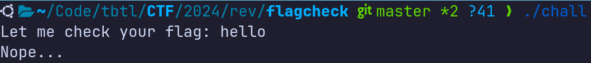

# Flagcheck &mdash; Solution

We are given a 64-bit Linux command line executable, let's run it, give it some
input and see what happens.



As the name of the challenge suggests, the binary seems to be a tool that
checks the validity of the flag. Let's open the binary using a disassambler
such as [IDA Free](https://hex-rays.com/ida-free/) and try to retrieve/examine
the source code or the assembly. We quickly identify the `main` function, and
decompiling using the IDA's cloud decompiler feature discovers the relatively
simple logic for checking the flag validity.

```c
int __fastcall main(int argc, const char **argv, const char **envp)
{
  int v3; // ebx
  int seed; // [rsp+4h] [rbp-6Ch]
  int i; // [rsp+8h] [rbp-68h]
  int j; // [rsp+Ch] [rbp-64h]
  char s[72]; // [rsp+10h] [rbp-60h] BYREF
  unsigned __int64 v9; // [rsp+58h] [rbp-18h]

  v9 = __readfsqword(0x28u);
  printf("Let me check your flag: ");
  __isoc99_scanf("%s", s);
  if ( strlen(s) != 63 )
    no();
  seed = 1;
  for ( i = 0; i < strlen(s); ++i )
    seed *= s[i];
  srand(seed);
  for ( j = 0; j < strlen(s); ++j )
  {
    v3 = s[j];
    if ( ((rand() % 256) ^ v3) != target[j] )
      no();
  }
  puts("Correct!");
  return 0;
}
```

The flag seems to be a string of $63$ characters, the validity of which is
checked by xoring its characters with the output of `rand() % 256` invocation
and comparing that value to a constant array `target`.

At the first glance, it looks like we need to crack the PRNG behind
[rand()](https://en.cppreference.com/w/c/numeric/random/rand). This is a simple
[LCG](https://en.wikipedia.org/wiki/Linear_congruential_generator), and we
should have enough information to crack it knowing the standard flag format.

However, the way the RNG was seeded should point us towards an easier solution.
The seed is an integer obtained by multiplying the ASCII values of all flag
characters. Since the flag is quite long, there is high probability that the
result of that multiplication is $0$ modulo $2^{32}$, which would mean that the
`seed` value is likely to be zero.

Indeed, implementing a solution assuming the RNG is seeded with zero quickly
reveals the flag: `TBTL{l1n3a4_C0ngru3n7i41_6en3r4t0r_b453d_Fl4G_Ch3ckEr_G03z_8rr}`.

```cpp
#include <iostream>
#include <string>

int target[] = {
    0x33, 0x84, 0x3d, 0x3f,
    0x2a, 0x93, 0x7b, 0x82,
    0x1a, 0xac, 0x8e, 0xf4,
    0xb1, 0xcb, 0x8d, 0x21,
    0x0e, 0xb7, 0x67, 0x96,
    0x2c, 0x81, 0xd3, 0xbc,
    0x29, 0x6c, 0x4b, 0x0d,
    0x00, 0xed, 0xfd, 0xee,
    0x56, 0x40, 0x52, 0xd5,
    0x05, 0x6d, 0x90, 0x3e,
    0x7a, 0x1b, 0x69, 0x23,
    0x1f, 0xb6, 0x1d, 0xbc,
    0x98, 0xd1, 0xa6, 0x83,
    0xe9, 0xeb, 0x13, 0x21,
    0x3d, 0xf8, 0x2b, 0x79,
    0x53, 0x4f, 0xa1, 0x4e,
};

std::string flag = "";

int main() {
  srand(0);

  for (int i = 0; i < 64; i++) {
    int k = rand();

    for (int j = 32; j <= 127; j++) {
      if ((j ^ k % 0x100) == target[i]) {
        flag += (char)j;
        break;
      }
    }
  }

  std::cout << flag << std::endl;
  return 0;
}
```
