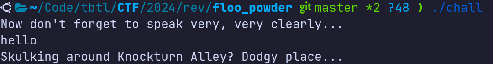
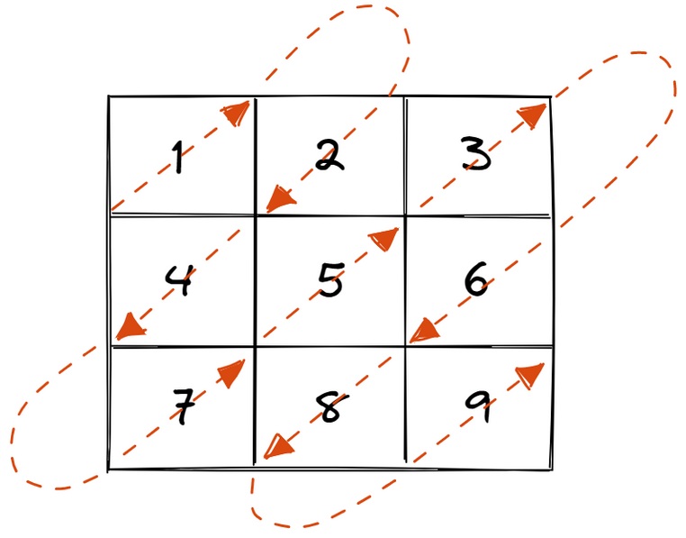

# Floo Powder &mdash; Solution

We are given a 64-bit Linux command line executable, let's run it, give it some
input and see what happens.



Let's open the binary using a disassambler such as [IDA
Free](https://hex-rays.com/ida-free/) and try to retrieve/examine the source
code or the assembly. We quickly identify the `main` function, and decompiling
using the IDA's cloud decompiler feature discovers the underlying logic.

```c
void __noreturn sub_11A9()
{
  puts("Skulking around Knockturn Alley? Dodgy place...");
  exit(0);
}

_BOOL8 __fastcall sub_11CA(int a1, int a2, int a3)
{
  _BOOL8 result; // rax

  result = byte_40C0[31 * a1 + a2] == 49;
  if ( (byte_40C0[31 * a1 + a2] == 49) != (((dword_4020[a3 / 31] >> (31 - a3 % 31 - 1)) & 1) != 0) )
    sub_11A9();
  return result;
}

__int64 __fastcall main(int a1, char **a2, char **a3)
{
  int i; // [rsp+0h] [rbp-20h]
  int j; // [rsp+4h] [rbp-1Ch]
  int v6; // [rsp+8h] [rbp-18h]
  int v7; // [rsp+Ch] [rbp-14h]
  int v8; // [rsp+10h] [rbp-10h]
  int v9; // [rsp+14h] [rbp-Ch]
  int v10; // [rsp+18h] [rbp-8h]
  int v11; // [rsp+1Ch] [rbp-4h]

  puts("Now don't forget to speak very, very clearly...");
  for ( i = 0; i < 31; ++i )
  {
    __isoc99_scanf("%s", &byte_40C0[31 * i]);
    if ( strlen(&byte_40C0[31 * i]) != 31 )
      sub_11A9();
    for ( j = 0; j < 31; ++j )
    {
      if ( byte_40C0[31 * i + j] != 49 && byte_40C0[31 * i + j] != 48 )
        sub_11A9();
    }
  }
  v6 = 0;
  v7 = 0;
  v8 = 0;
  v9 = 1;
  while ( v6 < 31 && v7 < 31 )
  {
    sub_11CA(v6, v7, v8++);
    if ( v9 == 1 )
    {
      v10 = v6 - 1;
      v11 = v7 + 1;
    }
    else
    {
      v10 = v6 + 1;
      v11 = v7 - 1;
    }
    if ( v10 < 0 || v10 == 31 || v11 < 0 || v11 == 31 )
    {
      if ( v9 == 1 )
      {
        v6 += v7 == 30;
        v7 += v7 < 30;
      }
      else
      {
        v7 += v6 == 30;
        v6 += v6 < 30;
      }
      v9 = 1 - v9;
    }
    else
    {
      v6 = v10;
      v7 = v11;
    }
  }
  puts("Welcome to Diagon Alley!");
  return 0LL;
}
```

After analysing the decompiled source code, we quickly realise that the
expected input to the binary is a `31x31` matrix of characters `0` or `1`.

The remainder of the code visits the characters of the matrix in a particular
order, and compares them to the particular bits of the constant array of
integers baked into the binary.

At this point, you might have analysed the order in which the input grid
characters are visited, and have realized it looks something like this:



In other words, the characters are visited along the diagonals, alternating
between moving top-to-bottom and bottom-to-top.

You could have also stopped analysing the binary, and reimplemented the logic
that additionally outputs the matrix that the binary accepts.

That particular matrix turns out to be:

```
0000000000000000000000000000000
0111111100100011010010011111110
0100000101101100111100010000010
0101110100111001100001010111010
0101110101101010111100010111010
0101110100010110000001010111010
0100000101010011100001010000010
0111111101010101010101011111110
0000000000000100110111000000000
0111110111110110001011101010100
0001001010100010010001111111100
0101000110101111111101001100000
0100110011111000100100100110100
0001010101101010101111001011000
0000011001110110011001000101000
0111000100100011101001010111000
0111110001010100010000011110110
0100101111000111000000000110100
0101101000100011011011101110100
0100011100011101101001111011000
0101100011011001100001101010100
0100100100111000110001111101000
0000000001010110000111000101000
0111111101100011110011010100000
0100000100000110010101000100000
0101110101000101101101111111110
0101110101000000010011101110110
0101110101111100100111011100100
0100000101101001110010101000100
0111111101111000111110011111000
0000000000000000000000000000000
```

Interpreting zeroes as white pixels and ones as black pixels reveals that the
correct input to the binary is a valid QR code.


Of course, the QR code contains the flag: `TBTL{Wh47_D1d_H3_5aY_D34r?_D14g0nal1y...}`.

Here is an example of a solve script:

```python3
mask = [
    80365906,
    1769232938,
    1128934032,
    919644615,
    268622536,
    76757739,
    1906480421,
    1839781169,
    1764071040,
    561586492,
    1569349783,
    1791633442,
    1419111682,
    626666709,
    380985946,
    780831418,
    762273460,
    1434245458,
    750052501,
    34417081,
    244000852,
    1179042137,
    1198822017,
    1411554630,
    1813829152,
    133697279,
    78464676,
    854310990,
    1336677923,
    1611538180,
    617426944,
]

X = [["$" for _ in range(31)] for _ in range(31)]


def set(x, y, cnt):
    X[x][y] = ["█", " "][((mask[cnt // 31] >> (31 - cnt % 31 - 1)) & 1)]


x = 0
y = 0
cnt = 0
dir = 1
while x < 31 and y < 31:
    set(x, y, cnt)
    cnt += 1
    if dir == 1:
        v10 = x - 1
        v11 = y + 1
    else:
        v10 = x + 1
        v11 = y - 1
    if v10 < 0 or v10 == 31 or v11 < 0 or v11 == 31:
        if dir == 1:
            x += y == 30
            y += y < 30
        else:
            y += x == 30
            x += x < 30
        dir = 1 - dir
    else:
        x = v10
        y = v11

for row in X:
    print("".join(row))

```
