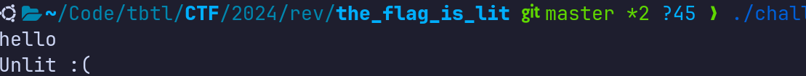

# The Flag is Lit &mdash; Solution

We are given a 64-bit Linux command line executable, let's run it, give it some
input and see what happens.



Let's open the binary using a disassambler such as [IDA
Free](https://hex-rays.com/ida-free/) and try to retrieve/examine the source
code or the assembly. We quickly identify the `main` function, and decompiling
using the IDA's cloud decompiler feature discovers the underlying logic.

```c
void __noreturn sub_1760()
{
  __printf_chk(1LL, "Unlit :(\n");
  exit(0);
}

void __fastcall __noreturn main(int a1, char **a2, __int64 a3)
{
  const char *v3; // rbp
  char *v4; // rbx
  char *v5; // rax

  v3 = s;
  v4 = &s[312];
  do
  {
    __isoc99_scanf(&off_2031, v3, a3);
    if ( strlen(v3) != 312 )
      goto LABEL_7;
    v5 = (char *)v3;
    do
    {
      a3 = (unsigned __int8)*v5;
      if ( (_BYTE)a3 != 46 && (_BYTE)a3 != 35 )
        goto LABEL_7;
      ++v5;
    }
    while ( v5 != v4 );
    v4 = v5 + 317;
    v3 += 317;
  }
  while ( v5 + 317 != &s[2531] );
  sub_15B0();
LABEL_7:
  sub_1760();
}
```

We conclude that the binary expects a grid of characters with $7$ rows and
$312$ columns that contains only characters `.` or `#`.

If that's the case, the binary proceeds to call function `sub_15B0()`,
otherwise fails and outputs `Unlit :(`.

Let's explore `sub_15B0`:

```c
__int64 sub_1360()
{
  void *v0; // rax
  bool v1; // zf
  char *v2; // rdx
  char *v3; // rcx
  __int64 result; // rax

  memset(&unk_6060, 0, 0xED8uLL);
  v0 = qword_6040;
  v1 = qword_6040 == (void *)qword_6048;
  *((_DWORD *)&unk_6060 + 950) = 0;
  if ( !v1 )
    qword_6048 = (__int64)v0;
  v2 = s;
  v3 = (char *)&unk_6060;
  do
  {
    for ( result = 0LL; result != 312; ++result )
      v3[result] = v2[result] == 35;
    v2 += 317;
    v3 += 317;
  }
  while ( v2 != &s[2219] );
  return result;
}

__int64 __fastcall sub_13E0(int a1, unsigned int a2)
{
  __int64 v3; // rbp
  __int64 v4; // rbp
  __int64 v5; // rdx
  int v6; // ecx
  __int64 result; // rax
  __int64 *v8; // r14
  __int64 v9; // rdx
  __int64 v10; // rcx
  __int64 v11; // rax
  bool v12; // cf
  unsigned __int64 v13; // rax
  __int64 v14; // rax
  __int64 v15; // r13
  char *v16; // r15
  int *v17; // rdx
  char *v18; // rcx
  __int64 *v19; // rdx
  __int64 v20; // rsi
  unsigned __int64 v21; // r13
  char *v22; // rax
  __int64 v23; // [rsp+8h] [rbp-40h]
  __int64 v24; // [rsp+8h] [rbp-40h]

  v3 = qword_6048;
  if ( qword_6048 == qword_6050 )
  {
    v8 = (__int64 *)qword_6040;
    v9 = qword_6048 - (_QWORD)qword_6040;
    v10 = (qword_6048 - (__int64)qword_6040) >> 3;
    if ( v10 == 0xFFFFFFFFFFFFFFFLL )
    {
      std::__throw_length_error("vector::_M_realloc_insert");
      return sub_15B0();
    }
    v11 = 1LL;
    if ( v10 )
      v11 = (qword_6048 - (__int64)qword_6040) >> 3;
    v12 = __CFADD__(v10, v11);
    v13 = v10 + v11;
    if ( v12 )
    {
      v21 = 0x7FFFFFFFFFFFFFF8LL;
    }
    else
    {
      if ( !v13 )
      {
        v14 = 8LL;
        v15 = 0LL;
        v16 = 0LL;
LABEL_16:
        v17 = (int *)&v16[v9];
        *v17 = a1;
        v17[1] = a2;
        if ( (__int64 *)v3 != v8 )
        {
          v18 = v16;
          v19 = v8;
          do
          {
            v20 = *v19++;
            v18 += 8;
            *((_QWORD *)v18 - 1) = v20;
          }
          while ( (__int64 *)v3 != v19 );
          v14 = (__int64)&v16[v3 - (_QWORD)v8 + 8];
        }
        if ( v8 )
        {
          v23 = v14;
          operator delete(v8);
          v14 = v23;
        }
        qword_6040 = v16;
        qword_6048 = v14;
        qword_6050 = v15;
        goto LABEL_3;
      }
      if ( v13 > 0xFFFFFFFFFFFFFFFLL )
        v13 = 0xFFFFFFFFFFFFFFFLL;
      v21 = 8 * v13;
    }
    v24 = qword_6048 - (_QWORD)qword_6040;
    v22 = (char *)operator new(v21);
    v9 = v24;
    v16 = v22;
    v15 = (__int64)&v22[v21];
    v14 = (__int64)(v22 + 8);
    goto LABEL_16;
  }
  *(_DWORD *)qword_6048 = a1;
  v4 = v3 + 8;
  *(_DWORD *)(v4 - 4) = a2;
  qword_6048 = v4;
LABEL_3:
  *((_BYTE *)&unk_6060 + 317 * a1 + (int)a2) ^= 1u;
  v5 = 0LL;
  v6 = 0;
  result = (unsigned int)(a1 + 1);
  if ( a1 + 1 < 0 )
    goto LABEL_6;
  while ( 1 )
  {
    if ( a1 <= 6 && a2 <= 0x137 )
    {
      result = (__int64)&unk_6060 + 317 * (int)result;
      *(_BYTE *)(result + (int)(a2 + v6)) ^= 1u;
    }
LABEL_6:
    v5 += 4LL;
    if ( v5 == 16 )
      break;
    while ( 1 )
    {
      v6 = *(_DWORD *)((char *)&unk_2040 + v5);
      result = (unsigned int)(a1 + *(_DWORD *)((char *)&unk_2050 + v5));
      if ( (int)result >= 0 )
        break;
      v5 += 4LL;
      if ( v5 == 16 )
        return result;
    }
  }
  return result;
}

__int64 sub_15B0()
{
  unsigned int j; // r15d
  unsigned int v1; // eax
  __int64 v2; // rdi
  char *v3; // r15
  _BYTE *v4; // r13
  unsigned int k; // r14d
  char *v6; // rsi
  char v7; // cl
  char *v8; // rax
  char v9; // dl
  __int64 result; // rax
  __int64 v11; // rax
  int m; // esi
  bool v13; // si
  unsigned int i; // [rsp+Ch] [rbp-3Ch]

  for ( i = 0; i != 128; result = i )
  {
    sub_1360();
    for ( j = 0; j != 7; ++j )
    {
      while ( 1 )
      {
        v1 = i;
        if ( _bittest((const int *)&v1, j) )
          break;
        if ( ++j == 7 )
          goto LABEL_6;
      }
      v2 = j;
      sub_13E0(v2, 0LL);
    }
LABEL_6:
    v3 = (char *)&unk_6060;
    do
    {
      v4 = v3;
      for ( k = 0; k != 7; ++k )
      {
        if ( *v4 )
          sub_13E0(k, 1 - ((unsigned int)&unk_6197 - 311) + (unsigned int)v3);
        v4 += 317;
      }
      ++v3;
    }
    while ( v3 != (char *)&unk_6197 );
    v6 = (char *)&unk_6198;
    v7 = 1;
    do
    {
      v8 = v6 - 312;
      do
      {
        v9 = *v8++;
        v7 &= v9 ^ 1;
      }
      while ( v8 != v6 );
      v6 = v8 + 317;
    }
    while ( &unk_6A43 != (_UNKNOWN *)(v8 + 317) );
    if ( v7 && qword_6048 - (_QWORD)qword_6040 == 8896 )
    {
      v11 = 0LL;
      for ( m = 3; ; m = *(_DWORD *)((char *)&unk_31C0 + v11) )
      {
        if ( *(_DWORD *)((char *)qword_6040 + 2 * v11) == m )
        {
          v13 = *(_DWORD *)((char *)qword_6040 + 2 * v11 + 4) == *(_DWORD *)((char *)&unk_2060 + v11);
          v11 += 4LL;
          v7 &= v13;
          if ( v11 == 4448 )
          {
LABEL_25:
            if ( v7 )
            {
              __printf_chk(1LL, "Lit \\m/\n");
              exit(0);
            }
            break;
          }
        }
        else
        {
          v11 += 4LL;
          v7 = 0;
          if ( v11 == 4448 )
            goto LABEL_25;
        }
      }
    }
    ++i;
  }
  return result;
}
```

After significant period of tedious analysis, we crack the idea behind these
functions:
  * `sub_1360` is an initialization function of sorts. Setting the matrix of
  booleans to a state defined by the grid from the input (`#` representing `true`)
  * `sub_15B0` implements some relatively complex logic which in certain branches of execution calls calls `sub_13E0`.
  * `sub_13E0` seems to take the row and column of a cell in the matrix of
  booleans and flip the state of that element and its four neighbouring
  elements. The function is hard to read due to bloat from C++ STL, but this
  can be easily seen by inspecting what happens in the debugger.
  * We can't reach the **win** state in `sub_15B0` if some boolean value in
  the matrix is non-zero.

Based on what we know, along with the hints from the challenge title and
description (*With the lights out, its less dangerous*), we make an educated
guess that the logic in the binary is somehow related to the [Lights
Out!](https://en.wikipedia.org/wiki/Lights_Out_(game)) game.

It fits, the goal of the game is to turn all the lighs out, and a single move
flips the lights of a given cell and all of its neighbours.

With that hypothesis in mind, let's take what other conditions are needed to
reach the win state. Let's zoom in here:

```c
for ( m = 3; ; m = *(_DWORD *)((char *)&unk_31C0 + v11) )
{
    if ( *(_DWORD *)((char *)qword_6040 + 2 * v11) == m )
    {
      v13 = *(_DWORD *)((char *)qword_6040 + 2 * v11 + 4) == *(_DWORD *)((char *)&unk_2060 + v11);
      v11 += 4LL;
      v7 &= v13;
      if ( v11 == 4448 )
      {
    LABEL_25:
        if ( v7 )
        {
          __printf_chk(1LL, "Lit \\m/\n");
          exit(0);
        }
        break;
      }
    }
    else
    {
      v11 += 4LL;
      v7 = 0;
      if ( v11 == 4448 )
        goto LABEL_25;
    }
}
```

We see some comparisons with the constant arrays `unk_31C0` and `unk_2060`
baked into the binary. Inspecting these arrays we can see that one of them
contains numbers ranging from `0` to `6`, while the other contains numbers
from `0` to `311`. These must be the coordinates within the grid, let's plot
them...

```
.#....####.#.#.#.#...#....####..###..#.#.#.#..###.###.#....##.###..#...#...#.#....##.#.#..#..#......##....##.#..#.##...#..#.#.#...#.##.##..#.#.####.###....##.#.#..#.###.#.....#.#..#.#####..##.###..#..#.#####......##........####.###..#...#..###....###...###..#.##..###.##.####.#####..#...........#....#...#.#.##.#
...##.#.###.#.#.####...##.##.###.#.###..#.##...#....#.#.##.###.##.###.####.#.##..#..#.#..######....###.##.##.#..#...#.##...#.#...#.#....#.#.##..#.#...#.##.#..##....#.###..###.#.####..#...##..####.####.#.###.#.....##.###..#..##...##....#..##.#.#..#..#.#.#.##..###..##....####..#...#..####....##....##....#.#.#....
.####..############.##.#..##..#.#.#.##.###.#.#....###.##...#.#.#.#......###..#.###.#.##..#.##..#..#.#.....#.#....##..#.#.#.###.#.#...#.##.#.#.#...##.#.....###.#......###.#.#....#####..#.#...###.###.##.###.####..#.##..##.#...##...#...######.#.#####.##.#..##..#..###.....###.#..#.#..#..#.#...#####.#..###.####.##..
#.##.#...###.#.#####..##.###.#.#########..#.#.##.#....#..##.###....##.#.###.#.#.###.#.####.##..#######.###....##...##.#.#..###..#...#####..##..##....#..###....##...####..##...###....#..#.##.##.###.....######..##.####.#.########.#.###.#.#..###..###.#...#..#.....##.#...#.#.#.##..##.#.#..#.##.######...#####...#.##
###..###..#..#..#.....#....##.#..#.#.#....##..###.#..#.#.##.##..#.#...#.##..#####.#.#####.########.###..#..#.#####..#.##.#..#..##.#.##..##.#.###...###..#.#####.#.#.##..#..####.##.##.###.#####....#.#.###..#.#.....#......#...#....###..#.#.##.....#.#.####....##.#.....#.####.##..#..#####..#.###.#.#.##..##..#.#.#..#
####.##.###.#.#.####.###.#.##.#...#.#.#..##.#.#..##..###.##.#.##.##.##..#.####.#######..#.#..##..####.#...#.#.##.#.###....#..#..#..######..#..#.##..####.##..#.#..#.....##.##.####....###....#####....#.##...#.#.##.#.##.#.#..#..#####.#.######.##.#.#....#......#####.#.#...#.##...##.##...#.#.###.###.#.###.#...####.#
#..#####....###...#...##.#.#.#.#..####..#.##.#....#..#...##...#..##....#..##.###.#..##..##...##..##...#####..####...##.#####.#.#.###..#...##...###...##.#.###....#.#.......##..#.######...##.#....##.#.####..###...##....####...#.##.#...##.##.....###...#..........#...#.##...##......##..####.#..#.#.#.#.##..####.#...
```

No luck...

Let's make another educated guess. What if the binary expects a `Lights out!`
initial grid that would have been solved (all lights turned off) after
pressing the squares from the constant arrays in the binary.

Finding such a configuration should be easy, just start with all lights turned off and "press" the coordinates found in the binary.


```cpp
#include <bits/stdc++.h>

using namespace std;

const int BEST = 1112;

const int TGT_R[BEST] = {3, 4, 5, 6, 0, 2, 4, 5, 2, 3, 4, 5, 1, 2, 3, 5, 6, 1, 2, 6, 3, 4, 5, 6, 0, 1, 4, 5, 6, 0, 2, 4, 6, 0, 1, 2, 5, 0, 1, 2, 3, 5, 1, 2, 3, 4, 5, 0, 2, 3, 1, 2, 5, 6, 0, 2, 3, 4, 6, 1, 2, 5, 6, 0, 2, 3, 1, 2, 3, 4, 5, 0, 1, 2, 3, 5, 1, 2, 3, 5, 6, 1, 3, 5, 2, 0, 2, 5, 3, 4, 5, 6, 1, 2, 3, 5, 6, 1, 3, 5, 6, 0, 1, 2, 3, 0, 1, 2, 3, 4, 5, 6, 0, 4, 5, 0, 1, 3, 6, 1, 2, 4, 5, 1, 3, 6, 0, 2, 3, 0, 1, 3, 4, 0, 2, 3, 5, 6, 1, 3, 4, 6, 1, 2, 3, 5, 6, 0, 1, 2, 3, 4, 6, 3, 5, 0, 2, 3, 1, 2, 6, 0, 2, 5, 1, 3, 4, 5, 6, 0, 1, 2, 4, 6, 3, 5, 2, 6, 0, 3, 4, 5, 0, 1, 3, 4, 0, 4, 3, 5, 0, 2, 4, 5, 6, 0, 2, 0, 1, 2, 4, 5, 6, 0, 1, 2, 3, 5, 2, 4, 5, 1, 1, 3, 4, 5, 6, 3, 4, 5, 6, 0, 1, 2, 0, 1, 3, 4, 5, 1, 2, 3, 4, 0, 3, 5, 6, 0, 1, 2, 5, 0, 1, 4, 2, 5, 6, 1, 4, 5, 6, 0, 1, 3, 1, 3, 5, 5, 1, 3, 4, 0, 1, 6, 1, 2, 3, 4, 5, 1, 2, 3, 4, 2, 3, 5, 6, 0, 1, 5, 6, 3, 4, 5, 0, 1, 2, 4, 5, 6, 1, 3, 4, 6, 2, 4, 5, 6, 2, 3, 4, 5, 1, 2, 3, 5, 6, 0, 3, 4, 5, 0, 2, 5, 1, 3, 4, 5, 6, 0, 2, 4, 5, 6, 1, 2, 3, 4, 0, 3, 4, 3, 4, 5, 6, 1, 2, 3, 6, 0, 1, 4, 5, 1, 2, 3, 4, 1, 2, 3, 4, 0, 1, 4, 5, 6, 1, 4, 5, 6, 2, 3, 4, 3, 4, 3, 4, 5, 6, 2, 3, 5, 6, 1, 3, 4, 5, 0, 1, 2, 3, 4, 5, 0, 1, 3, 4, 5, 6, 1, 3, 6, 1, 3, 4, 6, 3, 6, 0, 1, 2, 5, 6, 0, 1, 4, 2, 5, 0, 1, 4, 6, 3, 4, 5, 6, 3, 4, 5, 6, 0, 1, 4, 6, 2, 4, 5, 0, 2, 0, 3, 5, 1, 3, 4, 5, 6, 2, 5, 6, 1, 3, 4, 0, 1, 2, 4, 6, 3, 6, 2, 4, 6, 0, 5, 6, 1, 2, 3, 6, 0, 2, 3, 4, 1, 2, 3, 5, 6, 0, 2, 4, 6, 3, 4, 5, 1, 2, 6, 0, 4, 6, 1, 5, 6, 0, 3, 4, 5, 0, 2, 3, 4, 5, 3, 5, 6, 0, 2, 3, 5, 0, 1, 2, 3, 4, 5, 4, 1, 2, 6, 0, 3, 4, 5, 6, 1, 2, 3, 0, 1, 4, 2, 4, 5, 0, 3, 4, 6, 0, 1, 3, 5, 6, 0, 5, 6, 0, 1, 2, 2, 4, 0, 4, 5, 0, 2, 3, 4, 5, 6, 0, 1, 5, 6, 5, 1, 3, 4, 6, 1, 3, 5, 3, 4, 5, 6, 0, 1, 2, 4, 6, 0, 2, 4, 6, 2, 4, 5, 0, 1, 4, 1, 2, 3, 5, 0, 3, 4, 6, 4, 5, 0, 6, 1, 3, 4, 0, 3, 4, 0, 1, 2, 3, 0, 1, 2, 3, 1, 2, 4, 5, 0, 5, 2, 3, 1, 3, 4, 5, 6, 1, 2, 4, 5, 6, 1, 4, 4, 5, 0, 1, 3, 5, 6, 3, 4, 5, 0, 1, 2, 3, 4, 5, 6, 1, 2, 6, 1, 2, 4, 6, 0, 1, 2, 4, 6, 2, 6, 0, 3, 4, 5, 6, 0, 1, 4, 5, 0, 2, 4, 5, 0, 3, 0, 2, 4, 6, 1, 3, 4, 6, 1, 3, 4, 0, 4, 5, 6, 0, 2, 3, 4, 5, 1, 2, 3, 5, 0, 1, 2, 5, 0, 1, 3, 5, 0, 1, 2, 3, 6, 2, 3, 4, 6, 1, 2, 0, 1, 4, 6, 1, 2, 5, 1, 2, 4, 6, 0, 4, 5, 6, 1, 2, 3, 4, 5, 6, 0, 2, 3, 6, 0, 1, 2, 3, 0, 1, 3, 4, 0, 1, 2, 3, 5, 6, 0, 2, 3, 4, 6, 1, 2, 5, 6, 2, 3, 5, 3, 5, 2, 6, 3, 4, 5, 6, 0, 1, 2, 3, 0, 1, 2, 3, 5, 3, 5, 1, 1, 2, 3, 5, 6, 1, 2, 6, 3, 4, 5, 6, 2, 3, 6, 1, 3, 3, 5, 0, 3, 4, 0, 1, 2, 3, 6, 0, 1, 2, 3, 5, 0, 3, 5, 6, 5, 6, 0, 3, 4, 5, 0, 1, 2, 4, 5, 6, 0, 1, 3, 4, 3, 5, 3, 0, 2, 4, 5, 6, 2, 3, 5, 6, 1, 2, 4, 5, 2, 3, 5, 6, 0, 2, 4, 5, 6, 1, 2, 4, 5, 1, 3, 0, 2, 3, 5, 0, 1, 3, 5, 0, 2, 1, 2, 5, 6, 2, 3, 4, 6, 2, 3, 5, 6, 1, 2, 3, 4, 0, 0, 2, 3, 4, 0, 1, 2, 4, 6, 4, 5, 1, 2, 4, 3, 0, 1, 0, 2, 0, 1, 2, 3, 1, 4, 4, 5, 0, 2, 5, 1, 4, 5, 0, 1, 5, 6, 0, 1, 2, 3, 5, 2, 3, 2, 5, 0, 1, 3, 6, 0, 1, 4, 5, 0, 6, 4, 6, 0, 3, 4, 0, 2, 4, 5, 1, 2, 3, 4, 0, 1, 2, 5, 6, 0, 1, 3, 4, 5, 6, 0, 1, 2, 4, 0, 3, 3, 0, 1, 2, 4, 5, 0, 5, 0, 2, 3, 0, 3, 4, 5, 6, 0, 1, 4, 5, 6, 2, 3, 4, 4, 0, 1, 3, 4, 6, 1, 2, 5, 6, 1, 6, 1, 2, 3, 4, 5, 6, 3, 4, 5, 6, 3, 4, 5, 2, 4, 5, 1, 2, 3, 6, 1, 2, 3, 4, 5, 2, 3, 5, 6, 2, 3, 4, 5, 0, 3, 6, 2, 3, 4, 5, 1, 4, 6, 1, 5, 2, 5, 6, 0, 2, 3, 4, 5, 6, 2, 3, 4, 3, 5, 1, 2, 3, 6, 0, 2, 3, 4, 6, 1, 2, 6, 0, 2, 4, 5, 6, 1, 5, 0, 2, 3, 4, 5, 6, 0, 2, 5, 3, 0, 3, 4, 5};

const int TGT_S[BEST] = {0, 0, 0, 0, 1, 1, 1, 1, 2, 2, 2, 2, 3, 3, 3, 3, 3, 4, 4, 4, 5, 5, 5, 5, 6, 6, 6, 6, 6, 7, 7, 7, 7, 8, 8, 8, 8, 9, 9, 9, 9, 9, 10, 10, 10, 10, 10, 11, 11, 11, 12, 12, 12, 12, 13, 13, 13, 13, 13, 14, 14, 14, 14, 15, 15, 15, 16, 16, 16, 16, 16, 17, 17, 17, 17, 17, 18, 18, 18, 18, 18, 19, 19, 19, 20, 21, 21, 21, 22, 22, 22, 22, 23, 23, 23, 23, 23, 24, 25, 25, 25, 26, 26, 26, 26, 27, 27, 27, 27, 27, 27, 27, 28, 28, 28, 29, 29, 29, 29, 30, 30, 30, 30, 31, 31, 31, 32, 32, 32, 33, 33, 33, 33, 34, 34, 34, 34, 34, 35, 35, 35, 35, 36, 36, 36, 36, 36, 37, 37, 37, 37, 37, 37, 38, 38, 39, 39, 39, 40, 40, 40, 41, 41, 41, 42, 42, 42, 42, 42, 43, 43, 43, 43, 43, 44, 44, 45, 45, 46, 46, 46, 46, 47, 47, 47, 47, 48, 48, 49, 49, 50, 50, 50, 50, 50, 51, 51, 52, 52, 52, 53, 53, 53, 54, 54, 54, 54, 54, 55, 55, 55, 56, 57, 57, 57, 57, 57, 58, 58, 58, 58, 59, 59, 59, 60, 60, 60, 60, 60, 61, 61, 61, 61, 62, 62, 62, 62, 63, 63, 63, 63, 64, 64, 64, 65, 65, 65, 66, 66, 66, 66, 67, 67, 67, 68, 68, 68, 69, 70, 70, 70, 71, 71, 71, 72, 72, 72, 72, 72, 73, 73, 73, 73, 74, 74, 74, 74, 75, 75, 75, 75, 76, 76, 76, 77, 77, 77, 77, 77, 77, 78, 78, 78, 78, 79, 79, 79, 79, 80, 80, 80, 80, 81, 81, 81, 81, 81, 82, 82, 82, 82, 83, 83, 83, 84, 84, 84, 84, 84, 85, 85, 85, 85, 85, 86, 86, 86, 86, 87, 87, 87, 88, 88, 88, 88, 89, 89, 89, 89, 90, 90, 90, 90, 91, 91, 91, 91, 92, 92, 92, 92, 93, 93, 93, 93, 93, 94, 94, 94, 94, 95, 95, 95, 96, 96, 97, 97, 97, 97, 98, 98, 98, 98, 99, 99, 99, 99, 100, 100, 100, 100, 100, 100, 101, 101, 101, 101, 102, 102, 103, 103, 103, 104, 104, 104, 104, 105, 105, 106, 106, 106, 106, 106, 107, 107, 107, 108, 108, 109, 109, 109, 109, 110, 110, 110, 110, 111, 111, 111, 111, 112, 112, 112, 112, 113, 113, 113, 114, 114, 115, 115, 115, 116, 116, 116, 116, 116, 117, 117, 117, 118, 118, 118, 119, 119, 119, 119, 119, 120, 120, 121, 121, 121, 122, 122, 122, 123, 123, 123, 123, 124, 124, 124, 124, 125, 125, 125, 125, 125, 126, 127, 127, 127, 128, 128, 128, 129, 129, 129, 130, 130, 130, 131, 131, 131, 132, 132, 132, 132, 133, 133, 133, 133, 133, 134, 134, 134, 135, 135, 135, 135, 136, 136, 136, 136, 136, 136, 137, 138, 138, 138, 139, 139, 139, 139, 139, 140, 140, 140, 141, 141, 141, 142, 142, 142, 143, 143, 143, 143, 144, 144, 144, 144, 144, 145, 145, 145, 146, 146, 146, 147, 147, 148, 148, 148, 149, 149, 149, 149, 149, 149, 150, 150, 150, 150, 151, 152, 152, 152, 152, 153, 153, 153, 154, 154, 154, 154, 155, 155, 155, 155, 155, 156, 156, 156, 156, 157, 157, 157, 158, 158, 158, 159, 159, 159, 159, 160, 160, 160, 161, 162, 162, 163, 163, 164, 164, 164, 165, 165, 165, 166, 166, 166, 166, 167, 167, 167, 167, 168, 168, 168, 168, 169, 169, 170, 170, 171, 171, 171, 171, 171, 172, 172, 172, 172, 172, 173, 173, 174, 174, 175, 175, 175, 175, 175, 176, 176, 176, 177, 177, 177, 177, 177, 177, 177, 178, 178, 178, 179, 179, 179, 179, 180, 180, 180, 180, 180, 181, 181, 182, 182, 182, 182, 182, 183, 183, 183, 183, 184, 184, 184, 184, 185, 185, 186, 186, 186, 186, 187, 187, 187, 187, 188, 188, 188, 189, 189, 189, 189, 190, 190, 190, 190, 190, 191, 191, 191, 191, 192, 192, 192, 192, 193, 193, 193, 193, 194, 194, 194, 194, 194, 195, 195, 195, 195, 196, 196, 197, 197, 197, 197, 198, 198, 198, 199, 199, 199, 199, 200, 200, 200, 200, 201, 201, 201, 201, 201, 201, 202, 202, 202, 202, 203, 203, 203, 203, 204, 204, 204, 204, 205, 205, 205, 205, 205, 205, 206, 206, 206, 206, 206, 207, 207, 207, 207, 208, 209, 209, 210, 210, 211, 211, 212, 212, 212, 212, 213, 213, 213, 213, 214, 214, 214, 214, 214, 215, 215, 216, 217, 217, 217, 217, 217, 218, 218, 218, 219, 219, 219, 219, 220, 220, 220, 221, 221, 222, 222, 223, 223, 223, 224, 224, 224, 224, 224, 225, 225, 225, 225, 225, 226, 226, 226, 226, 227, 227, 228, 228, 228, 228, 229, 229, 229, 229, 229, 229, 230, 230, 230, 230, 231, 231, 232, 233, 233, 233, 233, 233, 234, 234, 234, 234, 235, 235, 235, 235, 236, 236, 236, 236, 237, 237, 237, 237, 237, 238, 238, 238, 238, 239, 239, 240, 240, 240, 240, 241, 241, 241, 241, 242, 242, 243, 243, 243, 243, 244, 244, 244, 244, 245, 245, 245, 245, 246, 246, 246, 246, 247, 248, 248, 248, 248, 249, 249, 249, 249, 249, 250, 250, 251, 251, 251, 252, 253, 253, 254, 254, 255, 255, 255, 255, 256, 256, 257, 257, 258, 258, 258, 259, 259, 259, 260, 260, 260, 260, 261, 261, 261, 261, 261, 262, 262, 263, 263, 264, 264, 264, 264, 265, 265, 265, 265, 266, 266, 267, 267, 268, 268, 268, 269, 269, 269, 269, 270, 270, 270, 270, 271, 271, 271, 271, 271, 272, 272, 272, 272, 272, 272, 273, 273, 273, 273, 274, 274, 275, 276, 276, 276, 276, 276, 277, 277, 278, 278, 278, 279, 279, 279, 279, 279, 280, 280, 280, 280, 280, 281, 281, 281, 282, 283, 283, 283, 283, 283, 284, 284, 284, 284, 285, 285, 286, 286, 286, 286, 286, 286, 288, 288, 288, 288, 289, 289, 289, 290, 290, 290, 291, 291, 291, 291, 292, 292, 292, 292, 292, 293, 293, 293, 293, 294, 294, 294, 294, 295, 295, 295, 296, 296, 296, 296, 297, 297, 297, 298, 298, 299, 299, 299, 300, 300, 300, 300, 300, 300, 301, 301, 301, 302, 302, 303, 303, 303, 303, 304, 304, 304, 304, 304, 305, 305, 305, 306, 306, 306, 306, 306, 307, 307, 308, 308, 308, 308, 308, 308, 309, 309, 309, 310, 311, 311, 311, 311};

const int R = 7;
const int S = 312;

const int DR[] = {1, 0, -1, 0};
const int DS[] = {0, 1, 0, -1};

bool canvas[R + 5][S + 5];

void move(int r, int s) {
  canvas[r][s] ^= 1;
  for (int i = 0; i < 4; ++i) {
    int rr = r + DR[i], ss = s + DS[i];
    if (rr < 0 || r >= R || s < 0 || s >= S)
      continue;
    canvas[rr][ss] ^= 1;
  }
}

int main(void) {
  for (int i = 0; i < BEST; ++i)
    move(TGT_R[i], TGT_S[i]);


  for (int i = 0; i < R; ++i) {
    for (int j = 0; j < S; ++j)
      if (canvas[i][j]) printf("#"); else printf(".");
    printf("\n");
  }

  return 0;
}
```

Voila, we have the flag:

```
########.########..########.##.........####.##.....##..#######..##.......##.........#####...........########..##........########..##....##.##....##..#######...######..########.........##.....##.##....##..........#######..##.......########..........########.########.....##....#######..##....##.########..####...#
...##....##.....##....##....##........##....##.....##.##.....##.##.......##........##...##..........##.....##.##....##..##.....##.##...##..###...##.##.....##.##....##.##...............###...###..##..##..........##.....##.##.......##.....##.........##.......##.....##..####...##.....##.###...##.##.....##....##..#
...##....##.....##....##....##........##....##.....##........##.##.......##.......##.....##.........##.....##.##....##..##.....##.##..##...####..##........##.##.......##...............####.####...####...........##.....##.##.......##.....##.........##.......##.....##....##..........##.####..##.##.....##....##..#
...##....########.....##....##.......###....#########..#######..##.......##.......##.....##.........##.....##.##....##..########..#####....##.##.##..#######...######..#######..........##.###.##....##............##.....##.##.......##.....##.........######...########.....##....#######..##.##.##.##.....##....###.#
...##....##.....##....##....##........##....##.....##........##.##.......##.......##.....##.........##.....##.#########.##...##...##..##...##..####........##.......##.......##.........##.....##....##............##.....##.##.......##.....##.........##.......##...##......##..........##.##..####.##.....##....##..#
...##....##.....##....##....##........##....##.....##.##.....##.##.......##........##...##..........##.....##.......##..##....##..##...##..##...###.##.....##.##....##.##....##.........##.....##....##............##.....##.##.......##.....##.........##.......##....##.....##...##.....##.##...###.##.....##....##...
...##....########.....##....########...####.##.....##..#######..########.########...#####...#######.########........##..##.....##.##....##.##....##..#######...######...######..#######.##.....##....##....#######..#######..########.########..#######.##.......##.....##..######..#######..##....##.########..####...#
```

In actuality, the binary was expecting the `Lights out!` grid, executed an
algorithm that finds an optimal solution for the provided grid (turning off the
lights in the smallest number of moves), and compared that solution to the one
baked into the binary.
