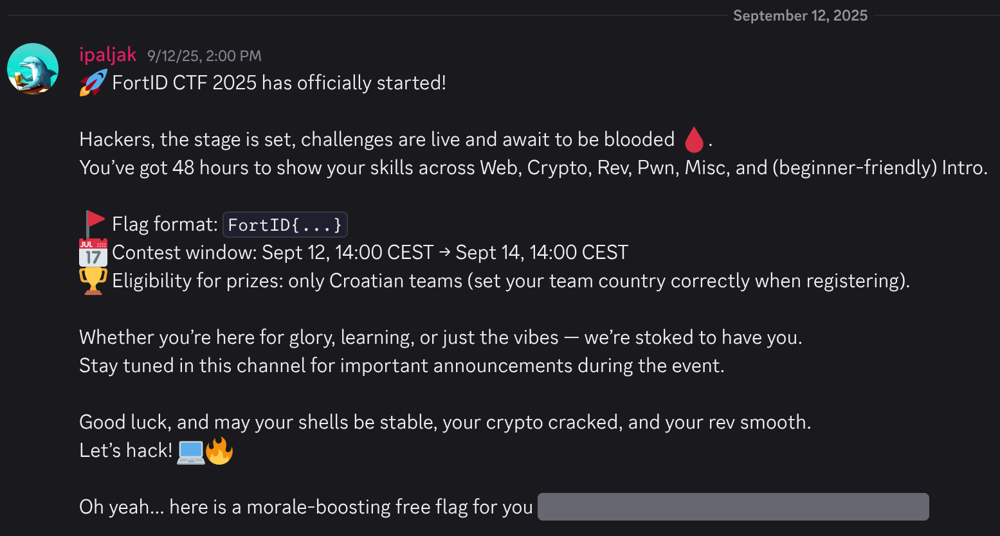

# Discord &mdash; solution

In the previous CTFs we've organized there was a common theme in the received
feedback &mdash; people didn't like the fact the we don't have a discord server
😿.

We decided to change that this year, and even handed out a free *sanity check*
flag through our Discord server.

The flag appeared at the beginning of the context in the `#announcements` channel.

Clicking on the hidden reveals the flag: `FortID{IRC_W45_Way_B377er_Jus7_Say1n...}`.
