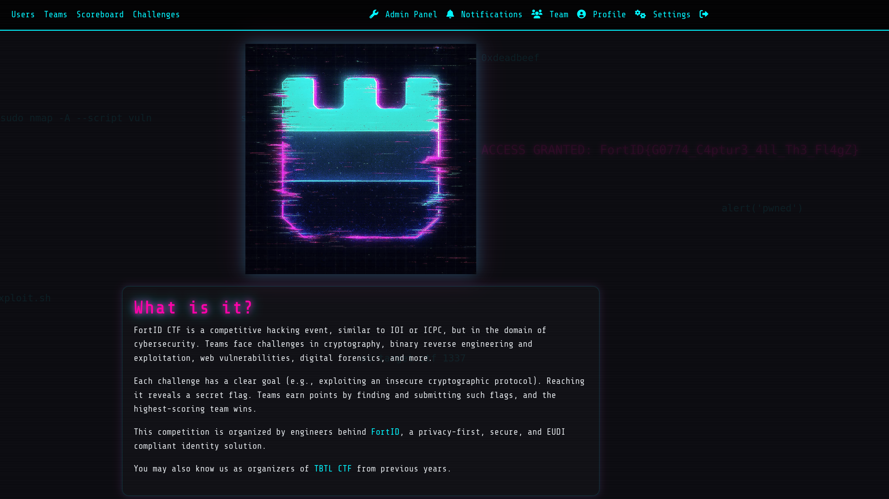

# Info &mdash; solution

In this challenge we are not given any files, only the instructions to take a
closer look at the homepage of the CTF website.

While reading the information and CTF rules we notice that a piece of text
starts revealing itself in the background. After giving it some more time we
can see it reveals the flag.



We could have also searched for the strings matching the flag format in the
source code:

```html
<!-- Hacker iconography background -->
<div class="hacker-bg">
  <div class="hacker-symbol" style="top:20%; left:5%; animation-delay:0s;">d = pow(e, -1, phi)</div>
  <div class="hacker-symbol" style="top:30%; left:20%; animation-delay:2s;">sudo nmap -A --script vuln</div>
  <div class="hacker-symbol" style="top:60%; left:15%; animation-delay:4s;">chmod +x exploit.sh</div>
  <div class="hacker-symbol" style="top:75%; left:8%; animation-delay:1s;">DROP TABLE users; --</div>
  <div class="hacker-symbol" style="top:20%; left:60%; animation-delay:3s;">0xdeadbeef</div>
  <div class="hacker-symbol" style="top:45%; left:80%; animation-delay:5s;">alert('pwned')</div>
  <div class="hacker-symbol" style="top:70%; left:50%; animation-delay:1.5s;">nc target.ctf 1337</div>
  <div class="hacker-symbol" style="top:30%; left:40%; animation-delay:2.5s;">ssh root@victim</div>

  <!-- Rare Easter egg -->
  <div class="rare-symbol" style="top:35%; left:60%;">
    ACCESS GRANTED: FortID{G0774_C4ptur3_4ll_Th3_Fl4gZ}
  </div>
</div>
```

So, the flag for this *sanity check* challenge is `FortID{G0774_C4ptur3_4ll_Th3_Fl4gZ}`
