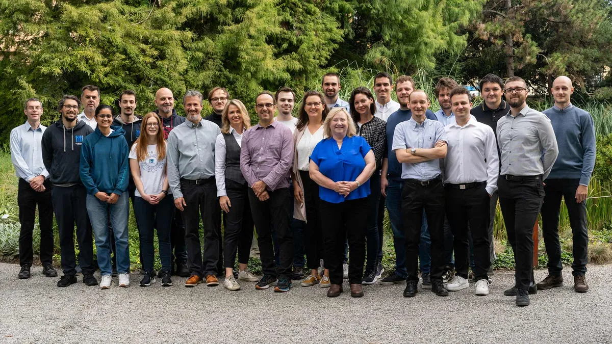
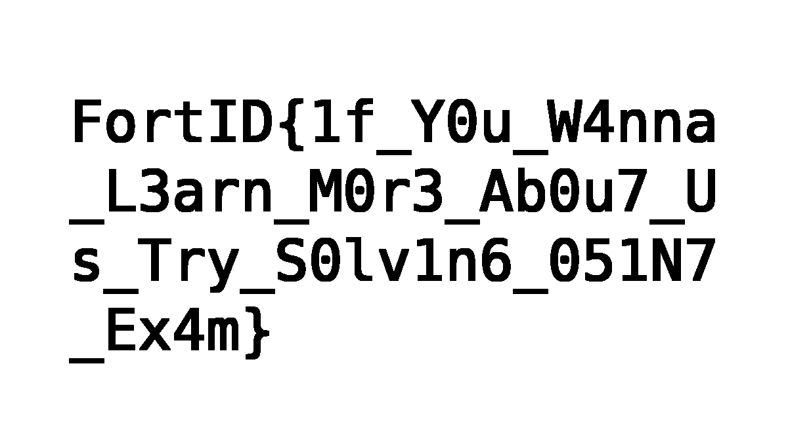

# Misc &mdash; solution

In this challenge we are given an image called `about_us.webp` along with the following description:

```
This picture seems oddly familiar... but something about it feels ever so slightly off.
```

The image in question is:



The challenge also has `OSINT` and `Stego` tags, instructing us that we need to
some [open-source
intelligence](https://en.wikipedia.org/wiki/Open-source_intelligence) and some
[steganography](https://en.wikipedia.org/wiki/Steganography) to get to the
flag.

Let's first try to find the original image. We can do so by either using
reverse image search, or by concluding that the image is related to the company
the CTF organizers work at. In either case, it's relatively easy to get to
[this page](https://fortid.com/about) from where we can find the original
image.

After doing some analysis, it's clear that the images are different (just as
the challenge description says). The steganographic method used likely lies in
those differences.

After some trial and error, the idea that finally works was to go over both
images pixel-by-pixel, and coloring only those pixels which differ in the two
images (e.g. set those pixels black, and other ones white). We can achieve that
using this simple python script:

```python
from PIL import Image
import numpy as np

original_path = "original.webp"
modified_path = "about_us.webp"

orig = Image.open(original_path).convert("RGB")
mod = Image.open(modified_path).convert("RGB")

if orig.size != mod.size:
    raise ValueError("Image sizes don't match")

orig_arr = np.array(orig, dtype=np.uint8)
mod_arr = np.array(mod, dtype=np.uint8)

diff_mask = np.any(orig_arr != mod_arr, axis=2)

reveal = np.full((*diff_mask.shape, 3), 255, dtype=np.uint8)
reveal[diff_mask] = [0, 0, 0]

reveal_img = Image.fromarray(reveal, mode="RGB")
reveal_img.save("revealed.png")
```

The final `revealed.png` image simply spells the flag.


