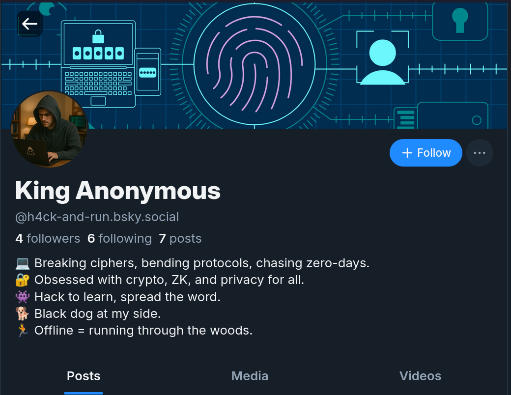
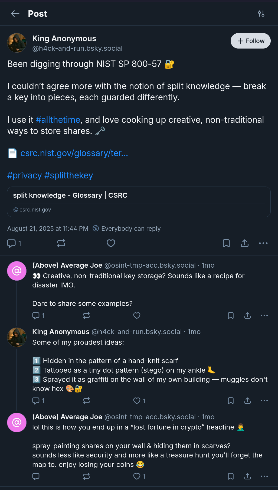
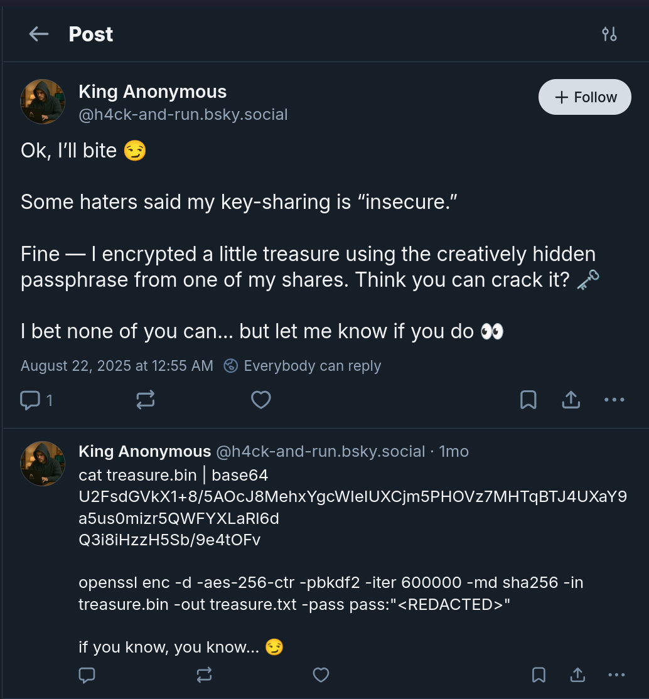
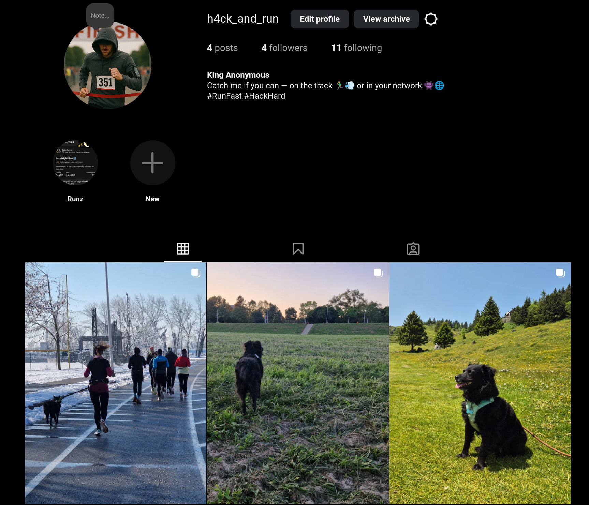
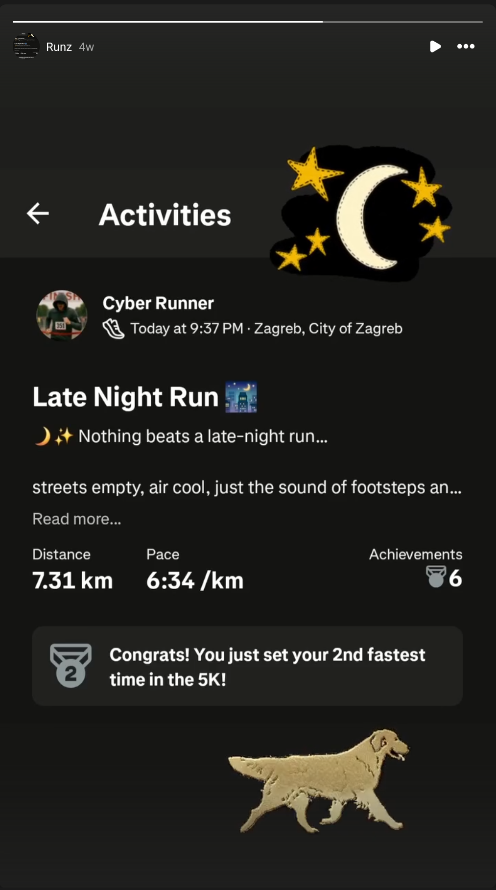
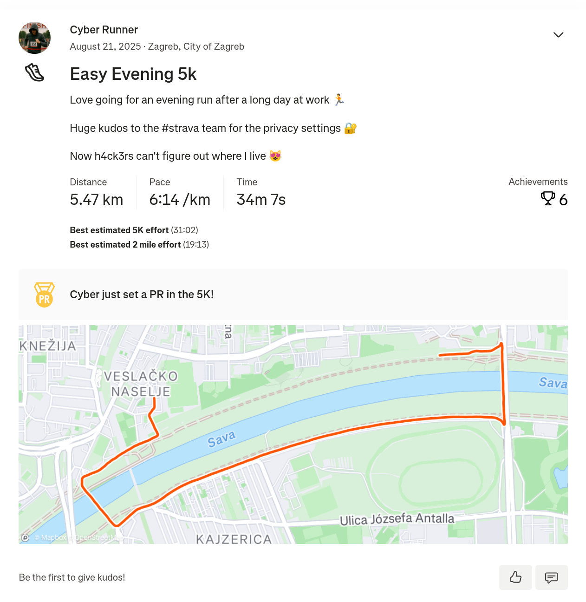
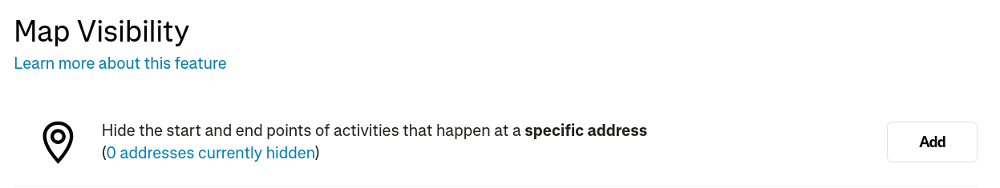
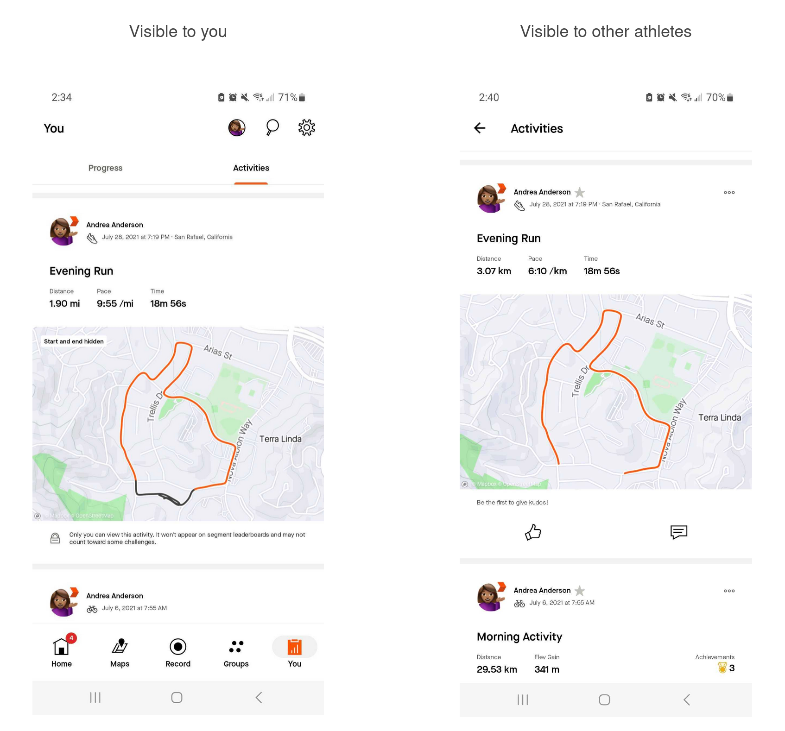
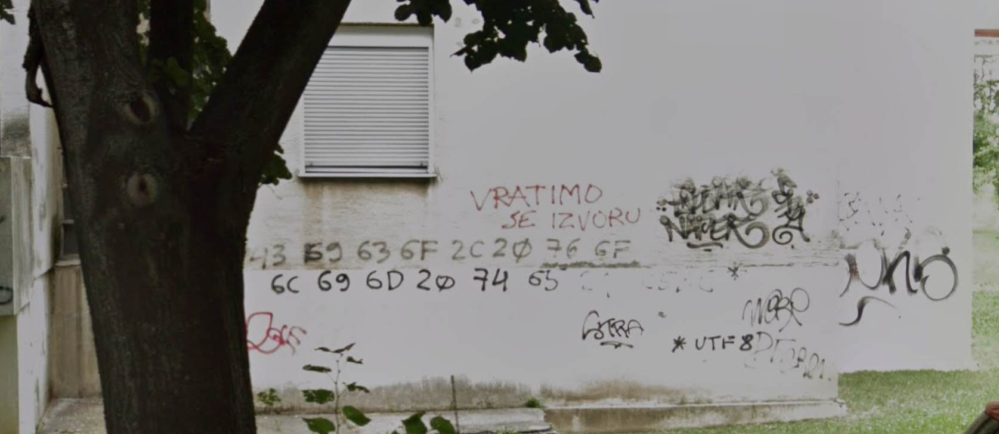

# Hack & Run &mdash; solution

This [OSINT](https://en.wikipedia.org/wiki/Open-source_intelligence) challenge
instructs us to take a look at a [Bluesky
profile](https://bsky.app/profile/h4ck-and-run.bsky.social) of `@h4ck-and-run`,
also known as `King Anonymous`.



Looks like this individual is interested in cybersecurity. Let's see what
they're all about...

They've posted about the following:
  * [Dan Boneh's 20 Years of Attacks on the RSA
  Cryptosystem](https://bsky.app/profile/h4ck-and-run.bsky.social/post/3lwwvdkwg3s2h)
  * [Split Knowledge from NIST SP 800-57](https://bsky.app/profile/h4ck-and-run.bsky.social/post/3lwwvyuvmuk2h)
  * [Challenges the community to prove his secret-sharing is
  insecure](https://bsky.app/profile/h4ck-and-run.bsky.social/post/3lwwzynapo22h)
  * [Recommends Smashing Security ep.
  391](https://bsky.app/profile/h4ck-and-run.bsky.social/post/3lwx36b6pp32i)
  * [Recommends FortID's blog on EUDI
  interoperability](https://bsky.app/profile/h4ck-and-run.bsky.social/post/3lwyesjnp5s2j)

The posts about the challenge and NIST article seem to be related, interesting,
and have generated some discussions. Let's check them out.



Looks like our person of interest has a peculiar taste when it comes to
splitting cryptographic keys into shares. This little altercation seems to have
influenced their next post.



This reveals the final stage of the challenge.

```
$ cat treasure.bin | base64
U2FsdGVkX1+8/5AOcJ8MehxYgcWIeIUXCjm5PHOVz7MHTqBTJ4UXaY9a5us0mizr5QWFYXLaRl6dQ3i8iHzzH5Sb/9e4tOFv

$ openssl enc -d -aes-256-ctr -pbkdf2 -iter 600000 -md sha256 -in treasure.bin -out treasure.txt -pass pass:"<REDACTED>"
```

We likely need to compromise one of the *creative key shares*, and decrypt the
`trasure.bin` as described.

As this is an OSINT challenge, let's find some more information about our
person if interest. For starters, let's see if they have any other social media
presence.

Turns out they have an [instagram
account](https://www.instagram.com/h4ck_and_run) as well.



The instagram profile has a different vibe, it's more about running and outdoor
activities than it is about cybersecurity. It even features the cutest little
black dog 🖤.

However, it leaks another piece of information &mdash; our persona has an
account on [strava](https://www.strava.com).



Let's check it out...

They have three runs public on their profile. The description on the first run
points us in the right direction.



They mention some kind of privacy settings protecting them from hackers that
would otherwise have figured out where they live. This now reminds us of a
piece of information from Bluesky &mdash; they've mentioned spraying the key
share in hex on the wall of their building as one of the ways of protecting
their shares.

Could it be that we somehow need to figure out where they live, look at what's
written on the building and use that to decrypt the treasure? Sounds like a
long-shot, but that's precisely what we need to do.

Let's consider those privacy settings from Strava that were mentioned in the
run description.

From the looks of their map, they were talking about this:



You can take a look at [the details](https://support.strava.com/hc/en-us/articles/115000173384-Edit-Map-Visibility), but this picture sums it up nicely:



In a sense, the app hides the part of the activity within a predefined radius
of the location you wish to conceal. In the case of running, this is mainly
used not to reveal the location of someone's home, because quite often people
start and finish their runs at their home.

At this point there are multiple ways to figure out the location of the
building. One neat idea is the fact that by observing two points on a circle,
we have two candidates for its centre, one of which will be obviously wrong. We
don't know the radius of the circle, but turns out Strava offers you a handful
of options, so we can brute-force those.

This is not super-precise, as they seem to do some fuzzing, but it narrows down
the area pretty significantly. It also helps that we have more than one run.

It was also possible to think about how one would make a circular route with
the remaining (not drawn) distance. Investigating the nearby area on street
view also gives hints as to which roads make more or less sense if you were
going for a run.

Or, you can simply brute-force all buildings in the neighbourhood, it's still
doable.

Whichever route you take, it should eventually bring you [here](https://www.google.com/maps/@45.7899737,15.9641065,3a,32.8y,96.4h,86.88t/data=!3m7!1e1!3m5!1sQkePTaMuusjfCNbuGWBxyQ!2e0!6shttps:%2F%2Fstreetviewpixels-pa.googleapis.com%2Fv1%2Fthumbnail%3Fcb_client%3Dmaps_sv.tactile%26w%3D900%26h%3D600%26pitch%3D3.123944005531399%26panoid%3DQkePTaMuusjfCNbuGWBxyQ%26yaw%3D96.39791574820174!7i16384!8i8192?entry=ttu&g_ep=EgoyMDI1MDkyNC4wIKXMDSoASAFQAw%3D%3D)



We covert those bytes to ASCII, use it as a passphrase for decryption, and get the flag.

```
$ openssl enc -d -aes-256-ctr -pbkdf2 -iter 600000 -md sha256 -in treasure.bin -out treasure.txt -pass pass:"Cico, volim te!"

$ cat treasure.txt
FortID{1_H0p3_7h3_C1c0_1n_Qu3st10n_15_Cic0_Kr4njc4r_:)}
```

We don't know who wrote those bytes on the wall, or who `Cico` is, but we hope
it's about [Zlatko
Kranjcar](https://en.wikipedia.org/wiki/Zlatko_Kranj%C4%8Dar) who was a famous
Croatian football manager and player.
