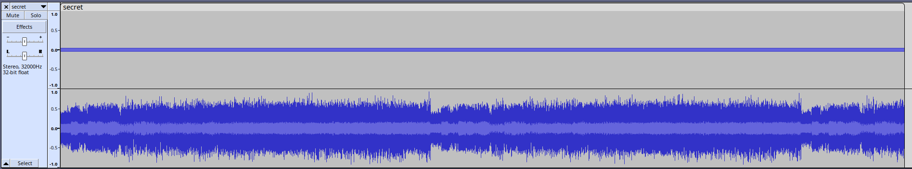
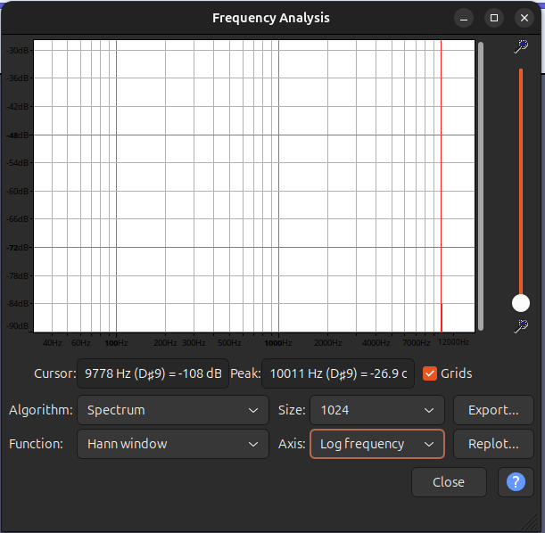
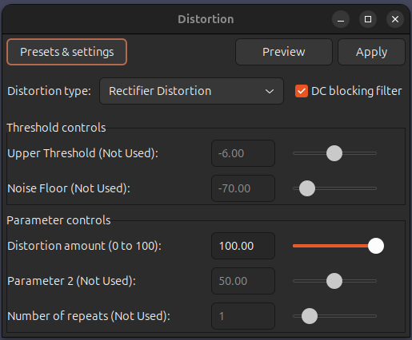
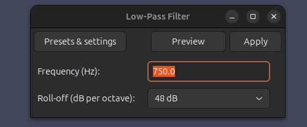
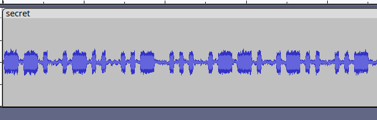

# Hard Rock &mdash; Solution

## Overview

This repository contains a single audio file, `secret.mp3`. The goal is to analyze the file, extract the hidden signal, decode it, and reveal the flag.

## Summary of approach

1. Inspect the audio channels to identify which one contains the hidden data.
2. Perform frequency analysis to locate the carrier.
3. Demodulate the signal (AM demodulation: rectification + low-pass filter).
4. Interpret the resulting waveform as Morse code, then decode to text.
5. Map decoded tokens to Brainfuck commands and run the resulting Brainfuck program to obtain the flag.

## File analysis

Open `secret.mp3` in an audio editor (e.g., Audacity). The file contains two channels:

* One channel contains normal music.
* The other channel contains a synthetic signal with hidden content.

See: .

## Frequency analysis

Perform a spectrogram / FFT on the suspicious channel to find prominent frequency components. The spectrogram shows a clear peak around **10 kHz**, suggesting an AM-style carrier.

See: .

## Demodulation (AM) — steps used in Audacity

To extract the envelope (the encoded data), perform the following steps:

1. **Rectification**

   * Rectify the signal to remove negative values.
   * This reveals the amplitude envelope in the spectrum, separating carrier and envelope components.
   * See: .

2. **Low-pass filtering**

   * Apply a low-pass filter with a cutoff below the carrier frequency (i.e., well below 10 kHz) to remove the carrier and preserve the envelope.
   * See: .

After these steps you should have a waveform whose amplitude encodes the hidden message.

## From waveform to Morse

The demodulated envelope resolves into discrete high/low pulses consistent with Morse code timing. Export or visually inspect the waveform and translate the pulses into dots (`.`), dashes (`-`), and inter-symbol gaps.

See: .

The decoded Morse (after converting the pulse patterns to textual tokens) yields a stream of words drawn from the Brainfuck command vocabulary.


```
PLUSPLUSPLUSPLUSPLUSPLUSPLUSPLUSPLUSPLUSOPENBKGREATERPLUSGREATERPLUSPLUS
PLUSGREATERPLUSPLUSPLUSPLUSPLUSPLUSPLUSGREATERPLUSPLUSPLUSPLUSPLUSPLUSPL
USPLUSPLUSPLUSLOWERLOWERLOWERLOWERMINUSCLOSEBKGREATERGREATERGREATERDOTPL
USPLUSPLUSPLUSPLUSPLUSPLUSPLUSPLUSDOTPLUSPLUSPLUSDOTPLUSPLUSDOTMINUSMINU
SMINUSMINUSMINUSMINUSMINUSMINUSMINUSMINUSMINUSDOTMINUSMINUSMINUSMINUSMIN
USDOTGREATERPLUSPLUSPLUSPLUSPLUSPLUSPLUSPLUSPLUSPLUSPLUSPLUSPLUSPLUSPLUS
PLUSPLUSPLUSPLUSPLUSPLUSPLUSPLUSDOTLOWERPLUSPLUSPLUSPLUSPLUSPLUSPLUSPLUS
PLUSDOTLOWERPLUSPLUSPLUSPLUSPLUSPLUSPLUSPLUSPLUSPLUSPLUSPLUSPLUSPLUSPLUS
PLUSPLUSPLUSPLUSPLUSPLUSPLUSDOTGREATERGREATERMINUSMINUSMINUSMINUSMINUSMI
NUSMINUSMINUSMINUSMINUSMINUSMINUSMINUSDOTPLUSPLUSPLUSPLUSPLUSPLUSPLUSPLU
SPLUSPLUSPLUSDOTLOWERPLUSPLUSPLUSPLUSPLUSPLUSPLUSPLUSPLUSPLUSPLUSPLUSPLU
SPLUSPLUSPLUSPLUSPLUSDOTLOWERPLUSDOTPLUSPLUSDOTMINUSMINUSMINUSMINUSDOTGR
EATERGREATERMINUSMINUSMINUSMINUSMINUSMINUSMINUSMINUSMINUSDOTLOWERLOWERPL
USPLUSDOTGREATERDOTPLUSPLUSPLUSPLUSPLUSPLUSPLUSDOT
```

## Mapping tokens to Brainfuck

Map the decoded words to Brainfuck characters as follows (the original capture used words like `PLUS`, `GREATER`, `LOWER`, `MINUS`, `DOT`, `OPENBK`, `CLOSEBK` to represent `+`, `>`, `<`, `-`, `.` , `[`, `]` respectively). After replacing each word with its corresponding character, you obtain a valid Brainfuck program.

The full program used to produce the flag:

```brainfuck
++++++++++[>+>+++>+++++++>++++++++++<<<<-]>>>.+++++++++.+++.++.-----------
.-----.>+++++++++++++++++++++++.<+++++++++.<++++++++++++++++++++++.>>----
---------.+++++++++++.<++++++++++++++++++.<+.++.----.>>---------.<<++.>.+
++++++. <-----.>>++.<-------.>----.<<.>.>++++.<<+++.+.+.-----.>>----.<.<+.
++++.>.>+++++++++.<+++++++++.<-.+++.>---------.<--.--.>++++.>-----.<<.+++
+.>----.<------.++++.>>+++++++++++.
```

## Running the Brainfuck program

You can run the Brainfuck program with any Brainfuck interpreter (online interpreters are available, or use a local implementation). Executing the program prints the flag:

**Flag:** `FORTID{M4ny_573p5_f0r_n0_r3450n_15_wh47_53cr37_15}`
