# OSINT Exam

In this challenge we are given a `handout.zip` containing a bunch of images,
and the instructions to connect to a remote service. Let's do that and see what
happens.

```
$ nc 0.cloud.chals.io 27689


 ▒█████    ██████  ██▓ ███▄    █ ▄▄▄█████▓   ▓█████ ▒██   ██▒ ▄▄▄       ███▄ ▄███▓
▒██▒  ██▒▒██    ▒ ▓██▒ ██ ▀█   █ ▓  ██▒ ▓▒   ▓█   ▀ ▒▒ █ █ ▒░▒████▄    ▓██▒▀█▀ ██▒
▒██░  ██▒░ ▓██▄   ▒██▒▓██  ▀█ ██▒▒ ▓██░ ▒░   ▒███   ░░  █   ░▒██  ▀█▄  ▓██    ▓██░
▒██   ██░  ▒   ██▒░██░▓██▒  ▐▌██▒░ ▓██▓ ░    ▒▓█  ▄  ░ █ █ ▒ ░██▄▄▄▄██ ▒██    ▒██
░ ████▓▒░▒██████▒▒░██░▒██░   ▓██░  ▒██▒ ░    ░▒████▒▒██▒ ▒██▒ ▓█   ▓██▒▒██▒   ░██▒
░ ▒░▒░▒░ ▒ ▒▓▒ ▒ ░░▓  ░ ▒░   ▒ ▒   ▒ ░░      ░░ ▒░ ░▒▒ ░ ░▓ ░ ▒▒   ▓▒█░░ ▒░   ░  ░
  ░ ▒ ▒░ ░ ░▒  ░ ░ ▒ ░░ ░░   ░ ▒░    ░        ░ ░  ░░░   ░▒ ░  ▒   ▒▒ ░░  ░      ░
░ ░ ░ ▒  ░  ░  ░   ▒ ░   ░   ░ ░   ░            ░    ░    ░    ░   ▒   ░      ░
    ░ ░        ░   ░           ░                ░  ░ ░    ░        ░  ░       ░

         Instructions:
           1) Use your st4lk1ng skillz
           2) Get the FLAG


============================================================

1) One of our branch headquarters is located @ <location_1.png>. What is the full name of that coworking space and who is the managing director of that branch?

Format: <name_of_coworking_space> <managing_director_name> <managing_director_surname>

Answer:
```

Cool, looks like we need to answer some specific questions that relate to the
images we've been given in the handout.

## Question 1

We are asked to find the name of the co-working space and the managing
direction of the company branch working there.

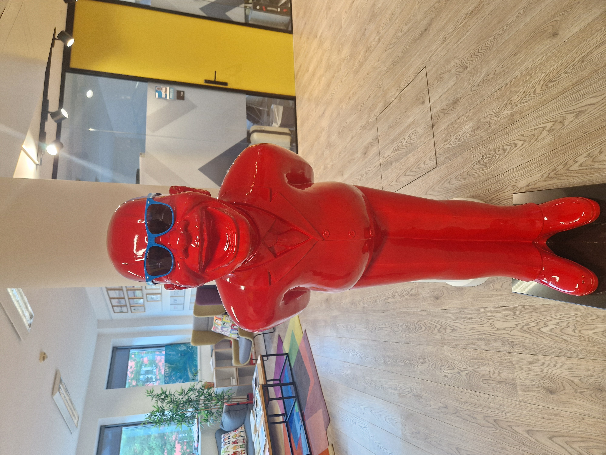

Using some sort of reverse image search tool (e.g. [Google
Lens](https://lens.google/)), we quickly find the image is related to the
[LHoFT
office](https://lhoft.com/insights/8-new-fintechs-added-to-the-lhoft-ecosystem-2/).
Meaning the answer to the co-working space should be `Luxembourg House of
Financial Technology`.

We now only need to find the managing director of TBTL's branch in Luxembourg
that has an office in LHoFT. We quickly find the
[meet-the-team](https://tbtl.com/meet-the-team/) page, and identify the
managing director in question.


So, the final answer to question 1 should be `Luxembourg House of Financial
Technology Petra Krizan`. Let's submit that to the service and see what
happens.

## Question 2

```
============================================================

2) One of our branch headquarters is located @ <location_2.png>. What is the full address of that building?

Format: <house_number> <street_name> <town> <postcode> <country>

Answer:
```

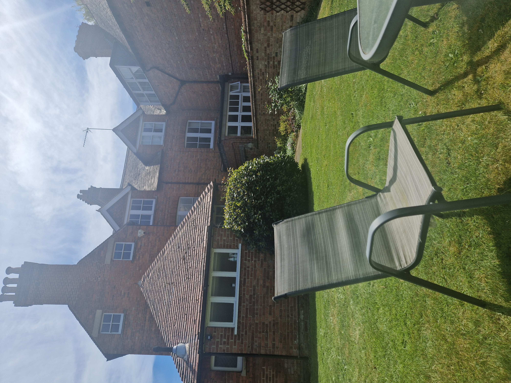

While it was possible to solve this one purely using
[geoguessr](https://en.wikipedia.org/wiki/GeoGuessr)-adjacent skills, it was
probably easier to consider the relationship with the Blockhouse Technology.
Investigating the company reveals we have an Oxford office, and the setting
feels very British. A simple google search like `Blockhouse Technology Oxford
office` instantly reveals the solution.

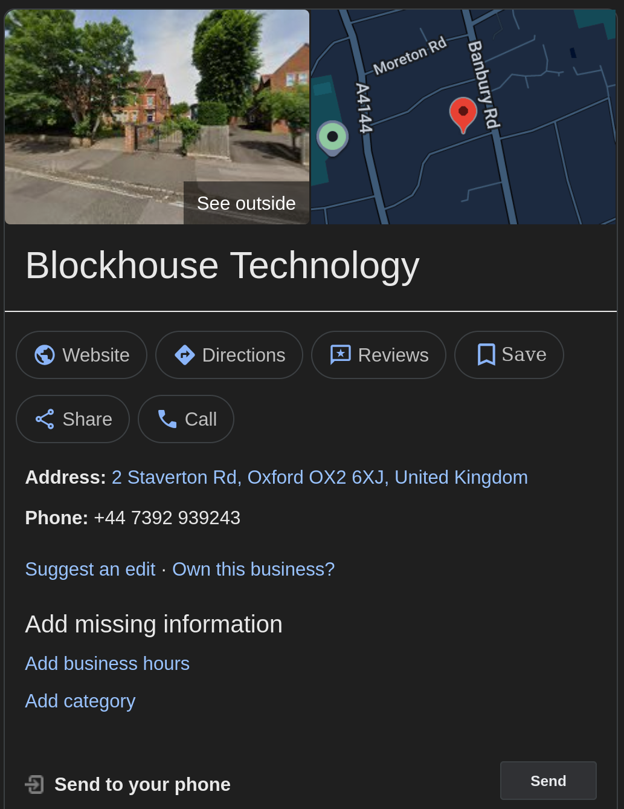

Therefore, the answer should be `2 Staverton Road Oxford OX2 6XJ United
Kingdom`. Let's submit that to the service and move on to the next question.

## Question 3

```
============================================================

3) Our branch with the best BBQ is located @ <location_3.png>. What is the full address of that building?

Format: <street_name> <house number> <postcode> <town> <country>

Answer:
```

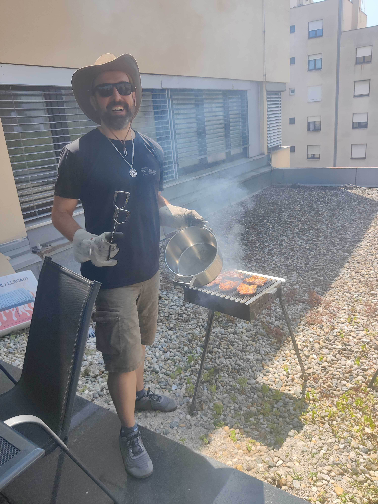

Similar to the previous challenge, we could've used *GEOSINT* skills, but it's
better to solve it within the context of the company. It's not hard to find
that we also have a branch in Zagreb, and repeating a similar Google search
leads us to [this
page](https://www.fininfo.hr/Poduzece/Pregled/the-blockhouse-technology/Detaljno/795383)
containing the address.


After a bit of fiddling with the format, we submit `Koturaska 51 10000 Zagreb
Croatia` and move to the next challenge.

## Question 4

```
============================================================

4) Two of our team members ran a road race together earlier this year @ <location_4.png>. What city was the race at and what were their finish times (hh:mm:ss)?

Format: <city> <slower_result> <faster_result>
```

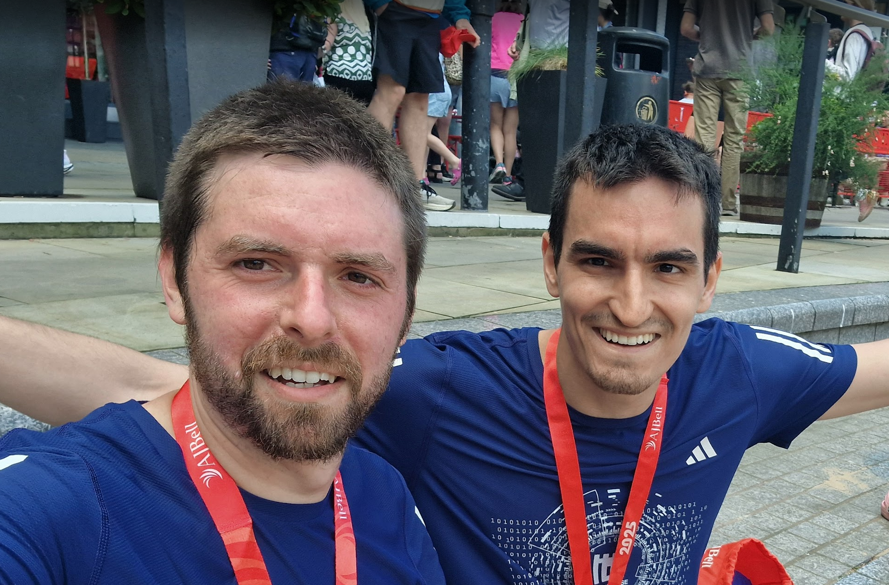

This one already feels a bit harder, let's gather some clues from the image.
Firstly, we can notice both guys having their finisher medals around their
necks with a visible `AJBell 2025` written on them. Let's Google that and see
what comes out.

We quickly find the so-called *AJ Bell Great Run* series of races across the UK. It's not that hard to find a [place where we can check the results](https://www.greatrun.org/results/).

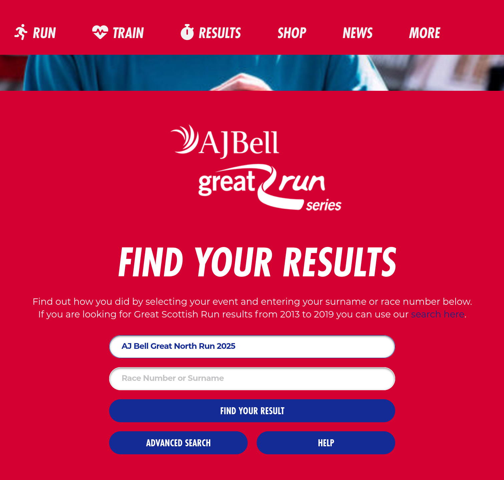

What we need to figure out is what is the race in question, and what are the
(sur)names of the guys in the picture.

The location can again be determined using *GEOSINT*, but it's not necessary
since there are only a handful of races to pick from, it's more important to
find the names.

Going through the [FortID's linkedin](https://www.linkedin.com/company/fortid/posts/?feedView=all), we find a post with the picture of the person on the left.

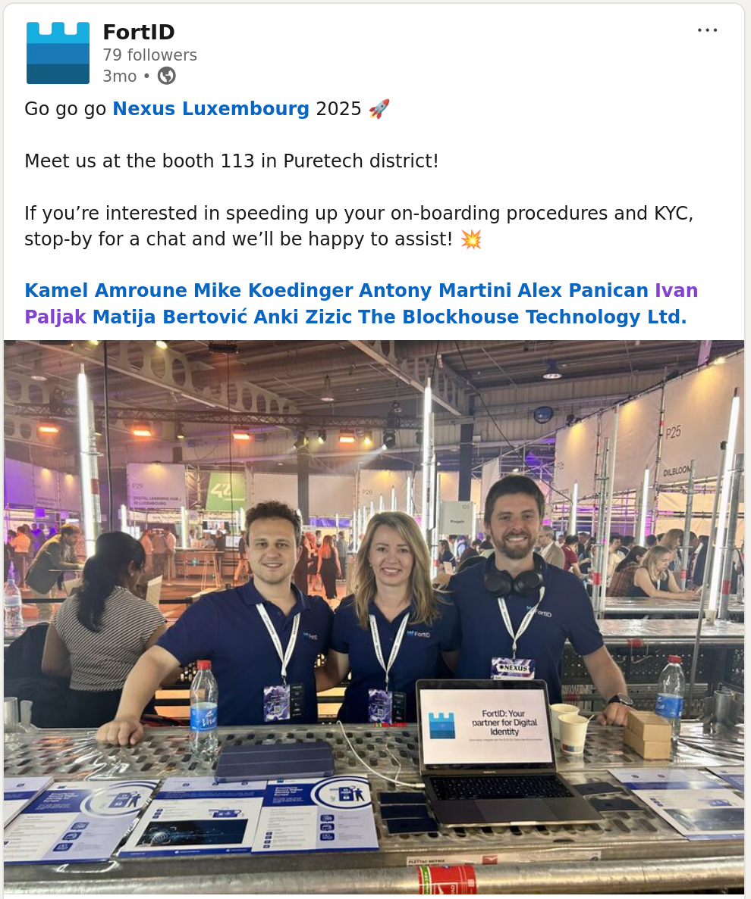

Comparing him to the tagged people in the post, we easily find [his
profile](https://www.linkedin.com/in/ivan-paljak-49587a126/), and therefore the
name &mdash; `Ivan Paljak`.

Let's put that into the `greatrun.org` website and see what comes out.

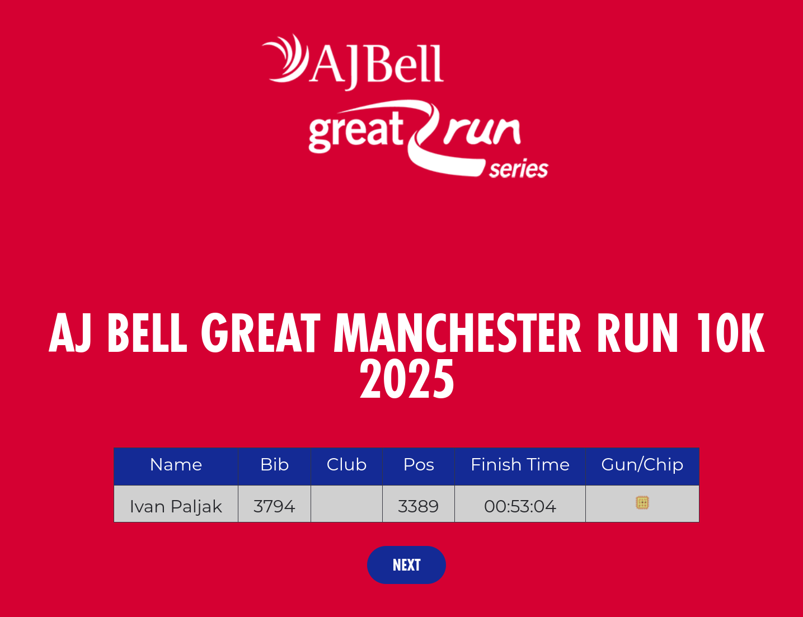

There we have it, we now know this is about `AJ Bell Great Manchester Run 10k
2025`, and that one result is `00:53:04`.

Turns out that finding the other person was a bit more involved, but
contestants found very clever and unintended ways of doing so. The way we
imagined it to be done was through results of some other races that Blockhouse
Technology employees ran. A good way of doing so is by finding such races on
[utrka.com](https://www.utrka.com) (a popular local site for such races).

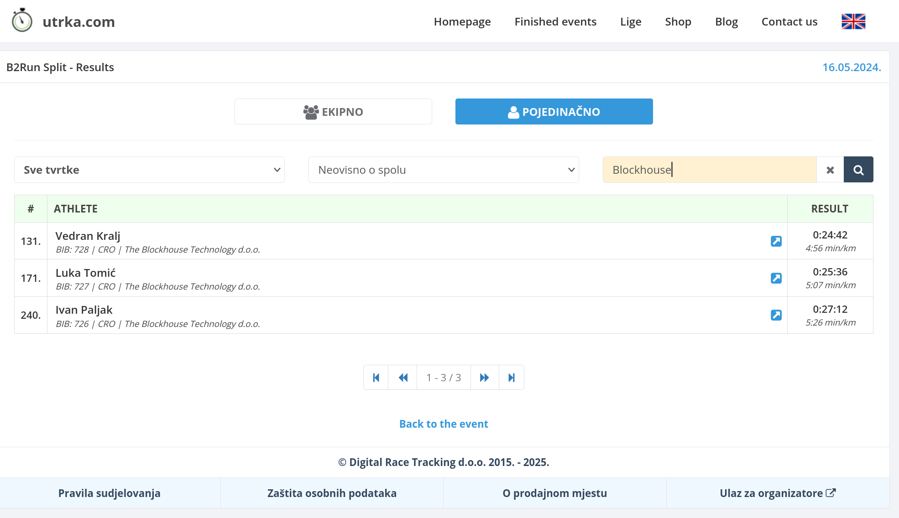

We then just brute-force the names against the Manchester website and find that
the person in question is `Luka Tomic`.

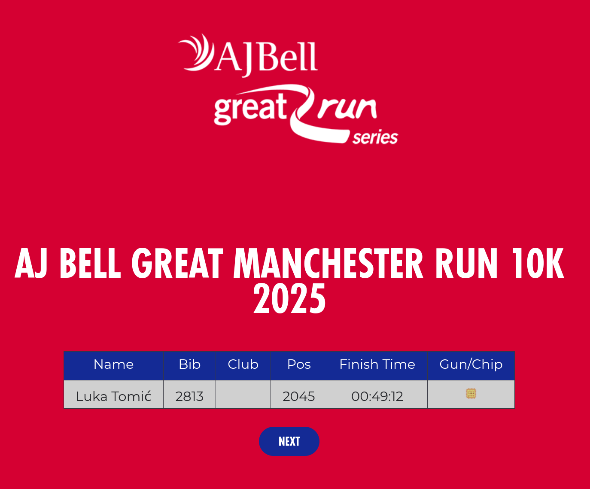

Finally, the answer to the challenge is `Manchester 00:53:04 00:49:12`.

At this point you might want to check out some alternative routes of finding
Luka, one of which is nicely explained in [this
writeup](https://medium.com/@dracula1337/osint-exam-writeup-fortid-ctf-2025-07076bf470d3)
by `@dracula1337`.

This part of the challenge was also made unintentionally easier by having both
`@ipaljak` and `@ltomic` as Discord admins, so they were sort-of hidden in
plain sight. This was a constant source of funny interactions that kept admins
entertained, such as this ticket where the contestant tags `@ltomic` when
asking for a hint on how to find him.

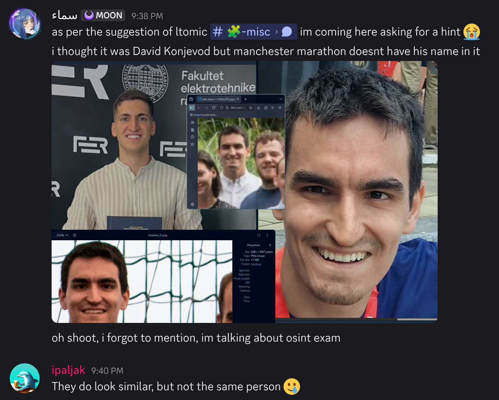

## Question 5

```
============================================================

5) The squad from our Zagreb office took part in a local charity futsal tournament in 2024 @ <location_5.png>. What was the tournament called and what place did they win?

 Format: <tournament_name> <place_won>

Answer:
```

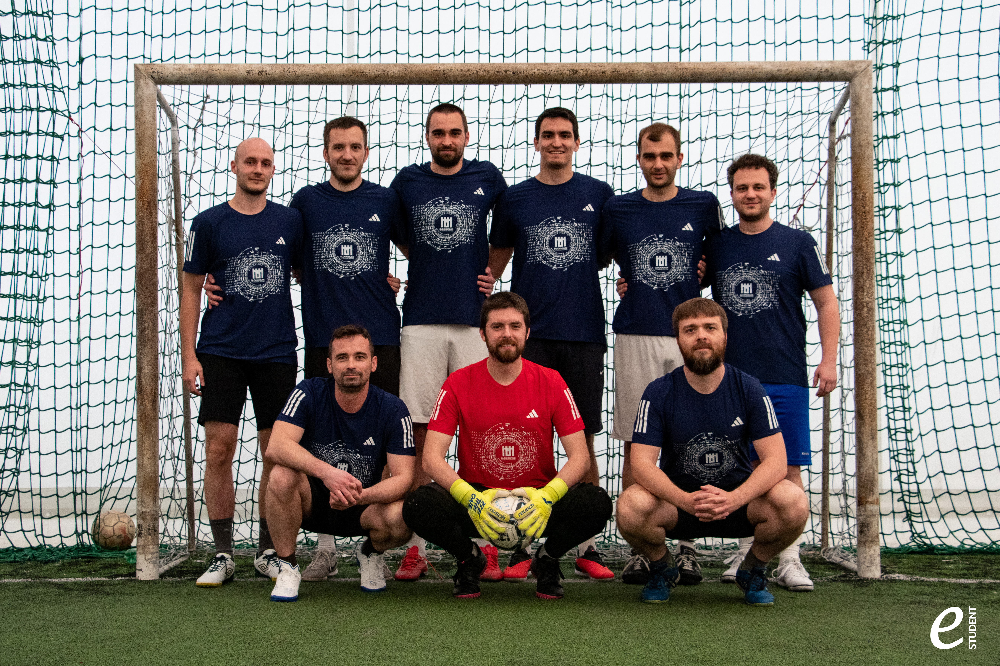

The key piece of information for cracking this one is the `e-student` logo in
the bottom right corner of the image. Searching for futsal tournaments
organized by this student initiative reveals a charity tournament called
`Kopacka solidarnosti`. Although, finding this might involve searching in Croatian.

Basically, google skills lead you to [this
article](https://www.srednja.hr/srednja-zajednica/uspjesno-odrzan-humanitarni-malonogometni-turnir-evo-tko-su-pobjednici/)
covering the 2024 edition of the tournament.

After translating, we can figure out the answer is `Kopacka solidarnosti 3`.

## Question 6


```
============================================================

6) One of our senior members has an artistic side to them as you can see from the beautiful flower @ <location_6.png>. What is the name of the book with that member's self-portrait on its cover?

 Format: <book title>

Answer:
```

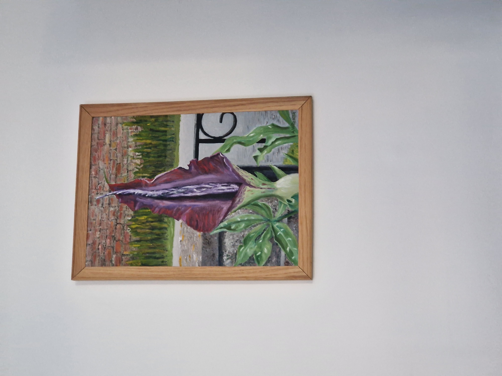

This one was not so hard to crack. Firstly, notice the signature of the author
in the corner of the painting, it's not completely clear, but seems to say `AW
ROS??E`.

Let's see what we can find about TBTL's senior management.


It should be clear at this point that the signature on the painting says `AW
ROSCOE`. Googling *Bill Roscoe* also reveals his full name to be `Andrew
William Roscoe`, so the `AW` part of the signature makes sense.

Finally, using some basic web browsing skills (e.g. search for `Bill Roscoe
Book`), we find the [book in
question](https://link.springer.com/book/10.1007/978-3-319-51046-0).

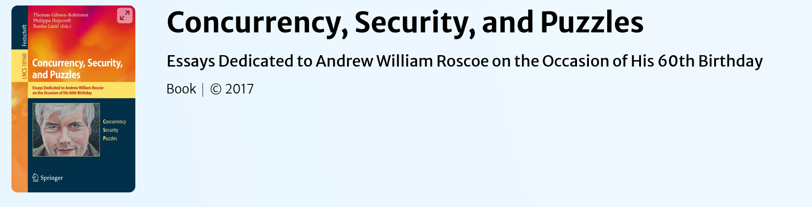

So, the answer to this question is simply `Concurrency, Security, and Puzzles`.

After submitting this, the remote service congratulates us and reveals the
flag: `FortID{C3rt1fi3d_0p3n_50urc3_1n73l1genc3_M45t3r}`.
